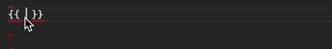

# Angular Interview Questions & Answers

> Click :star:if you like the project and follow [@DhaouJawhar](https://www.linkedin.com/in/dhaou-jawhar/) for technical updates. 

---

<p align="center">
  <a href=https://dhaou-jawhar.github.io/my-path>
    
  </a>
</p>

---

## Table of Contents

| No. | Questions                                                                                                                                                                |
| --- | ------------------------------------------------------------------------------------------------------------------------------------------------------------------------ |
|     | **Introduction**                                                                                                                                                         |
| 1   | [What is Spring Framework?](#What-is-Spring-Framework)                                                                                                                   |
| 2   | [What is open source?](#What-is-open-source)                                                                                                                             |
| 3   | [What is an application framework?](#What-is-an-application-framework)                                                                                                   |
| 4   | [How is Spring lightweight?](#How-is-Spring-lightweight)                                                                                                                 |
| 5   | [What is Inversion of Control (IoC)?](#What-is-Inversion-of-Control-IoC)                                                                                                 |
| 6   | [What is an aspect-oriented container framework?](#What-is-an-aspect-oriented-container-framework)                                                                       |
| 7   | [What are the features of Spring Framework?](#What-are-the-features-of-Spring-Framework)                                                                                 |
| 8   | [What are the differences between Spring & Struts?](#What-are-the-differences-between-Spring--Struts)                                                                    |
| 9   | [What is Java EE?](#What-is-Java-EE)                                                                                                                                     |
| 10  | [What are the limitations of Java EE (API)?](#What-are-the-limitations-of-Java-EE-API)                                                                                   |
| 11  | [What is Boilerplate code? What are the problems if we write the boilerplate code?](#What-is-Boilerplate-code-What-are-the-problems-if-we-write-the-boilerplate-code)    |
| 12  | [Can we say Spring is the replacement of Java EE?](#Can-we-say-Spring-is-the-replacement-of-Java-EE)                                                                     |
| 13  | [What are the different modules available in Spring?](#What-are-the-different-modules-available-in-Spring)                                                               |
| 14  | [What is POJO?](#What-is-POJO)                                                                                                                                           |
| 15  | [What is a Java Bean?](#What-is-a-Java-Bean)                                                                                                                             |
| 16  | [Similarities and Differences between POJO & Java Bean?](#Similarities-and-Differences-between-POJO--Java-Bean)                                                          |
| 17  | [What is a Spring Bean?](#What-is-a-Spring-Bean)                                                                                                                         |
| 18  | [Java Bean vs Spring Bean?](#Java-Bean-vs-Spring-Bean)                                                                                                                   |
| 19  | [What are the ways of collaborating objects?](#What-are-the-ways-of-collaborating-objects)                                                                               |
| 20  | [Differences Between Inheritance Vs Composition?](#Differences-Between-Inheritance-Vs-Composition)                                                                       |
| 21  | [When to use Inheritance?](#When-to-use-Inheritance)                                                                                                                     |
| 22  | [When to use Composition?](#When-to-use-Composition)                                                                                                                     |
| 23  | [Difference between Tight coupling & Loose coupling?](#Difference-between-Tight-coupling--Loose-coupling)                                                                |
| 24  | [Describe "_Favour composition over inheritance_".](#Describe-Favour-composition-over-inheritance)                                                                       |
| 25  | [Describe "_Program to an interface, not an implementation_".](#Describe-Program-to-an-interface-not-an-implementation)                                                  |
| 26  | [What is the Open-Closed principle?](#What-is-the-Open-Closed-principle)                                                                                                 |
| 27  | [What is a Design Pattern?](#What-is-a-Design-Pattern)                                                                                                                   |
| 28  | [What is IoC Container?](#What-is-IoC-Container)                                                                                                                         |
| 29  | [What is Configuration Metadata?](#What-is-Configuration-Metadata)                                                                                                       |
| 30  | [How many types of IoC container/how to create IoC container?](#How-many-types-of-IoC-containerhow-to-create-IoC-container)                                              |
| 31  | [BeanFactory vs ApplicationContext?](#BeanFactory-vs-ApplicationContext)                                                                                                 |
|     | **Spring Core**                                                                                                                                                          |
| 32  | [What is Bean scope?](#What-is-Bean-scope)                                                                                                                               |
| 33  | [What type of dependency injection spring supports?](#What-type-of-dependency-injection-spring-supports)                                                                 |
| 34  | [Difference between constructor and setter injection.](#Difference-between-constructor-and-setter-injection)                                                             |
| 35  | [Which one is the best dependency injection? Setter, Constructor or Field injection?](#Which-one-is-the-best-dependency-injection-Setter-Constructor-or-Field-injection) |
| 36  | [What is the type ambiguity in constructor injection?](#What-is-the-type-ambiguity-in-constructor-injection)                                                             |
| 37  | [How can we resolve type ambiguity in constructor injection?](#How-can-we-resolve-type-ambiguity-in-constructor-injection)                                               |
| 38  | [More question will be added soon...](#More)

---

### Table of Contents

| No. | Questions |
|---- | ---------
|1 | [What is Angular Framework?](#what-is-angular-framework)|
|2 | [What is the difference between AngularJS and Angular?](#what-is-the-difference-between-angularjs-and-angular)|
|3 | [What is TypeScript?](#what-is-typescript)|
|4 | [Write a pictorial diagram of Angular architecture?](#write-a-pictorial-diagram-of-angular-architecture)|
|5 | [What are the key components of Angular?](#what-are-the-key-components-of-angular)|
|6 | [What are directives?](#what-are-directives)|
|7 | [What are components?](#what-are-components)|
|8 | [What are the differences between Component and Directive?](#what-are-the-differences-between-component-and-directive)|
|9 | [What is a template?](#what-is-a-template)|
|10| [What is a module?](#what-is-a-module)|
|11| [What are lifecycle hooks available?](#what-are-lifecycle-hooks-available)|
|12| [What is a data binding?](#what-is-a-data-binding)|
|13| [What is metadata?](#what-is-metadata)|
|14| [What is Angular CLI?](#what-is-angular-cli)|
|15| [What is the difference between constructor and ngOnInit?](#what-is-the-difference-between-constructor-and-ngoninit)|
|16| [What is a service](#what-is-a-service)|
|17| [What is dependency injection in Angular?](#what-is-dependency-injection-in-angular)|
|18| [How is Dependency Hierarchy formed?](#how-is-dependency-hierarchy-formed)|
|19| [What is the purpose of async pipe?](#what-is-the-purpose-of-async-pipe)|
|20| [What is the option to choose between inline and external template file?](#what-is-the-option-to-choose-between-inline-and-external-template-file)|
|21| [What is the purpose of *ngFor directive?](#what-is-the-purpose-of-ngfor-directive)|
|22| [What is the purpose of ngIf directive?](#what-is-the-purpose-of-ngif-directive)|
|23| [What happens if you use script tag inside template?](#what-happens-if-you-use-script-tag-inside-template)|
|24| [What is interpolation?](#what-is-interpolation)|
|25| [What are template expressions?](#what-are-template-expressions)|
|26| [What are template statements?](#what-are-template-statements)|
|27| [How do you categorize data binding types?](#how-do-you-categorize-data-binding-types)|
|28| [What are pipes?](#what-are-pipes)|
|29| [What is a parameterized pipe?](#what-is-a-parameterized-pipe)|
|30| [How do you chain pipes?](#how-do-you-chain-pipes)|
|31| [What is a custom pipe?](#what-is-a-custom-pipe)|
|32| [Give an example of custom pipe?](#give-an-example-of-custom-pipe)|
|33| [What is the difference between pure and impure pipe?](#what-is-the-difference-between-pure-and-impure-pipe)|
|34| [What is a bootstrapping module?](#what-is-a-bootstrapping-module)|
|35| [What are observables?](#what-are-observables)|
|36| [What is HttpClient and its benefits?](#what-is-httpclient-and-its-benefits)|
|37| [Explain on how to use HttpClient with an example?](#explain-on-how-to-use-httpclient-with-an-example)|
|38| [How can you read full response?](#how-can-you-read-full-response)|
|39| [How do you perform Error handling?](#how-do-you-perform-error-handling)|
|40| [What is RxJS?](#what-is-rxjs)|
|41| [What is subscribing?](#what-is-subscribing)|
|42| [What is an observable?](#what-is-an-observable)|
|43| [What is an observer?](#what-is-an-observer)|
|44| [What is the difference between promise and observable?](#what-is-the-difference-between-promise-and-observable)|
|45| [What is multicasting?](#what-is-multicasting)|
|46| [How do you perform error handling in observables?](#how-do-you-perform-error-handling-in-observables)|
|47| [What is the shorthand notation for subscribe method?](#what-is-the-shorthand-notation-for-subscribe-method)|
|48| [What are the utility functions provided by RxJS?](#what-are-the-utility-functions-provided-by-rxjs)|
|49| [What are observable creation functions?](#what-are-observable-creation-functions)|
|50| [What will happen if you do not supply handler for the observer?](#what-will-happen-if-you-do-not-supply-handler-for-the-observer)|
|51| [What are Angular elements?](#what-are-angular-elements)|
|52| [What is the browser support of Angular Elements?](#what-is-the-browser-support-of-angular-elements)|
|53| [What are custom elements?](#what-are-custom-elements)|
|54| [Do I need to bootstrap custom elements?](#do-i-need-to-bootstrap-custom-elements)|
|55| [Explain how custom elements works internally?](#explain-how-custom-elements-works-internally)|
|56| [How to transfer components to custom elements?](#how-to-transfer-components-to-custom-elements)|
|57| [What are the mapping rules between Angular component and custom element?](#what-are-the-mapping-rules-between-angular-component-and-custom-element)|
|58| [How do you define typings for custom elements?](#how-do-you-define-typings-for-custom-elements)|
|59| [What are dynamic components?](#what-are-dynamic-components)|
|60| [What are the various kinds of directives?](#what-are-the-various-kinds-of-directives)|
|61| [How do you create directives using CLI?](#how-do-you-create-directives-using-cli)|
|62| [Give an example for attribute directives?](#give-an-example-for-attribute-directives)|
|63| [What is Angular Router?](#what-is-angular-router)|
|64| [What is the purpose of base href tag?](#what-is-the-purpose-of-base-href-tag)|
|65| [What are the router imports?](#what-are-the-router-imports)|
|66| [What is router outlet?](#what-is-router-outlet)|
|67| [What are router links?](#what-are-router-links)|
|68| [What are active router links?](#what-are-active-router-links)|
|69| [What is router state?](#what-is-router-state)|
|70| [What are router events?](#what-are-router-events)|
|71| [What is activated route?](#what-is-activated-route)|
|72| [How do you define routes?](#how-do-you-define-routes)|
|73| [What is the purpose of Wildcard route?](#what-is-the-purpose-of-wildcard-route)|
|74| [Do I need a Routing Module always?](#do-i-need-a-routing-module-always)|
|75| [What is Angular Universal?](#what-is-angular-universal)|
|76| [What are different types of compilation in Angular?](#what-are-different-types-of-compilation-in-angular)|
|77| [What is JIT?](#what-is-jit)|
|78| [What is AOT?](#what-is-aot)|
|79| [Why do we need compilation process?](#why-do-we-need-compilation-process)|
|80| [What are the advantages with AOT?](#what-are-the-advantages-with-aot)|
|81| [What are the ways to control AOT compilation?](#what-are-the-ways-to-control-aot-compilation)|
|82| [What are the restrictions of metadata?](#what-are-the-restrictions-of-metadata)|
|83| [What are the three phases of AOT?](#what-are-the-three-phases-of-aot)|
|84| [Can I use arrow functions in AOT?](#can-i-use-arrow-functions-in-aot)|
|85| [What is the purpose of metadata json files?](#what-is-the-purpose-of-metadata-json-files)|
|86| [Can I use any javascript feature for expression syntax in AOT?](#can-i-use-any-javascript-feature-for-expression-syntax-in-aot)|
|87| [What is folding?](#what-is-folding)|
|88| [What are macros?](#what-are-macros)|
|89| [Give an example of few metadata errors?](#give-an-example-of-few-metadata-errors)|
|90| [What is metadata rewriting?](#what-is-metadata-rewriting)|
|91| [How do you provide configuration inheritance?](#how-do-you-provide-configuration-inheritance)|
|92| [How do you specify angular template compiler options?](#how-do-you-specify-angular-template-compiler-options)|
|93| [How do you enable binding expression validation?](#how-do-you-enable-binding-expression-validation)|
|94| [What is the purpose of any type cast function?](#what-is-the-purpose-of-any-type-cast-function)|
|95| [What is Non null type assertion operator?](#what-is-non-null-type-assertion-operator)|
|96| [What is type narrowing?](#what-is-type-narrowing)|
|97| [How do you describe various dependencies in angular application?](#how-do-you-describe-various-dependencies-in-angular-application)|
|98| [What is zone?](#what-is-zone)|
|99| [What is the purpose of common module?](#what-is-the-purpose-of-common-module)|
|100| [What is codelyzer?](#what-is-codelyzer)|
|101| [What is angular animation?](#what-is-angular-animation)|
|102| [What are the steps to use animation module?](#what-are-the-steps-to-use-animation-module)|
|103| [What is State function?](#what-is-state-function)|
|104| [What is Style function?](#what-is-style-function)|
|105| [What is the purpose of animate function?](#what-is-the-purpose-of-animate-function)|
|106| [What is transition function?](#what-is-transition-function)|
|107| [How to inject the dynamic script in angular?](#how-to-inject-the-dynamic-script-in-angular)|
|108| [What is a service worker and its role in Angular?](#what-is-a-service-worker-and-its-role-in-angular)|
|109| [What are the design goals of service workers?](#what-are-the-design-goals-of-service-workers)|
|110| [What are the differences between AngularJS and Angular with respect to dependency injection?](#what-are-the-differences-between-angularjs-and-angular-with-respect-to-dependency-injection)|
|111| [What is Angular Ivy?](#what-is-angular-ivy)|
|112| [What are the features included in ivy preview?](#what-are-the-features-included-in-ivy-preview)|
|113| [Can I use AOT compilation with Ivy?](#can-i-use-aot-compilation-with-ivy)|
|114| [What is Angular Language Service?](#what-is-angular-language-service)|
|115| [How do you install angular language service in the project?](#how-do-you-install-angular-language-service-in-the-project)|
|116| [Is there any editor support for Angular Language Service?](#is-there-any-editor-support-for-angular-language-service)|
|117| [Explain the features provided by Angular Language Service?](#explain-the-features-provided-by-angular-language-service)|
|118| [How do you add web workers in your application?](#how-do-you-add-web-workers-in-your-application)|
|119| [What are the limitations with web workers?](#what-are-the-limitations-with-web-workers)|
|120| [What is Angular CLI Builder?](#what-is-angular-cli-builder)|
|121| [What is a builder?](#what-is-a-builder)|
|122| [How do you invoke a builder?](#how-do-you-invoke-a-builder)|
|123| [How do you create app shell in Angular?](#how-do-you-create-app-shell-in-angular)|
|124| [What are the case types in Angular?](#what-are-the-case-types-in-angular)|
|125| [What are the class decorators in Angular?](#what-are-the-class-decorators-in-angular)|
|126| [What are class field decorators?](#what-are-class-field-decorators)|
|127| [What is declarable in Angular?](#what-is-declarable-in-angular)|
|128| [What are the restrictions on declarable classes?](#what-are-the-restrictions-on-declarable-classes)|
|129| [What is a DI token?](#what-is-a-di-token)|
|130| [What is Angular DSL?](#what-is-angular-dsl)|
|131| [What is an rxjs Subject?](#what-is-an-rxjs-Subject)|
|132| [What is Bazel tool?](#what-is-bazel-tool)|
|133| [What are the advantages of Bazel tool?](#what-are-the-advantages-of-bazel-tool)|
|134| [How do you use Bazel with Angular CLI?](#how-do-you-use-bazel-with-angular-cli)|
|135| [How do you run Bazel directly?](#how-do-you-run-bazel-directly)|
|136| [What is platform in Angular?](#what-is-platform-in-angular)|
|137| [What happens if I import the same module twice?](#what-happens-if-i-import-the-same-module-twice)|
|138| [How do you select an element with in a component template?](#how-do-you-select-an-element-with-in-a-component-template)|
|139| [How do you detect route change in Angular?](#how-do-you-detect-route-change-in-angular)|
|140| [How do you pass headers for HTTP client?](#how-do-you-pass-headers-for-http-client)|
|141| [What is the purpose of differential loading in CLI?](#what-is-the-purpose-of-differential-loading-in-cli)|
|142| [Is Angular supports dynamic imports?](#is-angular-supports-dynamic-imports)|
|143| [What is lazy loading?](#what-is-lazy-loading)|
|144| [What are workspace APIs?](#what-are-workspace-apis)|
|145| [How do you upgrade angular version?](#how-do-you-upgrade-angular-version)|
|146| [What is Angular Material?](#what-is-angular-material)|
|147| [How do you upgrade location service of angularjs?](#how-do-you-upgrade-location-service-of-angularjs)|
|148| [What is NgUpgrade?](#what-is-ngupgrade)|
|149| [How do you test Angular application using CLI?](#how-do-you-test-angular-application-using-cli)|
|150| [How to use polyfills in Angular application?](#how-to-use-polyfills-in-angular-application)|
|151| [What are the ways to trigger change detection in Angular?](#what-are-the-ways-to-trigger-change-detection-in-angular)|
|152| [What are the differences of various versions of Angular?](#what-are-the-differences-of-various-versions-of-angular)|
|153| [What are the security principles in angular?](#what-are-the-security-principles-in-angular)|
|154| [What is the reason to deprecate Web Tracing Framework?](#what-is-the-reason-to-deprecate-web-tracing-framework)|
|155| [What is the reason to deprecate web worker packages?](#what-is-the-reason-to-deprecate-web-worker-packages)|
|156| [How do you find angular CLI version?](#how-do-you-find-angular-cli-version)|
|157| [What is the browser support for Angular?](#what-is-the-browser-support-for-angular)|
|158| [What is schematic](#what-is-schematic)|
|159| [What is rule in Schematics?](#what-is-rule-in-schematics)|
|160| [What is Schematics CLI?](#what-is-schematics-cli)|
|161| [What are the best practices for security in angular?](#what-are-the-best-practices-for-security-in-angular)|
|162| [What is Angular security model for preventing XSS attacks?](#what-is-angular-security-model-for-preventing-xss-attacks)|
|163| [What is the role of template compiler for prevention of XSS attacks?](#what-is-the-role-of-template-compiler-for-prevention-of-xss-attacks)|
|164| [What are the various security contexts in Angular?](#what-are-the-various-security-contexts-in-Angular)|
|165| [What is Sanitization? Is angular supports it?](#what-is-sanitization?Is-angular-supports-it)|
|166| [What is the purpose of innerHTML?](#what-is-the-purpose-of-innerhtml)|
|167| [What is the difference between interpolated content and innerHTML?](#what-is-the-difference-between-interpolated-content-and-innerhtml)|
|168| [How do you prevent automatic sanitization?](#how-do-you-prevent-automatic-sanitization)|
|169| [Is safe to use direct DOM API methods in terms of security?](#is-safe-to-use-direct-dom-api-methods-in-terms-of-security)|
|170| [What is DOM sanitizer?](#what-is-dom-sanitizer)|
|171| [How do you support server side XSS protection in Angular application?](#how-do-you-support-server-side-xss-protection-in-angular-application)
|172| [Is angular prevents http level vulnerabilities?](#is-angular-prevents-http-level-vulnerabilities)|
|173| [What are Http Interceptors?](#what-are-http-interceptors)|
|174| [What are the applications of HTTP interceptors?](#what-are-the-applications-of-http-interceptors)|
|175| [Is multiple interceptors supported in Angular?](#is-multiple-interceptors-supported-in-angular)|
|176| [How can I use interceptor for an entire application?](#how-can-i-use-interceptor-for-an-entire-application)|
|177| [How does Angular simplifies Internationalization?](#how-does-angular-simplifies-internationalization)|
|178| [How do you manually register locale data?](#how-do-you-manually-register-locale-data)|
|179| [What are the four phases of template translation?](#what-are-the-four-phases-of-template-translation)|
|180| [What is the purpose of i18n attribute?](#what-is-the-purpose-of-i18n-attribute)|
|181| [What is the purpose of custom id?](#what-is-the-purpose-of-custom-id)|
|182| [What happens if the custom id is not unique?](#what-happens-if-the-custom-id-is-not-unique)|
|183| [Can I translate text without creating an element?](#can-i-translate-text-without-creating-an-element)|
|184| [How can I translate attribute?](#how-can-i-translate-attribute)|
|185| [List down the pluralization categories?](#list-down-the-pluralization-categories)|
|186| [What is select ICU expression?](#what-is-select-icu-expression)|
|187| [How do you report missing translations?](#how-do-you-report-missing-translations)|
|188| [How do you provide build configuration for multiple locales?](#how-do-you-provide-build-configuration-for-multiple-locales)|
|189| [What is an angular library?](#what-is-an-angular-library)|
|190| [What is AOT compiler?](#what-is-aot-compiler)|
|191| [How do you select an element in component template?](#how-do-you-select-an-element-in-component-template)|
|192| [What is TestBed?](#what-is-testbed)|
|193| [What is protractor?](#what-is-protractor)|
|194| [What is collection?](#what-is-collection)|
|195| [How do you create schematics for libraries?](#how-do-you-create-schematics-for-libraries)|
|196| [How do you use jquery in Angular?](#how-do-you-use-jquery-in-angular)|
|197| [What is the reason for No provider for HTTP exception?](#what-is-the-reason-for-no-provider-for-http-exception)|
|198| [What is router state?](#what-is-router-state)|
|199| [How can I use SASS in angular project?](#how-can-i-use-sass-in-angular-project)|
|200| [What is the purpose of hidden property?](#what-is-the-purpose-of-hidden-property)|
|201| [What is the difference between ngIf and hidden property?](#what-is-the-difference-between-ngif-and-hidden-property)|
|202| [What is slice pipe?](#what-is-slice-pipe)|
|203| [What is index property in ngFor directive?](#what-is-index-property-in-ngfor-directive)|
|204| [What is the purpose of ngFor trackBy?](#what-is-the-purpose-of-ngfor-trackby)|
|205| [What is the purpose of ngSwitch directive?](#what-is-the-purpose-of-ngswitch-directive)|
|206| [Is it possible to do aliasing for inputs and outputs?](#is-it-possible-to-do-aliasing-for-inputs-and-outputs)|
|207| [What is safe navigation operator?](#what-is-safe-navigation-operator)|
|208| [Is any special configuration required for Angular9?](#is-any-special-configuration-required-for-angular9)|
|209| [What are type safe TestBed API changes in Angular9?](#what-are-type-safe-testbed-api-changes-in-angular9)|
|210| [Is mandatory to pass static flag for ViewChild?](#is-mandatory-to-pass-static-flag-for-viewchild)|
|211| [What are the list of template expression operators?](#what-are-the-list-of-template-expression-operators)
|212| [What is the precedence between pipe and ternary operators?](#what-is-the-precedence-between-pipe-and-ternary-operators)
|213| [What is an entry component?](#what-is-an-entry-component)|
|214| [What is a bootstrapped component?](#what-is-a-bootstrapped-component)|
|215| [How do you manually bootstrap an application?](#how-do-you-manually-bootstrap-an-application)|
|216| [Is it necessary for bootstrapped component to be entry component?](#is-it-necessary-for-bootstrapped-component-to-be-entry-component)|
|217| [What is a routed entry component?](#what-is-a-routed-entry-component#)|
|218| [Why is not necessary to use entryComponents array every time?](#why-is-not-necessary-to-use-entrycomponents-array-every-time)|
|219| [Do I still need to use entryComponents array in Angular9?](#do-i-still-need-to-use-entrycomponents-array-in-angular9#)|
|220| [Is it all components generated in production build?](#is-it-all-components-generated-in-production-build)|
|221| [What is Angular compiler?](#what-is-angular-compiler)|
|222| [What is the role of ngModule metadata in compilation process?](#what-is-the-role-of-ngmodule-metadata-in-compilation-process)|
|223| [How does angular finds components, directives and pipes?](#how-does-angular-finds-components-directives-and-pipes)|
|224| [Give few examples for NgModules?](#give-few-examples-for-ngmodules)|
|225| [What are feature modules?](#what-are-feature-modules)|
|226| [What are the imported modules in CLI generated feature modules?](#what-are-the-imported-modules-in-cli-generated-feature-modules)|
|227| [What are the differences between ngmodule and javascript module?](#what-are-the-differences-between-ngmodule-and-javascript-module)|
|228| [What are the possible errors with declarations?](#what-are-the-possible-errors-with-declarations)|
|229| [What are the steps to use declaration elements?](#what-are-the-steps-to-use-declaration-elements)|
|230| [What happens if browserModule used in feature module?](#what-happens-if-browsermodule-used-in-feature-module)|
|231| [What are the types of feature modules?](#what-are-the-types-of-feature-modules)|
|232| [What is a provider?](#what-is-a-provider)|
|233| [What is the recommendation for provider scope?](#what-is-the-recommendation-for-provider-scope#)|
|234| [How do you restrict provider scope to a module?](#how-do-you-restrict-provider-scope-to-a-module)|
|235| [How do you provide a singleton service?](#how-do-you-provide-a-singleton-service)|
|236| [What are the different ways to remove duplicate service registration?](#what-are-the-different-ways-to-remove-duplicate-service-registration)|
|237| [How does forRoot method helpful to avoid duplicate router instances?](#how-does-forroot-method-helpful-to-avoid-duplicate-router-instances)|
|238| [What is a shared module?](#what-is-a-shared-module)|
|239| [Can I share services using modules?](#can-i-share-services-using-modules)|
|240| [How do you get current direction for locales??](#how-do-you-get-current-direction-for-locales)|
|241| [What is ngcc?](#what-is-ngcc)|
|242| [What classes should not be added to declarations?](#what-classes-should-not-be-added-to-declarations)|
|243| [What is ngzone?](#what-is-ngzone)|
|244| [What is NoopZone?](#what-is-noopzone)|
|245| [How do you create displayBlock components?](#how-do-you-create-displayblock-components)|
|246| [What are the possible data change scenarios for change detection?](#what-are-the-possible-data-change-scenarios-for-change-detection)|
|247| [What is a zone context?](#what-is-a-zone-context)|
|248| [What are the lifecycle hooks of a zone?](#what-are-the-lifecycle-hooks-of-a-zone)|
|249| [Which are the methods of NgZone used to control change detection?](#which-are-the-methods-of-ngzone-used-to-control-change-detection)|
|250| [How do you change the settings of zonejs?](#how-do-you-change-the-settings-of-zonejs)|
|251| [How do you trigger an animation?](#how-do-you-trigger-an-animation)|
|252| [How do you configure injectors with providers at different levels?](#how-do-you-configure-injectors-with-providers-at-different-levels)|
|253| [Is it mandatory to use injectable on every service class?](#is-it-mandatory-to-use-injectable-on-every-service-class)|
|254| [What is an optional dependency?](#what-is-an-optional-dependency)|
|255| [What are the types of injector hierarchies?](#what-are-the-types-of-injector-hierarchies)|
|256| [What are reactive forms?](#what-are-reactive-forms)|
|257| [What are dynamic forms?](#what-are-dynamic-forms)|
|258| [What are template driven forms?](#what-are-template-driven-forms)|
|259| [What are the differences between reactive forms and template driven forms?](#what-are-the-differences-between-reactive-forms-and-template-driven-forms)|
|260| [What are the different ways to group form controls?](#what-are-the-different-ways-to-group-form-controls)|
|261| [How do you update specific properties of a form model?](#how-do-you-update-specific-properties-of-a-form-model)|
|262| [What is the purpose of FormBuilder?](#what-is-the-purpose-of-formbuilder)|
|263| [How do you verify the model changes in forms?](#how-do-you-verify-the-model-changes-in-forms)|
|264| [What are the state CSS classes provided by ngModel?](#what-are-the-state-css-classes-provided-by-ngmodel)|
|265| [How do you reset the form?](#how-do-you-reset-the-form)|
|266| [What are the types of validator functions?](#what-are-the-types-of-validator-functions)|
|267| [Can you give an example of built-in validators?](#can-you-give-an-example-of-built-in-validators)|
|268| [How do you optimize the performance of async validators?](#how-do-you-optimize-the-performance-of-async-validators)|
|269| [How to set ngFor and ngIf on the same element?](#how-to-set-ngfor-and-ngif-on-the-same-element)|
|270| [What is host property in css?](#what-is-host-property-in-css)|
|271| [How do you get the current route?](#how-do-you-get-the-current-route)|
|272| [What is Component Test Harnesses?](#what-is-component-test-harnesses)|
|273| [What is the benefit of Automatic Inlining of Fonts?](#what-is-the-benefit-of-automatic-inlining-of-fonts)|
|274| [What is content projection?](#what-is-content-projection)|
|275| [What is ng-content and its purpose?](#what-is-ng-content-and-its-purpose)|
|276| [What is standalone component?](#what-is-standalone-component)|
|277| [How to create a standalone component uing CLI command?](#how-to-create-a-standalone-component-uing-cli-command)
|278| [How to create a standalone component manually?](#how-to-create-a-standalone-component-manually)
|279| [What is hydration ?](#what-is-hydration)
|279| [](#)


------- Spring Boot --------
## Introduction

1. ### What is Spring Framework?

   Spring Framework is an open source application framework. We can also say that it is a lightweight inversion of control(IoC) container and aspect-oriented container framework for the Java platform. Spring handles the infrastructure so that we can focus on our application development. It was created by **Rod Johnson**. In 2003 Spring came into existence.

   <div align="right">
       <b><a href="#table-of-contents">⬆ Back to Top</a></b>
   </div>

2. ### What is open source?

   Open source simply means the source code that anyone can see, inspect, modify, and enhance. If you want you can also contribute to [spring-framework](https://github.com/spring-projects/spring-framework).

   <div align="right">
     <b><a href="#table-of-contents">⬆ Back to Top</a></b>
   </div>

3. ### What is an application framework?

   An application framework is a software library that provides a fundamental structure to support the development of applications for a specific environment. An application framework acts as the skeletal support to build an application. The intention of designing application frameworks is to lessen the general issues faced during the development of applications.

   <div align="right">
     <b><a href="#table-of-contents">⬆ Back to Top</a></b>
   </div>

4. ### How is Spring lightweight?

   Spring is considered lightweight compared to traditional Java EE applications. If we want to run a Java EE application, we can't just create a small application that will run on its own. We shall need a Java EE application server to run our application such as Glassfish, Wildfly, WebLogic, Websphere etc. Most application servers are big and complex pieces of software, that are not trivial to install or configure. Hence If we use Spring then we won't need such things.

   Secondly, Spring provides various modules for different purposes. These modules are grouped into Core Container, Data Access/Integration, Web, AOP (Aspect Oriented Programming), Instrumentation, Messaging, and Test, as shown in the following diagram. To use one or part of the module we don't need to inject all the modules. For example, we can use Spring JDBC without Spring Web.

   

   <div align="right">
     <b><a href="#table-of-contents">⬆ Back to Top</a></b>
   </div>

5. ### What is Inversion of Control (IoC)?

   Inversion of Control is a principle in Software Engineering by which the control of objects or portions of a program is transferred to a container or framework.

   For example, say our application has a text editor component and we want to provide spell checking. Our standard code would look something like this:

   ```java
   public class TextEditor {
       private SpellChecker checker = new SpellChecker();
   }
   ```

   Here TextEditor needs a SpellChecker object. Means TextEditor is dependent on SpellChecker and we are manually instantiating the TextEditor object. Means we are managing the dependency. Means we have the control. Now look at the below code:

   ```java
   public class TextEditor {
      private SpellChecker checker;

      public TextEditor(SpellChecker checker) {
          this.checker = checker;
      }
   }
   ```

   Here we are asking the Spring to instantiate the SpellChecker object and pass in the constructor of TextEditor i.e. Constructor Injection. Means Spring is managing the dependency. Now the control is transferred from Programmer to Spring. This is nothing but Inversion of Control.

  <div align="right">
    <b><a href="#table-of-contents">⬆ Back to Top</a></b>
  </div>

6. ### What is an aspect-oriented container framework?

   In computing, aspect-oriented programming (AOP) is a programming paradigm that aims to increase modularity by allowing the separation of cross-cutting concerns. In simple words we can say that it is a methodology which will separate cross-cutting concerns from core concerns. For example, if writing an application for handling medical records, the indexing of such records is a core concern, while logging a history of changes to the record database or user database, or an authentication system, would be cross-cutting concerns.

   **Core concern:** The logic that seems to be mandatory and without having that logic the existence of our application will not be there, such kind of logic is considered as core concern. Ex: writing business logic, fetching data from database/external API etc.

   **Cross-Cutting concern:** The program logic which is common across the application and the presence/absence of that logic does not impact core business functionality but if we apply the cross-cutting logic then it affects multiple points of an application is nothing but cross-cutting logic. Ex: Logging, Caching, Transaction processing, Security etc.

   

   The above figure represents a typical application that’s broken down into modules. Each module’s main concern is to provide services for its particular domain. But each module also requires similar ancillary functionalities, such as security, logging & transaction management.

   Spring has provided rich support for aspect-oriented programming in its AOP module. Hence we can say that Spring is an aspect-oriented container framework.

  <div align="right">
    <b><a href="#table-of-contents">⬆ Back to Top</a></b>
  </div>

7. ### What are the features of Spring Framework?

   - **Versatile:** Spring can be called as a framework of frameworks because it provides support to various other frameworks such as Struts, Hibernate, Tapestry, EJB, JSF etc. If we want to use Spring in the existing application we can use it without removing the existing technology and don't need to rewrite the code for existing functionality that is nothing but Versatile application development.

     Prior to Spring, Struts was so popular in the market. Almost every company was using the Struts. Now Spring says let the existing investments(code/technology) be in the same way. We don't demand you to modify any of your existing investments. In addition to the existing investments you have, start adding the Spring framework into your project. Spring is versatile & flexible in such a way, it can dissolve into your existing project and can make your project more richer, much better & much stronger than earlier one.

   - **Non-Invasive:** We don't need to extend/implement any Spring provided class/interface to our classes. So whenever we want we can change Spring framework to any other framework. In this case no need to change the logic of our classes.

   - **Lightweight:** Actually Spring is a vast framework but Spring people divided the whole framework into different modules. They are designed in such a way that no module is dependent on other modules except the Spring Core module. Hence according to our requirement we can learn/use a particular module. We don't need to learn the whole framework to use the part of it. Example: We can use Spring ORM module without Spring Web module.

   - **Dependency Injection:** The process of injecting the target object into the dependent object is nothing but dependency injection. Let's take an example: There is an `Employee` class. It requires an `Address` object. Means `Employee` class is dependent on `Address` class. Hence `Employee` class becomes the dependent object and the `Address` class becomes the target object.

     ```java
     @Component
     class Employee {
       private int id;
       private String name;
       private Address address;

       Employee() {
         id = 10;
         name="David";
         address = new Address();
       }
     }
     ```

     ```java
     @Component
     class Address {
       private String street;
       private String city;

       Address() {
         street="Wall Street";
         city="New York";
       }
     }
     ```

     In the above code, Spring is creating both the objects(Employee & Address) and injecting the address object into Employee class constructor.

     There are 3 types of Dependency Injection:

     - Constructor Injection: Dependencies are provided as constructor parameters. Ex: Spring, Pico container etc
     - Setter Injection: Dependencies are assigned through setter methods. Ex: Spring
     - Field Injection: Dependencies are assigned directly through the variables. Ex: Spring
     - Interface Injection: Injection is done through an interface. Ex: Avalon, but Avalon has been closed now

     **Note:** Spring supports only Constructor and Setter Injection.

   - **IoC Container:** Spring has provided a container which is responsible for collaborating objects & managing the lifecycle of objects. There are two ways for collaborating objects.

     1. Dependency Pulling

        - Dependency Lookup
        - Contextual Dependency Lookup

     2. Dependency Injection

        - Setter Injection
        - Constructor Injection

   - **AOP:** Aspect-Oriented Programming(AOP) is used for separating cross-cutting concerns (logging, caching, security, etc) from the business logic of the application. For more info [Read this...](#What-is-an-aspect-oriented-container-framework)

   - **MVC Framework:** Used to create web applications or RESTful web services, capable of returning responses in different formats like json,xml etc.

   - **Transaction Management:** Spring framework provides a generic Transaction Management layer which can be used with or without J2EE(JEE) environment. It provides an interface that can scale down to a local transaction and scale up to global transactions (using JTA).

   - **Secure:** Spring has provided a separate module for securing the application. Spring Security is a Java SE/Java EE security framework to provide Authentication, Authorization, SSO and other Security features for Web Applications or Enterprise Applications. Spring Security supports the various types of security such as :

     - Authentication and Authorization.
     - BASIC,Digest and Form-Based Authentication.
     - LDAP Authentication.
     - OpenID Authentication.
     - SSO (Single Sign-On) Implementation.
     - Cross-Site Request Forgery (CSRF) Implementation.
     - "Remember-Me" Feature through HTTP Cookies.
     - Implementation of ACLs.
     - "Channel Security" that means automatically switching between HTTP and HTTPS.
     - JAAS (Java Authentication and Authorization Service).
     - Flow Authorization using Spring WebFlow Framework.
     - WS-Security using Spring Web Services.

   - **Layered Architecture:** Spring framework is a layered architecture which consists of several modules. All modules are built on the top of its core module. These modules provide everything that a developer may need for use in enterprise application development. A developer is always free to choose what features he/she needs and eliminate the modules which are of no use. It's modular architecture enables integration with other frameworks without much hassle.

   - **Exception Handling:** Spring provides a convenient API for translating technology-specific exceptions into unchecked exceptions.

   - **Easy Integration:** Spring is designed to be used with other frameworks as well. We can use ORM, Struts, Hibernate and other frameworks together with Spring. Spring framework does not impose any restriction on the frameworks to be used together.

   - **End to end development:** Spring can be used for development of different kinds of applications like standalone applications, Web applications and applets as well.

  <div align="right">
    <b><a href="#table-of-contents">⬆ Back to Top</a></b>
  </div>

8. ### What are the differences between Spring & Struts?

   Struts framework supports only developing web applications but spring framework supports various types of application development. In a web application not only have web related aspects, but can have various other things like managing business logic, persisting data, transaction management, messaging, calling external web-services etc. In this case Struts not able to serve these aspects but using Spring we can develop JSE, JEE, Remote(RMI), Persistency, Distributed applications etc.

   Technical Differences between Spring & Struts:
   | Spring | Struts |
   | --------------------------- | ---------------------------- |
   | Spring is an application framework which implements both MVC & IoC design pattern.| Struts is a web framework which implements only MVC design pattern. |
   | Spring is a layered architecture. | Struts is a not a layered architecture. |
   | Spring provides abstraction layer on multiple Java technologies including Servlet, JSPs as well as on other framework software like Hibernate, Tapestry, EJB, JSF etc. | Struts provides abstraction layer only on Servlet, JSP technology. |
   | Spring is a lightweight framework which is loosely coupled. | Struts is a heavyweight framework which is tightly coupled. |
   | Spring provides easy integration with ORM, JDBC technologies. | Struts does not provide support for integrating with ORM, JDBC technology. Manually we need to write code. |
   | Spring is non-invasive which means it doesn’t force a programmer to extend/implement their class from any predefined class or interface given by Spring API. | Struts is invasive. Means it forces the programmer to extend the base class provided by Struts API. |
   |Spring allows JSP, Velocity, Free maker, Excel and PDF for view components. |Struts allows only JSP as view components.|

  <div align="right">
    <b><a href="#table-of-contents">⬆ Back to Top</a></b>
  </div>

9. ### What is Java EE?

   Java EE is an api/specification. Anyone is open to develop and provide a working implementation of the specification. The concrete implementations are the so-called application servers like WildFly, TomEE, GlassFish, Liberty, WebLogic, etc. There are also Servlet containers which implement only the JSP/Servlet part of the huge Java EE API such as Tomcat, Jetty, etc.

   We can develop Web and Enterprise applications using Java EE. Java EE platforms provide an API and runtime environment for developing applications.

  <div align="right">
    <b><a href="#table-of-contents">⬆ Back to Top</a></b>
  </div>
 
10. ### What are the limitations of Java EE (API)?
 
    - Since Java EE is an API and API is partial. Means it mostly contains interfaces & abstract classes. There may be some concrete classes, enums as well but still we need implementation to develop applications.
    - API does not provide boilerplate code.
    - API does not promote rapid application development.
    - API is huge in nature and the classes are interdependent with each other. For example: Consider the following code which will fetch the data from `mysql` database using JDBC API.
 
      ```java
      Connection con=DriverManager.getConnection("url","username","password");
      Statement st=con.createStatement();
      ResultSet rs=st.executeQuery("select * from emp");
      while(rs.next()) {
        System.out.println(rs.getString(1);
      }
      ```
 
      Here ResultSet is dependent on Statement. Without having a `Statement` object we cannot create a `ResultSet` object. Again Statement is dependent on Connection. Without having a `Connection` object we cannot create a `Statement` object. Considering these facts it will take a lot of time to learn.
 
  <div align="right">
    <b><a href="#table-of-contents">⬆ Back to Top</a></b>
  </div>
 
11. ### What is Boilerplate code? What are the problems if we write the boilerplate code?
 
    The repetitive code that every developer needs to write at many places with little or no modification to achieve some task is called the boilerplate code.
 
    How do we get the connection while executing the JDBC code?
 
    ```java
    Class.forName("com.mysql.jdbc.Driver");
    Connection con=DriverManager.getConnection("url","username","password");
    Statement st=con.createStatement();
    ResultSet rs=st.executeQuery("select * from emp");
    while(rs.next()) {
      System.out.println(rs.getString(1);
    }
    ```
 
    - Load & register the `Driver` class.
    - Invoke the `getConnection()` method on DriverManager to obtain the `Connection` object.
    - Create the `Statement` object by invoking `createStatement()` method.
    - Get the `ResultSet` object by invoking `executeQuery("query")`.
 
    Is there any alternative to these steps? Actually, no! Whenever, wherever we have to perform JDBC operations, these same steps have to be repeated every time by everyone. This kind of repetitive code is nothing but boilerplate code. The boiler plate code makes the development unnecessarily lengthier and complex.
 
    If API does not provide boilerplate code then we need to write the huge amount of code. If we write huge amount of code then
 
    - It will take a huge amount of time.
    - It will take a huge effort.
    - We need more resources(people) and the cost of the development will become high.
    - Many chances to increase the bug.
    - It will take more time for testing and the cost of the testing will become high.
    - Maintenance of the project and making changes in the code will be difficult.
 
    Considering the above points API does not promote rapid application development. Hence instead of using Java EE we can use Spring framework as it provides the boilerplate code. Hence we can develop the same applications whatever we can build using Java EE in less time & with less amount of code.
 
  <div align="right">
    <b><a href="#table-of-contents">⬆ Back to Top</a></b>
  </div>
 
12. ### Can we say Spring is the replacement of Java EE?
 
    No, Spring is not the replacement of Java EE. Spring is built on the top of Java EE. Spring internally uses Java EE. Our application will talk to the Spring provided classes and Spring provided classes talk to Java EE internally. Without Java EE, the existence of the Spring will not be there. Just like Hibernate is nothing without JDBC or **Omelette (Spring) is not possible without Egg (Java EE)**. Rather we can say Spring is the complement to Java EE.
 
  <div align="right">
    <b><a href="#table-of-contents">⬆ Back to Top</a></b>
  </div>

13. ### What are the different modules available in Spring?

    Spring Framework contains a lot of features which are well-organized in about 20 modules. These modules can be grouped together based on their primary features into _Core Container_, _Data Access/Integration_, _Web_, _AOP_, _Instrumentation_, _Messaging_, and _Test_, as shown in the following diagram.
    

    **Core Container:** The Core Container consists of the Core, Beans, Context, Context-Support and Expression modules.

    `spring-core` & `spring-beans` modules provide the fundamental parts of the framework including IoC and Dependency Injection features. We can use <u>BeanFactory</u> to create the IoC Container. BeanFactory is a sophisticated implementation of the factory design pattern. It removes the need for a programmatic singleton design pattern.

    `spring-context` module builds on the solid base provided by the Core & Beans modules. Means to access objects in a framework-style manner we can use Context module which is similar to a JNDI registry. Context module inherits its features from the Beans module and adds support for internationalization, event propagation, resource loading. Context module also supports Java EE features such as EJB, JMX, and basic remoting. We can use ApplicationContext to create the IoC Container similar to BeanFactory but is more advanced than BeanFactory.

    `spring-context-support` provides support for integrating common third-party libraries into a Spring application context for caching (EhCache, Guava, JCache), mailing (JavaMail), scheduling (CommonJ, Quartz) and template engines (FreeMarker, JasperReports, Velocity).

    `spring-expression` module provides a powerful Expression Language for querying and manipulating an object graph at runtime. It is an extension of the unified expression language (unified EL) as specified in the JSP 2.1 specification. The language supports setting and getting property values, property assignment, method invocation, accessing the content of arrays, collections and indexers, logical and arithmetic operators, named variables, and retrieval of objects by name from Spring’s IoC container. It also supports list projection and selection as well as common list aggregations.

    **Test:** `spring-test` module supports the unit testing and integration testing of Spring components with JUnit or TestNG. It provides consistent loading of Spring ApplicationContexts and caching of those contexts. It also provides mock objects so that we can test our code in isolation.

    **AOP:** `spring-aop` module provides an AOP Alliance-compliant aspect-oriented programming implementation which allows to separate cross-cutting concerns from core concerns. [Click here](#What-is-an-aspect-oriented-container-framework) for more info.

    **AspectJ:** To provide integration with AspectJ, Spring has provided a separate module `spring-aspects`.

    **Instrumentation:** `spring-instrument` module provides class instrumentation support and classloader implementations to be used in certain application servers. The `spring-instrument-tomcat` module contains Spring’s instrumentation agent for Tomcat.

    **Messaging:** Spring Framework provides extensive support for integrating with messaging systems from simplified use of the JMS API using JmsTemplate to a complete infrastructure to receive messages asynchronously. `Spring AMQP` provides a similar feature set for the Advanced Message Queuing Protocol.

    **Data Access/Integration:** The Data Access/Integration layer consists of the JDBC, ORM, OXM, JMS, and Transaction modules.

    `spring-jdbc` module provides a JDBC-abstraction layer that removes the need to do tedious JDBC coding and parsing of database-vendor specific error codes.

    `spring-tx` module supports programmatic and declarative transaction management for classes that implement special interfaces and for all your POJOs (Plain Old Java Objects).

    `spring-orm` module provides integration layers for popular object-relational mapping APIs, including JPA and Hibernate. Using the spring-orm module we can use these O/R-mapping frameworks in combination with all of the other features Spring offers, such as the simple declarative transaction management feature mentioned previously.

    `spring-oxm` module provides an abstraction layer that supports Object/XML mapping implementations such as JAXB, Castor, JiBX and XStream.

    `spring-jms` module (Java Messaging Service) contains features for producing and consuming messages. Since Spring Framework 4.1, it provides integration with the `spring-messaging` module.

    **Web:** The Web layer consists of the Web, Web MVC, Websocket and Web MVC Portlet modules.

    `spring-web` module provides basic web-oriented integration features such as multipart file upload functionality and the initialization of the IoC container using Servlet listeners and a web-oriented application context. It also contains an HTTP client and the web-related parts of Spring’s remoting support.

    `spring-webmvc` module (also known as the Web-Servlet module) contains Spring’s model-view-controller (MVC) and REST Web Services implementation for web applications. Spring’s MVC framework provides a clean separation between domain model code and web forms and integrates with all of the other features of the Spring Framework.

    WebSocket is a bi-directional, full-duplex, persistent connection between a web browser and a server. Once a WebSocket connection is established the connection stays open until the client or server decides to close this connection. A typical use case could be when an app involves multiple users communicating with each other, like in a chat. By using `spring-websocket` we can build WebSocket applications.

    `spring-webmvc-portlet` is a framework released by Spring community for easier development of Java Portlets. Portlets are web components similar to Servlets managed by Portlet Container (similar to Web Container which manages Servlets). Portlets are components used in the UI layer for displaying the content fetched from different data sources to the end user.

  <div align="right">
    <b><a href="#table-of-contents">⬆ Back to Top</a></b>
  </div>

14. ### What is POJO?

    **POJO:** POJO stands for `Plain Old Java Object`. If a public class does not implement/extend an prespecified interface/class and does not have any prespecified annotation and can be directly compiled & executable under the JDK without having any classpath reference to a library & framework is called a POJO class. Below `EmployeePojo.java` & `MyThread.java` are POJO classes.

    ```java
    public class EmployeePojo {
        private String name;
        private int age;
        private double salary;

        public EmployeePojo() {
        }

        public EmployeePojo(String name, int age, double salary) {
            this.name = name;
            this.age = age;
            this.salary = salary;
        }

        public String empInfo() {
           return name + " " + age + " " + salary;
        }
    }
    ```

    ```java
    class MyThread extends Thread {
        public void run() {
          // ...
        }
    }
    ```

    Followings are not POJO classes:

    ```java
    public class MyServlet extends javax.servlet.http.HttpServlet {
        /* MyServlet is not a POJO class because it extends the HttpServlet class which is not a part of Java SE API. HttpServlet is part of the Servlet API.*/
    }
    ```

    ```java
    public class Bar implements javax.ejb.EntityBean {
        /* Bar is not a POJO class because it implements the EntityBean interface which is not a part of Java SE API. EntityBean is part of the EJB API.*/
    }
    ```

    ```java
    @javax.persistence.Entity
    public class Foo {
        /*Foo is not a POJO class because it uses the @Entity annotation which is not a part of Java SE API. @Entity is a part of JPA.*/
    }
    ```

    _Note: Prespecified interface/class/annotation means except the JAVA SE API(third party interface/class/annotation). We can even implement `Serializable` interface & follow setter/getter pattern for methods in POJO but it is our own wish._

  <div align="right">
    <b><a href="#table-of-contents">⬆ Back to Top</a></b>
  </div>
 
15. ### What is a Java Bean?
 
    **Java Bean:** A JavaBean is nothing but a POJO class but have a strict set of rules:
 
    - _Access levels:_ Properties should be private and expose getters and setters.
    - _Method names:_ Getters & Setters follow the `getX()` & `setX()` convention (in the case of a boolean, `isX()` can be used for a getter).
    - _Default Constructor:_ A no-argument constructor must be present so that an instance can be created without providing arguments for example during deserialization.
    - _Serializable:_ Implementing the Serializable interface allows us to store the state.
 
    Example:- `EmployeeBean.java`
 
    ```java
    public class EmployeeBean implements java.io.Serializable {
 
        private static final long serialVersionUID = 1L;
 
        private String name;
        private int age;
        private double salary;
 
        public EmployeeBean() {
        }
 
        public EmployeeBean(String name, int age, double salary) {
            this.name = name;
            this.age = age;
            this.salary = salary;
        }
 
        public String getName() {
            return name;
        }
 
        public void setName(String name) {
            this.name = name;
        }
 
        // additional getters/setters
    }
 
    ```
 
  <div align="right">
    <b><a href="#table-of-contents">⬆ Back to Top</a></b>
  </div>
 
16. ### Similarities and Differences between POJO & Java Bean?
 
    **Similarities:**
 
    - Both classes must be public i.e accessible to all.
    - Properties or variables defined in both classes must be private i.e. can't be accessed directly.
    - Both classes must have a default constructor i.e no argument constructor.
 
    **Differences:**
 
    - Java Bean must implement `java.io.Serializable` but it is not mandatory in case of POJO.
    - There must be getters & setters in Java Bean but it is optional in case of POJO.
 
    _Note: Due to this we can say, All Java Beans are POJOs but not all POJOs are Java Beans._
 
  <div align="right">
    <b><a href="#table-of-contents">⬆ Back to Top</a></b>
  </div>
 
17. ### What is a Spring Bean?
 
    A class which contains attributes and methods with business logic to perform some processing and its object is instantiated, assembled and otherwise managed by a Spring IoC container is called a Spring Bean. There is no restriction for creating spring beans. It can refer to any third party interface/class/annotation.
 
  <div align="right">
    <b><a href="#table-of-contents">⬆ Back to Top</a></b>
  </div>
 
18. ### Java Bean vs Spring Bean?
 
    - Java Bean is always serializable, Spring Bean doesn’t need to.
    - Java Bean must have a default no-arg constructor, Spring Bean doesn’t need to.
    - Spring bean is managed by Spring IoC Container, Java Bean is not.
 
    _Note: Every java bean can be a spring bean but every spring bean cannot be a java bean._
 
  <div align="right">
    <b><a href="#table-of-contents">⬆ Back to Top</a></b>
  </div>
 
19. ### What are the ways of collaborating objects?
 
    In a project, we don't have only one class to fulfil the business requirements. We can have a lot of classes and obviously these classes can't be isolated. Means one class needs another class to complete its functionality. Hence one class will talk to another class. Means one class will reuse its functionality by calling its method. This is nothing but collaborating objects. There are 2 ways of collaborating objects.
 
    **Inheritance:** The process of acquiring attributes & methods from one class to another class is called Inheritance. The class being inherited is called Super Class(Parent) and the class that inherits from another class is called Sub Class(Child). The aim of inheritance is to provide the reusability of code so that a class has to write only the unique features and rest of the common properties and functionalities. The biggest advantage of Inheritance is that the code that is already present in super class need not be rewritten in the sub class. Inheritance represents an `IS-A` relationship. Means _PhysicsTeacher is a Teacher_. Example: `PhysicsTeacher.java`
 
    ```java
    class Teacher {
        String designation = "Teacher";
        String collegeName = "IIT Madras";
 
        void does() {
           System.out.println("Does(): Teaching");
        }
      }
 
    public class PhysicsTeacher extends Teacher {
        String mainSubject = "Physics";
 
        public static void main(String[] args) {
            PhysicsTeacher pt = new PhysicsTeacher();
            System.out.println("College Name: "+pt.collegeName);
            System.out.println("Designation: "+pt.designation);
            System.out.println("Main Subject: "+pt.mainSubject);
            pt.does();
        }
    }
    ```
 
    ```
    Output:
      College Name: IIT Madras
      Designation: Teacher
      Main Subject: Physics
      Does(): Teaching
    ```
 
    **Association:** Association is the relation between two separate classes which establishes through their Objects. Association relationship indicates how objects know each other and how they are using each other’s functionality. It represents the `HAS-A` relationship. Association in Java can have the following relationships.
 
    - `one-to-one:` A person can have only one passport.
    - `one-to-many:` A bank can have many employees.
    - `many-to-one:` Many students work on the same project.
    - `many-to-many:` A user can belong to multiple communities, and a community can have multiple users.
 
    Example: The below program demonstrates an association in Java.
 
    ```java
    class Account {
        private String bankName;
        private long accountNo;
 
        Account(String bankName, long accountNo) {
            this.bankName = bankName;
            this.accountNo = accountNo;
        }
 
        public String getBankName() {
            return this.bankName;
        }
 
        public long getAccountNumber() {
            return this.accountNo;
        }
    }
 
    class Employee {
        private String empName;
 
        Employee(String empName) {
            this.empName = empName;
        }
 
        public String getEmpName() {
           return empName;
        }
    }
 
    public class Association {
 
      public static void main(String[] args) {
          Employee emp = new Employee("Andrew");
          Account acc = new Account("Citi Bank", 12345);
          System.out.println(emp.getEmpName() + " has an account with " + acc.getBankName() + " with Account Number:" + acc.getAccountNumber());
      }
    }
    ```
 
    ```
    Output: Andrew has an account with Citi Bank with Account Number:12345
    ```
 
    Here, we have a class `Account` that has a bankName and accountNo. Next, we have an `Employee` class. We know that every employee will have an account number for depositing salary etc. So what we do is, instead of writing another class or method to read the Employee’s bank account details, we directly reuse the existing Account class. In other words, we associate an `Account` object with the `Employee` so that we get the Employee’s bank account details.
 
    There are 2 forms of Association.
 
    **1. Aggregation:** It is a unidirectional association i.e. a one way relationship. For example, a department can have students but vice versa is not possible. In Aggregation, both the entities(objects) can survive individually which means ending one entity will not affect the other entity(object). Therefore, it is often referred to as weak association. Let’s take the example of a player and a team.
 
    ```java
    import java.util.ArrayList;
    import java.util.List;
    import java.util.stream.Collectors;
 
    class Team {
      private String teamName;
      private List<Player> players;
 
      public Team(String teamName, List<Player> players) {
        this.teamName = teamName;
        this.players = players;
      }
 
      private List<String> getPlayerInfo() {
        return players.stream().map(player -> player.getPlayerName() + "(" + player.getPlayerAge() + ")").collect(Collectors.toList());
      }
 
      public String getTeamInfo() {
        return teamName + ": " + getPlayerInfo();
      }
    }
 
    class Player {
      private String playerName;
      private int playerAge;
 
      public Player(String playerName, int playerAge) {
        this.playerName = playerName;
        this.playerAge = playerAge;
      }
 
      public String getPlayerName() {
        return playerName;
      }
 
      public int getPlayerAge() {
        return playerAge;
      }
    }
 
    public class Aggregation {
      public static void main(String[] args) {
        Player player1 = new Player("David Warner", 34);
        Player player2 = new Player("Rashid Khan", 22);
 
        List<Player> players = new ArrayList<>();
        players.add(player1);
        players.add(player2);
 
        Team team = new Team("Sunrisers Hyderabad", players);
        System.out.println(team.getTeamInfo());
      }
    }
 
    ```
 
    ```
    Output: Sunrisers Hyderabad: [David Warner(34), Rashid Khan(22)]
 
    ```
 
    Here if we destroy the team object, but still player1 & player2 objects will be alive.
 
    **2. Composition:** It is a restricted form of Aggregation in which two entities (or we can say classes) are highly dependent on each other. For e.g. Human and Heart. A human needs a heart to live and a heart cannot survive without a human body.
 
    ```java
    class Human {
        private String name;
        private Heart heart;
 
        public Human(String name) {
            this.name = name;
            heart = new Heart(290, 72);
        }
 
        public String getHumanInfo() {
            return name + ": " + heart.toString();
        }
    }
 
    class Heart {
        private int weight;
        private int heartBeat;
 
        public Heart(int weight, int heartBeat) {
          this.weight = weight;
          this.heartBeat = heartBeat;
        }
 
        @Override
        public String toString() {
          return "Heart [weight=" + weight + "grams, heartBeat=" + heartBeat + "times/min]";
        }
    }
 
    public class Composition {
        public static void main(String[] args) {
            Human human = new Human("David");
            System.out.println(human.getHumanInfo());
        }
    }
 
    ```
 
    ```
    Output: David: Heart [weight=290grams, heartBeat=72times/min]
 
    ```
 
    Here, if we destroy the human object, the heart object will also be destroyed.
 
  <div align="right">
    <b><a href="#table-of-contents">⬆ Back to Top</a></b>
  </div>

20. ### Differences Between Inheritance Vs Composition?

    | Inheritance                                                                          | Composition                                            |
    | ------------------------------------------------------------------------------------ | ------------------------------------------------------ |
    | Inheritance represents an 'Is-A' relationship.                                       | Composition depicts the 'Has-A' relationship.          |
    | A class can extend only one class. Therefore, we can reuse code from only one class. | In composition, we can reuse code of multiple classes. |
    | Inheritance is a static or compile time binding.                                     | Composition is a dynamic or run time-binding.          |
    | We cannot reuse code from the final class.                                           | It allows code reusability even from final classes.    |
    | It exposes both public and protected methods.                                        | It allows to invoke only public methods.               |

  <div align="right">
    <b><a href="#table-of-contents">⬆ Back to Top</a></b>
  </div>

21. ### When to use Inheritance?

    1. We can use inheritance when we know there is an `"IS-A"` relationship between a child and its parent class. Some examples would be:

       - A person is a human.
       - A cat is an animal.
       - A car is a vehicle.

    2. If the properties & behaviours of super class is common to subclass(sub class can have its own properties & behaviours) then we should use inheritance.
    3. If we are not satisfied with the functionality of a class or if we want to change the functionality of a class without having source code then we can go for inheritance so that we can override the methods and provide a new implementation.
    4. If we need to use almost all the methods of the superclass the we can go for inheritance.

    > Bad example of Inheritance:

    ```java
    import java.util.ArrayList;
    public class BadExampleInheritance extends ArrayList<Object> {

        public static void main(String[] args) {
            BadExampleInheritance list = new BadExampleInheritance();
            list.add("Mobile");
            list.add("Laptop");
            list.add("Television");
            list.forEach(System.out::println);
        }
    }
    ```

    Since, ArrayList has a lot of methods and we are inheriting all the methods but using only two methods i.e. `add()` & `forEach()`. Except these, no other methods are being used which is resulting in tightly coupled code that is both confusing and difficult to maintain. If we look closely, it is also clear that this code does not pass the `"IS-A"` test.

    > Some predefined good examples of inheritance:

    ```java
      class IndexOutOfBoundsException extends RuntimeException {...}

      class ArrayIndexOutOfBoundsException extends IndexOutOfBoundsException {...}

      class FileWriter extends OutputStreamWriter {...}

      class OutputStreamWriter extends Writer {...}

      interface Stream<T> extends BaseStream<T, Stream<T>> {...}
    ```

  <div align="right">
    <b><a href="#table-of-contents">⬆ Back to Top</a></b>
  </div>
 
22. ### When to use Composition?
 
    1. If an object has(or is part of) another object, we can go for composition. Some examples would be:
       - A car has a battery (a battery is part of a car).
       - A person has a heart (a heart is part of a person).
       - A house has a living room (a living room is part of a house).
    2. If we don't need all the behaviours(methods) of a class. Means we need only a few functionalities of a class then we should go for composition. We can see in the below example, we are using only 2 methods of ArrayList class without inheriting all of them.
 
       ```java
       import java.util.ArrayList;
       import java.util.List;
       public class GoodExampleComposition {
 
         public static void main(String[] args) {
             List<String> list = new ArrayList<>();
             list.add("Mobile");
             list.add("Laptop");
             list.add("Television");
             list.forEach(System.out::println);
         }
       }
       ```
 
       This results in simpler, less coupled code that will be easier to understand and maintain.
 
  <div align="right">
    <b><a href="#table-of-contents">⬆ Back to Top</a></b>
  </div>

23. ### Difference between Tight coupling & Loose coupling?

    A situation where an object can be used by another object is termed as coupling. It is the process of collaborating together and working for each other. It simply means that one class requires another class to complete its task. There are 2 types of coupling.

    **1. Tight coupling:** When one class is highly dependent on another class. Means a class creates objects of another class to call its methods so that fulfil its functionality becomes tightly coupled. This scenario arises when a class assumes too many responsibilities or when one concern is spread over many classes rather than having its own class.

    Let's understand by an example: There is a Manager class which is dependent on SmartWorker class. Means until Manager has not smartWorker object it cannot complete its functionality. Therefore, Manager is creating an object of SmartWorker and calling its method.

    ```java
    class LazyWorker {
        public void work() {
            System.out.println("Lazy Worker working");
        }
    }

    class Manager {
        LazyWorker lazyWorker = new LazyWorker();

        public void manage() {
            lazyWorker.work();
        }
    }

    public class TightlyCoupled {
        public static void main(String[] args) {
            Manager manager = new Manager();
            manager.manage();
        }
    }
    ```

    Let’s say the requirement changes and the Manager wants to add one more worker that is SmartWorker. What shall we do now? We can create a class for SmartWorker and create an object and call its method like below.

    ```java
    class SmartWorker {
        public void work() {
            System.out.println("Smart Worker working");
        }
    }

    class LazyWorker {
        public void work() {
            System.out.println("Lazy Worker working");
        }
    }

    class Manager {
        LazyWorker lazyWorker = new LazyWorker();
        SmartWorker smartWorker = new SmartWorker();

        public void manage() {
            lazyWorker.work();
            smartWorker.work();
        }
    }

    public class TightlyCoupled {
        public static void main(String[] args) {
            Manager manager = new Manager();
            manager.manage();
        }
    }
    ```

    It's very simple right? but we notice that the source code is tightly coupled and that’s the reason we had to modify the existing Manager class.
    We saw that Manager class was modified at two places. Add an extra object of `smartWorker` and modified `manageWork()` method. Therefore, it violets the [open–closed principle](#What-is-Open-Closed-principle) (A class should be open for extension but closed for modification). The main problem with tightly coupled code is, it requires modification and testing. This is a simple program, but consider it is a large project and Manager class is very complex and has tons of operations to perform. As we know in real time no product is released without testing. Hence tightly coupled code means

    - more developer effort
    - more developer time
    - more tester effort
    - more tester timer
    - more cost
    - slow application development
    - project may be delayed

    **2. Loose coupling:** Loose coupling means objects are independent to each other. A loosely coupled code reduces maintenance and efforts. We can achieve loose coupling by using interface & dependency injection. Let's make the above example as loosely coupled.

    ```java
    interface IWorker {
        void work();
    }

    class SmartWorkerImpl implements IWorker {
        @Override
        public void work() {
            System.out.println("Smart Worker working");
        }
    }

    class LazyWorkerImpl implements IWorker {
        @Override
        public void work() {
            System.out.println("Lazy Worker working");
        }
    }

    class Manager {
        IWorker worker = null;

        public void setWorker(IWorker worker) {
            this.worker = worker;
        }

        public void manage() {
            worker.work();
        }
    }

    public class LooselyCoupled {
        public static void main(String[] args) {
            Manager manager = new Manager();
            LazyWorkerImpl lazyWorker = new LazyWorkerImpl();
            manager.setWorker(lazyWorker);
            manager.manage();
            SmartWorkerImpl smartWorker = new SmartWorkerImpl();
            manager.setWorker(smartWorker);
            manager.manage();
        }
    }
    ```

    Here, we have created an interface `IWorker` and `LazyWorkerImpl` is implementing it. In Manager class we have just declared the interface but not directly creating the object of `LazyWorkerImpl`. Instead we have a setter method `setWorker()` which will be used to set the required implementation object of `IWorker`. This is nothing but dependency injection(setter injection).

    Now let’s say requirement changes and Manager want to add one more worker that is SmartWorker. In this case we just need to create another implementation class of `IWorker` that is `SmartWorkerImpl` and pass this object whenever it is required. We don't need to change anything in Manager class. Now creating the object(LazyWorker & SmartWorker) and managing these dependencies is taken care of by our main class i.e. `LooselyCoupled` class. So, if we use Spring framework, this responsibility is transferred to Spring IoC container. In the above program to make it loosely coupled we have have followed certain principles like

    - create an interface.
    - create a setter method for injecting the dependent(target) class.
    - not directly creating objects using concrete class.

    **Hence to work with Spring also, we need to follow some object oriented principles and make our dependent classes(beans) according to the principle so that our classes will be loosely coupled and Spring can effectively manage them. These object oriented principles are:**

    1. **_Favour composition over inheritance_**
    2. **_Program to an interface, not an implementation_**
    3. **_Open-Closed Principle_**
    4. _Don't repeat yourself_
    5. _Encapsulate What Changes_
    6. _Delegation principles_
    7. _Single Responsibility Principle_
    8. _Liskov Substitution Principle_
    9. _Interface Segregation Principle_
    10. _Dependency Inversion Principle_

  <div align="right">
    <b><a href="#table-of-contents">⬆ Back to Top</a></b>
  </div>
 
24. ### Describe "_Favour composition over inheritance_".
 
    _Favor composition over inheritance_ is a one of the popular object-oriented design principles, which helps to create flexible and maintainable code in Java and other object-oriented languages. Using both(composition & inheritance) we can reuse the code but according to this design principle, it is recommended to use composition instead of using inheritance. Let's see why it is recommended?
 
    - If we need multiple functionalities(for example reading & writing data into a file), we need to extend two classes Reader & Writer and as we know java doesn't support multiple inheritance. Therefore, in this case we can't go for inheritance. Hence by using composition we can solve this problem.
 
    - Composition offers better test-ability of a class than Inheritance. If one class is composed of another class, we can easily create a Mock object representing the composed class for sake of testing. Inheritance doesn't provide this luxury. In order to test derived class, we must need its super class. Since unit testing is one of the most important things to consider during software development, especially in test driven development, composition wins over inheritance.
 
      Example: `will be added soon`
 
    - Most of the design patterns use composition over inheritance. For example in Strategy design pattern, composition is used to change the Context’s behavior without touching Context code. Context uses composition to hold the strategy, instead of getting it via inheritance.
 
      ```java
      import java.util.Scanner;
 
      interface PayStrategy {
        boolean pay(int amount);
      }
 
      class GooglePayStrategy implements PayStrategy {
        @Override
        public boolean pay(int amount) {
          System.out.println("Paying " + amount + " using GooglePay");
          return true;
        }
      }
 
      class PhonePayStrategy implements PayStrategy {
        @Override
        public boolean pay(int amount) {
          System.out.println("Paying " + amount + " using PhonePay");
          return true;
        }
      }
      // Factory class to create the implementation of Strategy
      class PayStrategyFactory {
        public PayStrategy createPay(int payerId) {
          if (payerId == 1)
            return new GooglePayStrategy();
          else if (payerId == 2)
            return new PhonePayStrategy();
          else {
            return null;
          }
        }
      }
 
      class Context {
        PayStrategy payStrategy = null;
 
        public Context(PayStrategy payStrategy) {
          this.payStrategy = payStrategy;
        }
 
        public boolean execute(int amount) {
          return payStrategy.pay(amount);
        }
      }
 
      public class Test {
        public static void main(String[] args) {
          // GooglePay=1, PhonePay=2
          System.out.println("Enter Payer Id: ");
          Scanner sc = new Scanner(System.in);
          int payerId = sc.nextInt();
          sc.close();
 
          PayStrategyFactory payStrategyFactory = new PayStrategyFactory();
          PayStrategy payStrategy = payStrategyFactory.createPay(payerId);
 
          if (payStrategy == null) {
            System.err.println("Error: Invalid payer id");
          } else {
            Context context = new Context(payStrategy);
            context.execute(500);
          }
        }
      }
      ```
 
    - Inheritance breaks encapsulation. Inheritance forces the developer of the subclass to know about the internals of the superclass, which means the encapsulation in the superclass is broken.
 
      ```java
      import java.util.Arrays;
      import java.util.Collection;
      import java.util.HashSet;
 
      class MyHashSet extends HashSet<String> {
        public int addCount = 0;
 
        @Override
        public boolean add(String element) {
          addCount += 1;
          return super.add(element);
        };
 
        @Override
        public boolean addAll(Collection collection) {
          addCount += collection.size();
          return super.addAll(collection);
        }
      }
 
      public class Test {
        public static void main(String[] args) {
          MyHashSet mhs = new MyHashSet();
          mhs.addAll(Arrays.asList("One", "Two", "Three"));
          System.out.println("Add Count= " + mhs.addCount);
        }
      }
 
      ```
 
      ```
      Output: Add Count= 6
      ```
 
      It is entirely non-obvious why `addCount` would return `6` instead of `3`. After all, we only added three elements, right? The answer is `HashSet.addAll()` method invokes the `add()` method internally. This means, when we call `mhs.addAll()` method by passing three values, addCount value increases by 3. Inside the `addAll(Collection collection)` method we are calling `super.addAll(collection)` which internally calls the `add()` method 3 times and as we are incrementing on every add operation by one which results 3+1+1+1=6.
 
      Hence to solve this kind of problem, the best approach would be to use composition.
 
      ```java
      import java.util.Arrays;
      import java.util.Collection;
      import java.util.HashSet;
 
      class MyHashSet {
        public int addCount = 0;
 
        private HashSet<String> hashSet = new HashSet<>();
 
        public boolean add(String element) {
          addCount += 1;
          return hashSet.add(element);
        }
 
        public boolean addAll(Collection collection) {
          addCount += collection.size();
          return hashSet.addAll(collection);
        }
      }
 
      public class InheritanceSolutionTest {
        public static void main(String[] args) {
          MyHashSet myHashSet = new MyHashSet();
          myHashSet.addAll(Arrays.asList("One", "Two", "Three"));
          System.out.println("Add Count= " + myHashSet.addCount);
        }
      }
 
      ```
 
      ```
      Output: Add Count= 3
      ```
 
    - Inheritance is more tightly coupled compared to composition.
 
        ```java
        class X {
          public void doo() {
          }
        }

        class Y extends X {
          public void work() {
            doo();
          }
        }
        ```

        As clear in above code, class Y has very strong coupling with class X. If anything changes in superclass X, Y may break dramatically. Suppose in future, class X creates a new method `work()` with the below signature:

        ```java
        public int work() {
          return 0;
        }
        ```

        Change is done in class X but it will make class Y uncompilable[`The return type is incompatible with
        X.work()`]. So this kind of dependency can go up to any level and it can be very dangerous. So we can avoid this tight and unnecessary coupling by using composition.

        ```java
        class X {
          public int work() {
            return 0;
          }

          public void doo() {
          }
        }

        class Y {
          X x = new X();

          public void work() {
            x.doo();
          }
        }

        ```

  <div align="right">
    <b><a href="#table-of-contents">⬆ Back to Top</a></b>
  </div>
 
25. ### Describe "_Program to an interface, not an implementation_".
 
    Whenever we build a larger piece of application, we shall have dependencies to each other classes and these dependencies result tightly coupled to each other classes. Therefore, to make this coupling loosely coupled, we can use interfaces. If we depend on interfaces only, we are decoupled from the implementation. That means the implementation can vary and that's a healthy dependency relationship. For example, for testing purposes we can replace a heavy database implementation with a lighter-weight mock implementation. If we have multiple strategies or algorithms then it is very easy to switch among them if we use this principle. Simply we can say, this principle is used in Strategy Design Pattern.
 
    ```java
    import java.util.Arrays;
    import java.util.List;
 
    interface Database {
      String findById(int id);
      List<String> findAll();
    }
 
    class HeavyWeightDatabase implements Database {
      @Override
      public String findById(int id) {
        return "HeavyWeightDatabase: returning data with id " + id;
      }
 
      @Override
      public List<String> findAll() {
        return Arrays.asList("HWD1", "HWD2", "HWD3");
      }
    }
 
    class LightWeightDatabase implements Database {
      @Override
      public String findById(int id) {
        return "LightWeightDatabase: returning data with id " + id;
      }
 
      @Override
      public List<String> findAll() {
        return Arrays.asList("LWD1", "LWD2", "LWD3");
      }
    }
 
    class DatabaseFactory {
      public Database createDatabaseImpl(String profile) {
        if (profile.equals("prod")) {
          return new HeavyWeightDatabase();
        } else {
          return new LightWeightDatabase();
        }
      }
    }
 
    class DatabaseService {
      Database database = null;
 
      public DatabaseService(Database database) {
        this.database = database;
      }
 
      public List<String> getAllData() {
        return database.findAll();
      }
 
      public String getData(int id) {
        return database.findById(id);
      }
    }
 
    public class Main {
      public static void main(String[] args) {
        DatabaseFactory databaseFactory = new DatabaseFactory();
    //    String profile = "prod";
        String profile = "dev";
        Database database = databaseFactory.createDatabaseImpl(profile);
        DatabaseService databaseService = new DatabaseService(database);
        System.out.println(databaseService.getData(123));
        System.out.println(databaseService.getAllData());
      }
    }
    ```
 
    In the above example, `DatabaseService` don't know the implementation class of `Database` interface and without changing the source code of `DatabaseService` we can easily switch from HeavyWeightDatabase to LightWeightDatabase or vice-versa. This is possible because of this principle. If we don't use this principle and need to change from HeavyWeightDatabase to LightWeightDatabase or vice-versa we will have to modify the `DatabaseService` class which is not recommended.
 
  <div align="right">
    <b><a href="#table-of-contents">⬆ Back to Top</a></b>
  </div>
 
26. ### What is the Open-Closed principle?
 
    The Open-Closed Principle is one of the `SOLID` design principles. SOLID contains five principles which were described by Robert C Martin. SOLID stands for
 
    - S - Single Responsibility Principle
    - O - Open-Closed Principle
    - L - Liskov Substitution Principle
    - I - Interface Segregation Principle
    - D - Dependency Inversion
 
    The open–closed principle states that "_Software entities (classes, modules, functions, etc.) should be open for extension, but closed for modification_". Means, such an entity can allow its behaviour to be extended without modifying its source code. In the above code(Manager/Worker, GooglePayStrategy/PhonePayStrategy and HeavyWeightDatabase/LightWeightDatabase), we have seen how we have implemented this principle by using interfaces.
 
  <div align="right">
    <b><a href="#table-of-contents">⬆ Back to Top</a></b>
  </div>
 
27. ### What is a Design Pattern?
 
    Design pattern is a general, reusable solution to a commonly occurring problem within a given context in software design. It is not a finished design that can be transformed directly into source code. Rather, it is a description or template for how to solve a problem that can be used in many different situations. Design patterns are formalized best practices that the programmer can use to solve common problems when designing an application or system.
 
    In 1994, four authors Erich Gamma, Richard Helm, Ralph Johnson and John Vlissides published a book titled _Design Patterns - Elements of Reusable Object-Oriented Software_ which initiated the concept of Design Pattern in Software development. These authors are collectively known as `Gang of Four(GoF)`. There are a total 23 GoF design patterns. GoF Design Patterns are divided into three categories.
 
    1. **Creational:** Abstract Factory, Builder, Factory Method, Prototype, Singleton
    2. **Structural:** Adapter, Bridge, Composite, Decorator, Facade, Flyweight, Proxy
    3. **Behavioral:** Chain of Responsibility, Command, Interpreter, Iterator, Mediator, Memento, Observer, State, Strategy, Template Method, Visitor
 
  <div align="right">
    <b><a href="#table-of-contents">⬆ Back to Top</a></b>
  </div>

28. ### What is IoC Container?

    IoC Container is a container of [Spring Beans](#What-is-a-Spring-Bean). The main objective of this container is to create the objects, wire them together, configure and manage their complete life cycle from creation till destruction. We provide Spring Beans(POJO) and some configuration metadata to the IoC container. IoC container reads the configuration metadata, wire the beans each other and manage beans lifecycle accordingly and provide us fully configured system(Ready for use).

    

  <div align="right">
    <b><a href="#table-of-contents">⬆ Back to Top</a></b>
  </div>

29. ### What is Configuration Metadata?

    Configuration Metadata is the details of all spring beans which may be dependent or independent with each other that represents how we as an application developer tell the Spring container to instantiate, configure, and assemble the objects in our application. Configuration metadata can be supplied in 3 forms.

    - **XML-based configuration:** Configuration metadata is traditionally supplied in a simple and intuitive XML format. Means XML-based configuration introduced from beginning of the Spring framework. We can configure spring bean with `<bean>` element which is inside a root element `<beans>`. A `<bean>` element is also called as Beans definition.

      ```xml
      <?xml version="1.0" encoding="UTF-8"?>
      <beans xmlns="http://www.springframework.org/schema/beans"
            xmlns:xsi="http://www.w3.org/2001/XMLSchema-instance"
            xsi:schemaLocation="http://www.springframework.org/schema/beans
                http://www.springframework.org/schema/beans/spring-beans.xsd">

        <bean id="..." class="...">
          <!-- collaborators and configuration for this bean go here -->
        </bean>

        <bean id="..." class="...">
          <!-- collaborators and configuration for this bean go here -->
        </bean>

        <!-- more bean definitions go here -->

      </beans>
      ```

      The `id` attribute is a string which can be used to identify the individual bean definition. The `class` attribute defines the type of the bean and uses the fully qualified classname. Like `id` & `class`, there are more attributes of `<bean>` which will be discussed later. See example [here](examples/core/01_hello-world_module/01-hello-world_xml).

    - **Annotation-based configuration:** Spring 2.5 introduced support for annotation-based configuration metadata. This is the another way of defining beans. In Spring 2.0 and later, the `@Repository` annotation is a marker for any class that fulfills the role(stereotype) of a repository (also known as Data Access Object or DAO). Spring 2.5 introduces further stereotype annotations: `@Component`, `@Service`, and `@Controller`. `@Component` is a generic stereotype for any Spring-managed component.

      ```java
      package com.altafjava.bean;
      @Component
      public class MyBean {
        public MyBean() {
          System.out.println("Constructor will execute");
        }
      }
      ```

      So, annotating a class with any of the stereotype annotation we are telling Spring to create the object and keep these into its container but the question is how Spring will know in which packages these annotated classes are present. That's why we use an annotation called `@ComponentScan` in the main class which generally presents in the root package. By default(without argument) `@ComponentScan` scans the current package and all of its sub-packages. We can tell Spring to scan only particular packages by providing arguments like this `@ComponentScan(basePackages = { "com.altafjava.dao", "com.altafjava.service" })`.

      ```java
      package com.altafjava;
      @ComponentScan
      public class App {
        public static void main(String[] args) {
          ApplicationContext applicationContext = new AnnotationConfigApplicationContext(App.class);
          GreetingManager greetingManager = applicationContext.getBean(GreetingManager.class);
          greetingManager.sayGreet();
        }
      }
      ```

      **Note:-** Spring stereotype annotation works the same as Java naming convention variables. Here the bean class name is MyBean. So as per the naming convention bean name will be `myBean`.

      See example [here](examples/core/01_hello-world_module/01-hello-world_annotation).

    - **Java-based configuration:** The Java-based configuration option enables us to write most of our Spring configuration without XML but with the help of a few Java-based annotations. In this configuration we generally make a class annotated with `@Configuration` annotation and make a method annotated with `@Bean` annotation. Annotating a class with the `@Configuration` indicates that the class can be used by the Spring IoC container as a source of bean definitions. The `@Bean` annotation tells Spring that a method annotated with `@Bean` will return an object that should be registered as a bean in the Spring IoC container. The simplest possible `@Configuration` class would be as follows:

      ```java
      @Configuration
      public class AppConfig {
          @Bean
          public TransferService transferServiceBean() {
              return new TransferServiceImpl();
          }
      }
      ```

      **Note:-** @Bean doesn't follow the Java naming convention. According to the Java naming convention the name should be `transferService` but this is not the bean name. Here the bean name is `transferServiceBean`. Means whatever the method name we keep, with the same name bean will be created. Here the method name is `transferServiceBean()`. Hence the bean name will be `transferServiceBean`. Means we can get the bean by using `applicationContext.getBean("transferServiceBean")`. If we try to get the bean object with some other name then we shall get an exception by saying `Exception in thread "main" org.springframework.beans.factory.NoSuchBeanDefinitionException: No bean named 'transferService' available`.

      We can provide bean name in the annotation itself like `@Bean("transferService")` or `@Bean(name = "transferService")`. The above code is exactly equivalent to the following XML configuration.

      ```xml
      <beans>
        <bean name="transferServiceBean" class="com.altafjava.TransferServiceImpl"/>
      </beans>
      ```

      See example [here](examples/core/01_hello-world_module/01-hello-world_javaconfig).

  <div align="right">
    <b><a href="#table-of-contents">⬆ Back to Top</a></b>
  </div>

30. ### How many types of IoC container/how to create IoC container?

    Spring provides two types of IoC containers.

    1. **BeanFactory container:-** BeanFactory was introduced in the early age of the Spring. This is the basic container which instantiates, configures and manages a number of beans. Nowadays people are going for ApplicationContext instead of BeanFactory. The main usage scenario when we might prefer to use the BeanFactory is when memory usage is the greatest concern(such as in an applet where every last KB counts) and we don't need all the features of the ApplicationContext. A BeanFactory is represented by the interface `org.springframework.beans.factory.Beanfactory`, for which there are multiple implementations. The most commonly used simple BeanFactory implementation is `org.springframework.beans.factory.xml.XmlBeanFactory`. We can instantiate XmlBeanFactory as follows:

       ```java
       Resource resource = new FileSystemResource("src/main/resources/application-context.xml");
       BeanFactory beanFactory = new XmlBeanFactory(resource);
       ```

       or

       ```java
       Resource resource = new ClassPathResource("application-context.xml");
       BeanFactory beanFactory = new XmlBeanFactory(resource);
       ```

       We can create `FileSystemResource` as:

       ```java
       String path = "src/main/resources/application-context.xml";
       Resource resource = new FileSystemResource(path);
       resource = new FileSystemResource(new File(path));
       resource = new FileSystemResource(Paths.get(path));
       resource = new FileSystemResource(FileSystems.getDefault(), path);
       ```

    2. **ApplicationContext container:-** ApplicationContext is the advanced container of BeanFactory. ApplicationContext has build on the top of the BeanFactory(It is the subclass of BeanFactory) and adds more enterprise-specific functionalities such as easier integration with Spring's AOP features, integrated lifecycle management, automatic `BeanPostProcessor` registration, Automatic `BeanFactoryPostProcessor` registration, convenient message resource handling(for use in Internationalization), built-in `ApplicationEvent` publication mechanism, etc. Because an ApplicationContext includes all the functionality of a BeanFactory, it is generally recommended over a plain BeanFactory. An ApplicationContext is represented by the interface `org.springframework.context.ApplicationContext` which has multiple implementations. The most commonly used ApplicationContext implementations are:

       - _FileSystemXmlApplicationContext:–_ This container loads the definitions of the beans from an XML file. Here we need to provide the full path of the XML bean configuration file to the constructor.

         ```java
         String path = "src/main/resources/application-context.xml";
         ApplicationContext applicationContext = new FileSystemXmlApplicationContext(path);
         ```

       - _ClassPathXmlApplicationContext:–_ This container loads the definitions of the beans from an XML file. This container will look at the XML bean configuration file in CLASSPATH.
         ```java
         ApplicationContext applicationContext = new ClassPathXmlApplicationContext("application-context.xml");
         ```
         Here the `application-context.xml` file is present inside the `src/main/resources` directory which is by default CLASSPATH location if we use any IDE like Eclipse.
       - _XmlWebApplicationContext:–_ XmlWebApplicationContext is used to represent Spring Container for web applications. It loads bean definitions from an XML file contained within a web application. By default it loads the configuration file from `"/WEB-INF"` location.

         ```java
         XmlWebApplicationContext applicationContext = new XmlWebApplicationContext();
         applicationContext.setConfigLocation("/WEB-INF/application-context.xml");
         applicationContext.refresh();
         ```

       - _AnnotationConfigApplicationContext:-_ AnnotationConfigApplicationContext class is used when we are using Java-based configuration for the bean definitions instead of Xml files.
         ```java
         ApplicationContext applicationContext=new AnnotationConfigApplicationContext(AppConfig.class);
         ```

  <div align="right">
    <b><a href="#table-of-contents">⬆ Back to Top</a></b>
  </div>

31. ### BeanFactory vs ApplicationContext?
    | BeanFactory                                                                                                                                                                                                                                              | ApplicationContext                                                                                                                                                                                                                   |
    | -------------------------------------------------------------------------------------------------------------------------------------------------------------------------------------------------------------------------------------------------------- | ------------------------------------------------------------------------------------------------------------------------------------------------------------------------------------------------------------------------------------ |
    | Beans are instantiated when they get requested for the first time, not when the object of BeanFactory itself gets created. When we call `beanFactory.getBean(Manager.class)` then the Manager bean will be created. This is known as lazy-instantiation. | `Singleton` beans do not get created lazily. By default ApplicationContext immediately instantiates the singleton beans and wire/set its properties just after creation of ApplicationContext. This is known as eager-instantiation. |
    | BeanFactory only supports two scopes(`Singleton` & `Prototype`).                                                                                                                                                                                         | ApplicationContext supports almost all types of bean scopes.                                                                                                                                                                         |
    | BeanFactory does not register BeanFactoryPostProcessor & BeanPostProcessor automatically at startup.                                                                                                                                                     | ApplicationContext automatically registers BeanFactoryPostProcessor and BeanPostProcessor at startup.                                                                                                                                |
    | BeanFactory does not provide integrated lifecycle management                                                                                                                                                                                             | ApplicationContext provides integrated lifecycle management                                                                                                                                                                          |
    | BeanFactory does not provide support for internationalization.                                                                                                                                                                                           | ApplicationContext provides support for internationalization.                                                                                                                                                                        |
    | It does not have any built-in ApplicationEvent publication mechanism.                                                                                                                                                                                    | It has a built-in ApplicationEvent publication mechanism.                                                                                                                                                                            |
    | Annotation based dependency injection is not supported by BeanFactory.                                                                                                                                                                                   | Annotation based dependency injection is supported by ApplicationContext such as @Autowired, @PreDestroy.                                                                                                                            |

  <div align="right">
    <b><a href="#table-of-contents">⬆ Back to Top</a></b>
  </div>

## Spring Core

32. ### What is Bean scope?

    Bean scope is used to decide which type of bean instance should be returned from Spring container back to the caller. Sometimes the same instance of a class can be used in multiple classes but in some other cases we might want it to be created separate instances for each class. The Spring Framework supports six scopes, four of which are available only if we use a web-aware `ApplicationContext`.

    1.  Singleton:- If a bean is associated with the Singleton bean scope then only a single object instance will be created for each IoC container. When we call the `applicationContext.getBean()` method, on each call we shall get the same object instance. This is the default bean scope. Generally, we use singleton when a class does not have any state(attributes).

        See examples here:

        - [bean-scope-singleton_xml](examples/core/02_bean-scope_module/02_bean-scope-singleton_xml)
        - [bean-scope-singleton_annotation](examples/core/02_bean-scope_module/02_bean-scope-singleton_annotation)
        - [bean-scope-singleton_javaconfig](examples/core/02_bean-scope_module/02_bean-scope-singleton_javaconfig)

    2.  Prototype:- A new instance will be created every time when the bean is requested from the container. When we call the `applicationContext.getBean()` method, on each call we shall get a different object instance. Prototype scope is used for all the beans that are stateful(contains some attributes).

        See examples here:

        - [bean-scope-prototype_xml](examples/core/02_bean-scope_module/02_bean-scope-prototype_xml)
        - [bean-scope-prototype_annotation](examples/core/02_bean-scope_module/02_bean-scope-prototype_annotation)
        - [bean-scope-prototype_javaconfig](examples/core/02_bean-scope_module/02_bean-scope-prototype_javaconfig)

    3.  Request:- This is the same as the prototype scope, however it is meant to be used for web applications. A new instance of the bean will be created for each HTTP request.

    4.  Session:- A new instance will be created for each HTTP session by the container. This can be used only in a web application environment.

    5.  Application:- A new instance will be created for each `ServletContext`. This can be used only in a web application environment.

    6.  Websocket:- A new instance will be created for each `WebSocket`. This can be used only in a web application environment.

   <div align="right">
       <b><a href="#table-of-contents">⬆ Back to Top</a></b>
   </div>

33. ### What type of dependency injection spring supports?

    Spring supports three ways of dependency injection.

    - Setter Injection:- Injecting the bean dependencies using the setter methods is called setter injection. The container first calls the no argument constructor and then calls the setters. It means it is mandatory to have no-arg constructor when working with Setter injection. Setter injection can be acheived by `<property>` tag.

      Syntax:

      ```xml
      <bean id="" class="">
        <property name="" value="" />
        <property name="" ref="" />
      </bean>
      ```

      Examples:

      [setter-injection_module](examples/core/03_dependency-injection_module/03_setter-injection_module)

    - Constructor injection:- Injecting the bean dependencies using the constructor is called constructor injection. Setter injection can be acheived by `<constructor-arg>` tag.

      Syntax:

      ```xml
      <bean id="" class="">
        <constructor-arg value="" />
        <constructor-arg ref="" />
      </bean>
      ```

      Examples:

      [constructor-injection_module](examples/core/03_dependency-injection_module/03_constructor-injection_module)

    - Field Injection:- Injecting the bean dependencies directly to the fields(variables) is called Field Injection. Spring can inject the dependencies, even if the field is private by using Java Reflections.

      Example:

      [field-injection](examples/core/03_dependency-injection_module/03_field-injection_module/03_fi-object-injection_annotation)

  <div align="right">
      <b><a href="#table-of-contents">⬆ Back to Top</a></b>
  </div>

34. ### Difference between constructor and setter injection.

    | Setter Injection                                                                                                                     | Constructor Injection                                                                                                     |
    | ------------------------------------------------------------------------------------------------------------------------------------ | ------------------------------------------------------------------------------------------------------------------------- |
    | It uses setters to inject the dependencies.                                                                                          | It uses constructors to inject the dependencies.                                                                          |
    | Dependency is injected after creating the dependent object.                                                                          | Dependency is injected after at the time of creating the dependent object.                                                |
    | `<property>` tag is used for setter injection.                                                                                       | `<constructor-arg>` is used for constructor injection.                                                                    |
    | &lt;property&gt; tag is optional. This means we can either write or leave the &lt;property&gt; tag but still object will be created. | &lt;constructor-arg&gt; is mandatory. We must have to write &lt;constructor-arg&gt; tag otherwise we shall get exception. |
    | &lt;property&gt; tag uses attribute name to inject the dependency.                                                                   | &lt;constructor-arg&gt; uses index to inject the dependency.                                                              |
    | Partial dependency can be injected using setter injection.                                                                           | Partial Injection is not possible in constructor injection.                                                               |
    | Setter injection overrides the constructor injection.                                                                                | Constructor injection has less priority than setter injection.                                                            |
    | Circular dependency can be handled in setter injection.                                                                              | Circular dependency cannot be handled in constructor injection.                                                           |
    | We can easily change the property value of a bean without creating a new object.                                                     | Changing the property value always creates a new object.                                                                  |

    **Partial Dependency:-** Let's say we have 3 properties in a class, having 3 arg constructor & setters. In this case, if we want to pass information for only one property, it is possible by setter injection only.

    **Note:-** If we use both constructor & setter injection, IOC container will use the setter injection. This means setter injection overrides the constructor injection.

    Example:- [setter-constructor-overridng](examples/core/03_dependency-injection_module/03_setter-constructor-overriding)

  <div align="right">
      <b><a href="#table-of-contents">⬆ Back to Top</a></b>
  </div>

35. ### Which one is the best dependency injection? Setter, Constructor or Field injection?

    Each dependency injection has its own advantages & disadvantages. The good thing about Spring is that it doesn't restrict us to use any particular dependency injection. These are just guidelines and not rules. We just have to be smart enough to take a call and justify which way we want to go.

    > **Readability:-** The readability is humans' judgement about how easy to understand a software program or a piece of software program is. A developer spends 30% of time writing a piece of software and 70% of time maintaining it. The readability improves software maintainability. When a developer looks at a class, he/she should quickly be able to focus on vital parts of the class without getting distracted by boilerplate code, or other framework components.

    - Field Injection:- Best. Less boilerplate code. Focus is on business logic.
    - Constructor Injection:- Better. Constructors visually stand separate from methods.
    - Setter Injection:- Worst. Adds multiple instance methods. Takes away focus from business methods.

    > **Immutability:-** In Software Programming terms, an Object is called as Immutable if, by any means, its state can not be modified after creation. Immutability is a really important principle of good Object Oriented Programming. The immutability brings thread-safety, state safety, and readability to the classes.

    - Constructor Injection:- Supports immutability.
    - Setter Injection:- No immutability.
    - Field Injection:- No immutability.

    > **State Safety:-** An object, most likely, is instantiated by the consumers or the underlying framework. The object itself should provide rules or guidelines to the instantiaters so that they will invoke the object in a correct state. If the Object doesn’t mandate such state safety, there is a possibility of the objects being instantiated to incomplete or incorrect states. If we are using Spring then no need to worry about state safety because Spring itself is resolving their dependencies and Spring will correctly initialise all the fields but some consumers may instantiate our object with a `new` keyword. We should look at state safety beyond Spring Framework.

    - Constructor Injection:- State safe. The object is instantiated to a full state or is not instantiated at all.
    - Setter Injection:- Consumers can use no-argument constructor and possibility miss calling one of the setters or call same setter twice with different value (copy-paste bugs).
    - Field Injection:- Consumers can use no-argument constructor. There is no valid way to set the state of the object. Only option is to use Reflection to set the private fields.

    > **Too Many Instance Fields:-** Let’s consider a case of an object having 6, 7 or more fields.

    - Field Injection:- Still looks better, and readable. The dependency part is segregated at one place.

      ```java
      @Component
      public class MyClass {
          @Autowired private Service1 service1;
          @Autowired private Service2 service2;
          @Autowired private Service3 service3;
          @Autowired private Service4 service4;
          @Autowired private Service5 service5;
          @Autowired private Service6 service6;
          @Autowired private Service7 service7;
          /*
           * Business methods
           */
      }
      ```

    - Constructor Injection:- Ugly. The constructor injection is really looking ugly. It is also not easy to use for consumers.

      ```java
      @Component
      public class MyClass {
          private Service1 service1;
          private Service2 service2;
          private Service3 service3;
          private Service4 service4;
          private Service5 service5;
          private Service6 service6;
          private Service7 service7;
          private Service8 service7;

          @Autowired
          public MyClass(Service1 service1, Service2 service2, Service3 service3, Service4 service4, Service5 service5, Service6 service6, Service7 service7) {
              this.service1 = service1;
              this.service2 = service2;
              this.service3 = service3;
              this.service4 = service4;
              this.service5 = service5;
              this.service6 = service6;
              this.service7 = service7;
          }
          /*
           * Business methods
           */
      }

      ```

    - Setter Injection:- Bad. It has added 7 extra instance methods just for setting up the dependency.

      ```java
      @Component
      public class MyClass {
          private Service1 service1;
          private Service2 service2;
          private Service3 service3;
          private Service4 service4;
          private Service5 service5;
          private Service6 service6;
          private Service7 service7;
          private Service8 service7;

          @Autowired
          public void setService1(Service1 service1) {
              this.service1 = service1;
          }
          @Autowired
          public void setService2(Service2 service2) {
              this.service2 = service2;
          }
          @Autowired
          public void setService3(Service3 service3) {
              this.service3 = service3;
          }
          @Autowired
          public void setService4(Service4 service4) {
              this.service4 = service4;
          }
          @Autowired
          public void setService5(Service5 service5) {
              this.service5 = service5;
          }
          @Autowired
          public void setService6(Service6 service6) {
              this.service6 = service6;
          }
          @Autowired
          public void setService7(Service7 service7) {
              this.service7 = service7;
          }
          /*
           * Business methods
           */
      }
      ```

  <div align="right">
      <b><a href="#table-of-contents">⬆ Back to Top</a></b>
  </div>

36. ### What is the type ambiguity in constructor injection?

    In case of constructor injection if our class contains multiple constructors with different types and same number of parameters then spring framework causes the type ambiguities issue. Let's say we have a bean class "Customer" having two constructors with the same number of parameters with different data types. The 1st constructor has (String name, String address) parameters and 2nd constructor has (String name, int age) parameters.

    ```java
    public class Customer {
      private String name;
      private String address;
      private int age;

      public Customer(String name, String address) {
        this.name = name;
        this.address = address;
      }
      public Customer(String name, int age) {
        this.name = name;
        this.age = age;
      }
      @Override
      public String toString() {
        return "Customer [name=" + name + ", address=" + address + ", age=" + age + "]";
      }
    }
    ```

    In the spring bean configuration file if we pass the parameters "Ghani" & "35". It should call the 2nd constructor but unfortunately it will call the 1st constructor and the result is not as expected.

    ```xml
    <bean id="customer" class="com.altafjava.bean.Customer">
    	<constructor-arg value="Ghani" />
    	<constructor-arg value="35" />
    </bean>
    ```

    Original Output: `Customer [name=Ghani, address=35, age=0]`

    Expected Output: `Customer [name=Ghani, address=null, age=35]`

    This is happening because by default any value we configure in the spring bean configuration file is treated as String and Spring gives more priority to the `String argument constructors`. So even if we pass `35` which is an Integer value, Spring will treat this as String. At the time of creating bean Spring will check if there are any constructor of (String, String) parameters. If yes then it will call that constructor else it will call the other constructor of (String, int) parameters.

    <div align="right">
        <b><a href="#table-of-contents">⬆ Back to Top</a></b>
    </div>

37. ### How can we resolve type ambiguity in constructor injection?

    We can resolve the type ambiguity in 3 ways.

    1.  **Using type attribute:-** We can pass the `type` attribute in `<constructor-arg>` tag. This tells the Spring to convert this into its required data type. Allowed values are any primitive type that can be converted from a String such as byte, short, int, long, float, double, char, boolean according to its range.

        ```xml
        <bean id="customer" class="com.altafjava.bean.Customer">
          <constructor-arg value="Ghani" />
          <constructor-arg value="35" type="int"/>
        </bean>
        ```

        Example:- [type-ambiguity-solution-type](examples/core/03_dependency-injection_module/03_constructor-injection_module/03_ci-type-ambiguity-solution-type)

    2.  **Using index attribute:-** Let's consider this example

        ```java
        public class Customer {
          private String name;
          private int age;

          public Customer(String name, int age) {
            this.name = name;
            this.age = age;
          }
          @Override
          public String toString() {
            return "Customer [name=" + name + ", age=" + age + "]";
          }
        }
        ```

        Here we need to configure the values(name & age) in the same order of the constructor parameters. 1st parameter is `name` & 2nd parameter is `age`. So we need to create the bean as follows:

        ```xml
        <bean id="customer" class="com.altafjava.bean.Customer">
          <constructor-arg value="Ghani" />
          <constructor-arg value="35"/>
        </bean>
        ```

        Now what happens if we just change the order.

        ```xml
        <constructor-arg value="35"/>
        <constructor-arg value="Ghani" />
        ```

        Here we will get an exception `UnsatisfiedDependencyException: Could not convert argument value of type [java.lang.String] to required type [int]`. If we don't want to care about the order of the `<constructor-arg>` then we can use the `index` attribute. If there are `n` parameters in the constructor then we need to specify the `index` attribute either for `n` or `n-1` parameters.

        ```xml
        <constructor-arg value="35" index="1" />
        <constructor-arg value="Ghani" />
        ```

        Example:- [type-ambiguity-solution-index](examples/core/03_dependency-injection_module/03_constructor-injection_module/03_ci-type-ambiguity-solution-index)

    3.  **Using name attribute:-** We can solve the above problem using `name` attribute as well.

        ```xml
        <bean id="customer" class="com.altafjava.bean.Customer">
          <constructor-arg value="35" name="age" />
          <constructor-arg value="Ghani" />
        </bean>
        ```

        If there are `n` parameters in the constructor then we need to specify the `name` attribute either for `n` or `n-1` parameters. **If we opt `n-1` then we can skip `name` attribute only for the "String" parameter**.

        Example:- [type-ambiguity-solution-name](examples/core/03_dependency-injection_module/03_constructor-injection_module/03_ci-type-ambiguity-solution-name)

  <div align="right">
      <b><a href="#table-of-contents">⬆ Back to Top</a></b>
  </div>


--------- Angular ----------


1. ### What is Angular Framework?

    Angular is a **TypeScript-based open-source** front-end platform that makes it easy to build web, mobile and desktop applications. The major features of this framework include declarative templates, dependency injection, end to end tooling which ease application development.

  **[⬆ Back to Top](#table-of-contents)**

2. ### What is the difference between AngularJS and Angular?
    Angular is a completely revived component-based framework in which an application is a tree of individual components.

    Here are some of the major differences in tabular format:-

    | AngularJS | Angular |
    |---- | ---------
    | It is based on MVC architecture| This is based on Service/Controller|
    | It uses JavaScript to build the application| Uses TypeScript to build the application|
    | Based on controllers concept| This is a component based UI approach|
    | No support for mobile platforms| Fully supports mobile platforms|
    | Difficult to build SEO friendly application| Ease to build SEO friendly applications|

  **[⬆ Back to Top](#table-of-contents)**

3. ### What is TypeScript?
    TypeScript is a strongly typed superset of JavaScript created by Microsoft that adds optional types, classes, async/await and many other features, and compiles to plain JavaScript. Angular is written entirely in TypeScript as a primary language.
    You can install TypeScript globally as
    ```cmd
    npm install -g typescript
    ```
    Let's see a simple example of TypeScript usage:-
    ```typescript
    function greeter(person: string) {
        return "Hello, " + person;
    }

    let user = "Sudheer";

    document.body.innerHTML = greeter(user);
    ```
    The greeter method allows only string type as argument.

  **[⬆ Back to Top](#table-of-contents)**

4. ### Write a pictorial diagram of Angular architecture?
    The main building blocks of an Angular application are shown in the diagram below:-
    

  **[⬆ Back to Top](#table-of-contents)**

5. ### What are the key components of Angular?
    Angular has the key components below,
    1. **Component:** These are the basic building blocks of an Angular application to control HTML views.
    2. **Modules:** An Angular module is a set of angular basic building blocks like components, directives, services etc. An application is divided into logical pieces and each piece of code is called as "module" which perform a single task.
    3. **Templates:** These represent the views of an Angular application.
    4. **Services:** Are used to create components which can be shared across the entire application.
    5. **Metadata:** This can be used to add more data to an Angular class.

  **[⬆ Back to Top](#table-of-contents)**

6. ### What are directives?
    Directives add behaviour to an existing DOM element or an existing component instance.
    ```typescript
    import { Directive, ElementRef, Input } from '@angular/core';

    @Directive({ selector: '[myHighlight]' })
    export class HighlightDirective {
        constructor(el: ElementRef) {
           el.nativeElement.style.backgroundColor = 'yellow';
        }
    }
    ```

    Now this directive extends HTML element behavior with a yellow background as below
    ```html
    <p myHighlight>Highlight me!</p>
    ```
  **[⬆ Back to Top](#table-of-contents)**

7. ### What are components?
    Components are the most basic UI building block of an Angular app, which form a tree of Angular components. These components are a subset of directives. Unlike directives, components always have a template, and only one component can be instantiated per element in a template.
    Let's see a simple example of Angular component
    ```typescript
    import { Component } from '@angular/core';

    @Component ({
       selector: 'my-app',
       template: ` <div>
          <h1>{{title}}</h1>
          <div>Learn Angular6 with examples</div>
       </div> `,
    })

    export class AppComponent {
       title: string = 'Welcome to Angular world';
    }
    ```

  **[⬆ Back to Top](#table-of-contents)**

8. ### What are the differences between Component and Directive?
    In a short note, A component(@component) is a directive-with-a-template.

    Some of the major differences are mentioned in a tabular form

    | Component | Directive |
    |---- | ---------
    | To register a component we use @Component meta-data annotation  | To register a directive we use @Directive meta-data annotation |
    | Components are typically used to create UI widgets| Directives are used to add behavior to an existing DOM element |
    | Component is used to break down the application into smaller components| Directive is used to design re-usable components|
    | Only one component can be present per DOM element | Many directives can be used per DOM element |
    | @View decorator or templateurl/template are mandatory | Directive doesn't use View|

  **[⬆ Back to Top](#table-of-contents)**

9. ### What is a template?
    A template is a HTML view where you can display data by binding controls to properties of an Angular component. You can store your component's template in one of two places. You can define it inline using the template property, or you can define the template in a separate HTML file and link to it in the component metadata using the @Component decorator's templateUrl property.

    **Using inline template with template syntax,**
    ```typescript
    import { Component } from '@angular/core';

    @Component ({
       selector: 'my-app',
       template: '
          <div>
             <h1>{{title}}</h1>
             <div>Learn Angular</div>
          </div>
       '
    })

    export class AppComponent {
       title: string = 'Hello World';
    }
    ```
    **Using separate template file such as app.component.html**
    ```typescript
    import { Component } from '@angular/core';

    @Component ({
       selector: 'my-app',
       templateUrl: 'app/app.component.html'
    })

    export class AppComponent {
       title: string = 'Hello World';
    }
    ```

  **[⬆ Back to Top](#table-of-contents)**

10. ### What is a module?

    Modules are logical boundaries in your application and the application is divided into separate modules to separate the functionality of your application.
    Lets take an example of **app.module.ts** root module declared with **@NgModule** decorator as below,
    ```typescript
    import { NgModule }      from '@angular/core';
    import { BrowserModule } from '@angular/platform-browser';
    import { AppComponent }  from './app.component';

    @NgModule ({
       imports:      [ BrowserModule ],
       declarations: [ AppComponent ],
       bootstrap:    [ AppComponent ],
       providers: []
    })
    export class AppModule { }
    ```
    The NgModule decorator has five important (among all) options:
    1. The imports option is used to import other dependent modules. The BrowserModule is required by default for any web based angular application.
    2. The declarations option is used to define components in the respective module.
    3. The bootstrap option tells Angular which Component to bootstrap in the application.
    4. The providers option is used to configure a set of injectable objects that are available in the injector of this module.
    5. The entryComponents option is a set of components dynamically loaded into the view.

  **[⬆ Back to Top](#table-of-contents)**

11. ### What are lifecycle hooks available?
    Angular application goes through an entire set of processes or has a lifecycle right from its initiation to the end of the application.
    The representation of lifecycle in pictorial representation as follows,

    

    The description of each lifecycle method is as below,
    1. **ngOnChanges:** When the value of a data bound property changes, then this method is called.
    2. **ngOnInit:** This is called whenever the initialization of the directive/component after Angular first displays the data-bound properties happens.
    3. **ngDoCheck:** This is for the detection and to act on changes that Angular can't or won't detect on its own.
    4. **ngAfterContentInit:** This is called in response after Angular projects external content into the component's view.
    5. **ngAfterContentChecked:** This is called in response after Angular checks the content projected into the component.
    6. **ngAfterViewInit:** This is called in response after Angular initializes the component's views and child views.
    7. **ngAfterViewChecked:** This is called in response after Angular checks the component's views and child views.
    8. **ngOnDestroy:** This is the cleanup phase just before Angular destroys the directive/component.

  **[⬆ Back to Top](#table-of-contents)**

12. ### What is a data binding?
    Data binding is a core concept in Angular and allows to define communication between a component and the DOM, making it very easy to define interactive applications without worrying about pushing and pulling data. There are four forms of data binding(divided as 3 categories) which differ in the way the data is flowing.
    1. **From the Component to the DOM:**

        **Interpolation:** {{ value }}: Adds the value of a property from the component
        ```html
        <li>Name: {{ user.name }}</li>
        <li>Address: {{ user.address }}</li>
        ```
        **Property binding:** [property]=”value”: The value is passed from the component to the specified property or simple HTML attribute
        ```html
        <input type="email" [value]="user.email">
        ```
    2. **From the DOM to the Component:**
        **Event binding: (event)=”function”:** When a specific DOM event happens (eg.: click, change, keyup), call the specified method in the component
        ```html
        <button (click)="logout()"></button>
        ```
    3. **Two-way binding:**
        **Two-way data binding:** [(ngModel)]=”value”: Two-way data binding allows to have the data flow both ways. For example, in the below code snippet, both the email DOM input and component email property are in sync
        ```html
        <input type="email" [(ngModel)]="user.email">
        ```

  **[⬆ Back to Top](#table-of-contents)**

13. ### What is metadata?
    Metadata is used to decorate a class so that it can configure the expected behavior of the class. The metadata is represented by decorators
    1. **Class decorators**, e.g. @Component and @NgModule
        ```typescript
        import { NgModule, Component } from '@angular/core';

        @Component({
          selector: 'my-component',
          template: '<div>Class decorator</div>',
        })
        export class MyComponent {
          constructor() {
            console.log('Hey I am a component!');
          }
        }

        @NgModule({
          imports: [],
          declarations: [],
        })
        export class MyModule {
          constructor() {
            console.log('Hey I am a module!');
          }
        }
        ```
    2. **Property decorators** Used for properties inside classes, e.g. @Input and @Output
        ```typescript
        import { Component, Input } from '@angular/core';

        @Component({
            selector: 'my-component',
            template: '<div>Property decorator</div>'
        })

        export class MyComponent {
            @Input()
            title: string;
        }
        ```
    3. **Method decorators** Used for methods inside classes, e.g. @HostListener
        ```typescript
        import { Component, HostListener } from '@angular/core';

        @Component({
            selector: 'my-component',
            template: '<div>Method decorator</div>'
        })
        export class MyComponent {
            @HostListener('click', ['$event'])
            onHostClick(event: Event) {
                // clicked, `event` available
            }
        }
        ```
    4. **Parameter decorators** Used for parameters inside class constructors, e.g. @Inject, @Optional
        ```typescript
        import { Component, Inject } from '@angular/core';
        import { MyService } from './my-service';

        @Component({
            selector: 'my-component',
            template: '<div>Parameter decorator</div>'
        })
        export class MyComponent {
            constructor(@Inject(MyService) myService) {
                console.log(myService); // MyService
            }
        }
        ```
  **[⬆ Back to Top](#table-of-contents)**

14. ### What is angular CLI?
    Angular CLI(**Command Line Interface**) is a command line interface to scaffold and build angular apps using nodejs style (commonJs) modules.
    You need to install using below npm command,
    ```
    npm install @angular/cli@latest
    ```
    Below are the list of few commands, which will come handy while creating angular projects
    1. **Creating New Project:** ng new <project-name>

    2. **Generating Components, Directives & Services:** ng generate/g <feature-name>
        The different types of commands would be,
        * ng generate class my-new-class: add a class to your application
        * ng generate component my-new-component: add a component to your application
        * ng generate directive my-new-directive: add a directive to your application
        * ng generate enum my-new-enum: add an enum to your application
        * ng generate module my-new-module: add a module to your application
        * ng generate pipe my-new-pipe: add a pipe to your application
        * ng generate service my-new-service: add a service to your application

    3. **Running the Project:** ng serve

  **[⬆ Back to Top](#table-of-contents)**

15. ### What is the difference between constructor and ngOnInit?
    The **Constructor** is a default method of the class that is executed when the class is instantiated and ensures proper initialisation of fields in the class and its subclasses. Angular, or better Dependency Injector (DI), analyses the constructor parameters and when it creates a new instance by calling new MyClass() it tries to find providers that match the types of the constructor parameters, resolves them and passes them to the constructor.  
    **ngOnInit** is a life cycle hook called by Angular to indicate that Angular is done creating the component.  
    Mostly we use ngOnInit for all the initialization/declaration and avoid stuff to work in the constructor. The constructor should only be used to initialize class members but shouldn't do actual "work".
    So you should use constructor() to setup Dependency Injection and not much else. ngOnInit() is better place to "start" - it's where/when components' bindings are resolved.

    ```typescript
    export class App implements OnInit{
      constructor(private myService: MyService){
         //called first time before the ngOnInit()
      }

      ngOnInit(){
         //called after the constructor and called  after the first ngOnChanges()
         //e.g. http call...
      }
    }
    ```

  **[⬆ Back to Top](#table-of-contents)**

16. ### What is a service?
    A service is used when a common functionality needs to be provided to various modules. Services allow for greater separation of concerns for your application and better modularity by allowing you to extract common functionality out of components.

    Let's create a repoService which can be used across components,

    ```typescript
    import { Injectable } from '@angular/core';
    import { Http } from '@angular/http';

    @Injectable({ // The Injectable decorator is required for dependency injection to work
      // providedIn option registers the service with a specific NgModule
      providedIn: 'root',  // This declares the service with the root app (AppModule)
    })
    export class RepoService{
      constructor(private http: Http){
      }

      fetchAll(){
        return this.http.get('https://api.github.com/repositories');
      }
    }
    ```
    The above service uses Http service as a dependency.

  **[⬆ Back to Top](#table-of-contents)**

17. ### What is dependency injection in Angular?
    Dependency injection (DI), is an important application design pattern in which a class asks for dependencies from external sources rather than creating them itself. Angular comes with its own dependency injection framework for resolving dependencies( services or objects that a class needs to perform its function).So you can have your services depend on other services throughout your application.

  **[⬆ Back to Top](#table-of-contents)**

18. ### How is Dependency Hierarchy formed?
    Injectors in Angular have rules that can be leveraged to achieve the desired visibility of injectables in your applications. By understanding these rules, you can determine in which NgModule, Component, or Directive you should declare a provider.

    #### Angular has two injector hierarchies:
    

    #### Module injector 
    When angular starts, it creates a root injector where the services will be registered, these are provided via injectable annotation. All services provided in the `ng-model` property are called providers (if those modules are not lazy-loaded).

    Angular recursively goes through all models which are being used in the application and creates instances for provided services in the root injector. If you provide some service in an eagerly-loaded model, the service will be added to the root injector, which makes it available across the whole application.

    #### Platform Module
    During application bootstrapping angular creates a few more injectors, above the root injector goes the platform injector, this one is created by the platform browser dynamic function inside the `main.ts` file, and it provides some platform-specific features like `DomSanitizer`. 

    #### NullInjector()
    At the very top, the next parent injector in the hierarchy is the `NullInjector()`.The responsibility of this injector is to throw the error if something tries to find dependencies there, unless you've used `@Optional()` because ultimately, everything ends at the `NullInjector()` and it returns an error or, in the case of `@Optional()`, `null`.

    


    #### ElementInjector
    Angular creates `ElementInjector` hierarchies implicitly for each DOM element. `ElementInjector` injector is being created for any tag that matches the angular component, or any tag on which directive is applied, and you can configure it in component and directive annotations inside the provider's property, thus, it creates its own hierarchy likewise the upper one.

    

  **[⬆ Back to Top](#table-of-contents)**

19. ### What is the purpose of async pipe?
    The AsyncPipe subscribes to an observable or promise and returns the latest value it has emitted. When a new value is emitted, the pipe marks the component to be checked for changes.

    Let's take a time observable which continuously updates the view for every 2 seconds with the current time.
    ```typescript
    @Component({
      selector: 'async-observable-pipe',
      template: `<div><code>observable|async</code>:
           Time: {{ time | async }}</div>`
    })
    export class AsyncObservablePipeComponent {
      time: Observable<string>;
      constructor() {
        this.time = new Observable((observer) => {
          setInterval(() => {
            observer.next(new Date().toString());
          }, 2000);
        });
      }
    }
    ```

  **[⬆ Back to Top](#table-of-contents)**

20. ### What is the option to choose between inline and external template file?
    You can store your component's template in one of two places. You can define it inline using the **template** property, or you can define the template in a separate HTML file and link to it in the component metadata using the **@Component** decorator's **templateUrl** property.

    The choice between inline and separate HTML is a matter of taste, circumstances, and organization policy. But normally we use inline template for small portion of code and external template file for bigger views. By default, the Angular CLI generates components with a template file. But you can override that with the below command,
    ```
    ng generate component hero -it
    ```

  **[⬆ Back to Top](#table-of-contents)**

21. ### What is the purpose of `*ngFor` directive?
    We use Angular `*ngFor` directive in the template to display each item in the list. For example, here we can iterate over a list of users:
    ```html
    <li *ngFor="let user of users">
      {{ user }}
    </li>
    ```
    The user variable in the `*ngFor` double-quoted instruction is a **template input variable**.

  **[⬆ Back to Top](#table-of-contents)**

22. ### What is the purpose of `*ngIf` directive?
    Sometimes an app needs to display a view or a portion of a view only under specific circumstances. The Angular `*ngIf` directive inserts or removes an element based on a truthy/falsy condition. Let's take an example to display a message if the user age is more than 18:
    ```html
    <p *ngIf="user.age > 18">You are not eligible for student pass!</p>
    ```
    **Note:** Angular isn't showing and hiding the message. It is adding and removing the paragraph element from the DOM. That improves performance, especially in the larger projects with many data bindings.

  **[⬆ Back to Top](#table-of-contents)**

23. ### What happens if you use script tag inside template?

    Angular recognizes the value as unsafe and automatically sanitizes it, which removes the `script` tag but keeps safe content such as the text content of the `script` tag. This way it eliminates the risk of script injection attacks. If you still use it then it will be ignored and a warning appears in the browser console.

    Let's take an example of innerHtml property binding which causes XSS vulnerability,
    ```typescript
    export class InnerHtmlBindingComponent {
      // For example, a user/attacker-controlled value from a URL.
      htmlSnippet = 'Template <script>alert("0wned")</script> <b>Syntax</b>';
    }
    ```

  **[⬆ Back to Top](#table-of-contents)**

24. ### What is interpolation?

    Interpolation is a special syntax that Angular converts into property binding. It’s a convenient alternative to property binding. It is represented by double curly braces({{}}). The text between the braces is often the name of a component property. Angular replaces that name with the string value of the corresponding component property.

    Let's take an example,
    ```html
    <h3>
      {{title}}
      
    </h3>
    ```
    In the example above, Angular evaluates the title and url properties and fills in the blanks, first displaying a bold application title and then a URL.

  **[⬆ Back to Top](#table-of-contents)**

25. ### What are template expressions?
    A template expression produces a value similar to any Javascript expression. Angular executes the expression and assigns it to a property of a binding target; the target might be an HTML element, a component, or a directive. In the property binding, a template expression appears in quotes to the right of the = symbol as in `[property]="expression"`.
    In interpolation syntax, the template expression is surrounded by double curly braces. For example, in the below interpolation, the template expression is `{{username}}`,

    ```html
    <h3>{{username}}, welcome to Angular</h3>
    ```

    The below javascript expressions are prohibited in template expression
    1. assignments (=, +=, -=, ...)
    2. new
    3. chaining expressions with ; or ,
    4. increment and decrement operators (++ and --)
    ----------------------------------

  **[⬆ Back to Top](#table-of-contents)**

26. ### What are template statements?
    A template statement responds to an event raised by a binding target such as an element, component, or directive. The template statements appear in quotes to the right of the = symbol like `(event)="statement"`.

    Let's take an example of button click event's statement

    ```html
    <button (click)="editProfile()">Edit Profile</button>
    ```
    In the above expression, editProfile is a template statement. The below JavaScript syntax expressions are not allowed.
    1. new
    2. increment and decrement operators, ++ and --
    3. operator assignment, such as += and -=
    4. the bitwise operators | and &
    5. the template expression operators
    --------------------------------------

  **[⬆ Back to Top](#table-of-contents)**

27. ### How do you categorize data binding types?

     Binding types can be grouped into three categories distinguished by the direction of data flow. They are listed as below,
     1. From the source-to-view
     2. From view-to-source
     3. View-to-source-to-view

     The possible binding syntax can be tabularized as below,

      | Data direction | Syntax | Type |
      |---- | --------- | ---- |
      | From the source-to-view(One-way)  | 1. {{expression}} 2. [target]="expression" 3. bind-target="expression" | Interpolation, Property, Attribute, Class, Style|
      | From view-to-source(One-way) | 1. (target)="statement" 2. on-target="statement" | Event |
      | View-to-source-to-view(Two-way)| 1. [(target)]="expression" 2. bindon-target="expression"| Two-way |

  **[⬆ Back to Top](#table-of-contents)**

28. ### What are pipes?
    Pipes are simple functions that use [template expressions](#what-are-template-expressions) to accept data as input and transform it into a desired output. For example, let us take a pipe to transform a component's birthday property into a human-friendly date using **date** pipe.

    ```javascript
    import { Component } from '@angular/core';

    @Component({
      selector: 'app-birthday',
      template: `<p>Birthday is {{ birthday | date }}</p>`
    })
    export class BirthdayComponent {
      birthday = new Date(1987, 6, 18); // June 18, 1987
    }
    ```

  **[⬆ Back to Top](#table-of-contents)**

29. ### What is a parameterized pipe?
    A pipe can accept any number of optional parameters to fine-tune its output. The parameterized pipe can be created by declaring the pipe name with a colon ( : ) and then the parameter value. If the pipe accepts multiple parameters, separate the values with colons. Let's take a birthday example with a particular format(dd/MM/yyyy):

    ```javascript
    import { Component } from '@angular/core';

        @Component({
          selector: 'app-birthday',
          template: `<p>Birthday is {{ birthday | date:'dd/MM/yyyy'}}</p>` // 18/06/1987
        })
        export class BirthdayComponent {
          birthday = new Date(1987, 6, 18);
        }
    ```
    **Note:** The parameter value can be any valid template expression, such as a string literal or a component property.

  **[⬆ Back to Top](#table-of-contents)**

30. ### How do you chain pipes?
    You can chain pipes together in potentially useful combinations as per the needs. Let's take a birthday property which uses date pipe(along with parameter) and uppercase pipes as below

    ```javascript
    import { Component } from '@angular/core';

            @Component({
              selector: 'app-birthday',
              template: `<p>Birthday is {{  birthday | date:'fullDate' | uppercase}} </p>` // THURSDAY, JUNE 18, 1987
            })
            export class BirthdayComponent {
              birthday = new Date(1987, 6, 18);
            }

    ```

  **[⬆ Back to Top](#table-of-contents)**

31. ### What is a custom pipe?
    Apart from built-in pipes, you can write your own custom pipe with the below key characteristics:
    1. A pipe is a class decorated with pipe metadata `@Pipe` decorator, which you import from the core Angular library
       For example,
        ```javascript
            @Pipe({name: 'myCustomPipe'})
        ```
    2. The pipe class implements the **PipeTransform** interface's transform method that accepts an input value followed by optional parameters and returns the transformed value.
       The structure of `PipeTransform` would be as below,
        ```javascript
        interface PipeTransform {
          transform(value: any, ...args: any[]): any
        }
        ```
    3. The `@Pipe` decorator allows you to define the pipe name that you'll use within template expressions. It must be a valid JavaScript identifier.
        ```javascript
        template: `{{someInputValue | myCustomPipe: someOtherValue}}`
        ```

  **[⬆ Back to Top](#table-of-contents)**

32. ### Give an example of custom pipe?
    You can create custom reusable pipes for the transformation of existing value. For example, let us create a custom pipe for finding file size based on an extension,
      ```javascript
        import { Pipe, PipeTransform } from '@angular/core';

        @Pipe({name: 'customFileSizePipe'})
        export class FileSizePipe implements PipeTransform {
          transform(size: number, extension: string = 'MB'): string {
            return (size / (1024 * 1024)).toFixed(2) + extension;
          }
        }
      ```
    Now you can use the above pipe in template expression as below,
      ```javascript
         template: `
            <h2>Find the size of a file</h2>
            <p>Size: {{288966 | customFileSizePipe: 'GB'}}</p>
          `
      ```

  **[⬆ Back to Top](#table-of-contents)**

33. ### What is the difference between pure and impure pipe?
    A pure pipe is only called when Angular detects a change in the value or the parameters passed to a pipe. For example, any changes to a primitive input value (String, Number, Boolean, Symbol) or a changed object reference (Date, Array, Function, Object). An impure pipe is called for every change detection cycle no matter whether the value or parameters changes. i.e, An impure pipe is called often, as often as every keystroke or mouse-move.

  **[⬆ Back to Top](#table-of-contents)**

34. ### What is a bootstrapping module?
    Every application has at least one Angular module, the root module that you bootstrap to launch the application is called as bootstrapping module. It is commonly known as `AppModule`. The default structure of `AppModule` generated by AngularCLI would be as follows:
	
	```javascript
        import { BrowserModule } from '@angular/platform-browser';
        import { NgModule } from '@angular/core';
        import { FormsModule } from '@angular/forms';
        import { HttpClientModule } from '@angular/common/http';

        import { AppComponent } from './app.component';

        /* the AppModule class with the @NgModule decorator */
        @NgModule({
          declarations: [
            AppComponent
          ],
          imports: [
            BrowserModule,
            FormsModule,
            HttpClientModule
          ],
          providers: [],
          bootstrap: [AppComponent]
        })
        export class AppModule { }
	```

  **[⬆ Back to Top](#table-of-contents)**

35. ### What are observables?
    Observables are declarative which provide support for passing messages between publishers and subscribers in your application. They are mainly used for event handling, asynchronous programming, and handling multiple values. In this case, you define a function for publishing values, but it is not executed until a consumer subscribes to it. The subscribed consumer then receives notifications until the function completes, or until they unsubscribe.

  **[⬆ Back to Top](#table-of-contents)**

36. ### What is HttpClient and its benefits?
    Most of the Front-end applications communicate with backend services over `HTTP` protocol using either `XMLHttpRequest` interface or the `fetch()` API. Angular provides a simplified client HTTP API known as `HttpClient` which is based on top of `XMLHttpRequest` interface. This client is available from `@angular/common/http` package.
    You can import in your root module as below:

    ```javascript
    import { HttpClientModule } from '@angular/common/http';
    ```

    The major advantages of HttpClient can be listed as below,
    1. Contains testability features
    2. Provides typed request and response objects
    3. Intercept request and response
    4. Supports Observalbe APIs
    5. Supports streamlined error handling

  **[⬆ Back to Top](#table-of-contents)**

37. ### Explain on how to use `HttpClient` with an example?
    Below are the steps need to be followed for the usage of `HttpClient`.
    1. Import `HttpClient` into root module:
        ```javascript
        import { HttpClientModule } from '@angular/common/http';
        @NgModule({
          imports: [
            BrowserModule,
            // import HttpClientModule after BrowserModule.
            HttpClientModule,
          ],
          ......
          })
         export class AppModule {}
        ```
    2. Inject the `HttpClient` into the application:
        Let's create a userProfileService(`userprofile.service.ts`) as an example. It also defines get method of `HttpClient`:
        ```javascript
        import { Injectable } from '@angular/core';
        import { HttpClient } from '@angular/common/http';

        const userProfileUrl: string = 'assets/data/profile.json';

        @Injectable()
        export class UserProfileService {
          constructor(private http: HttpClient) { }

          getUserProfile() {
            return this.http.get(this.userProfileUrl);
          }
        }
        ```
    3. Create a component for subscribing service:
        Let's create a component called UserProfileComponent(`userprofile.component.ts`), which injects `UserProfileService` and invokes the service method:
        ```javascript
        fetchUserProfile() {
          this.userProfileService.getUserProfile()
            .subscribe((data: User) => this.user = {
                id: data['userId'],
                name: data['firstName'],
                city:  data['city']
            });
        }
        ```
    Since the above service method returns an Observable which needs to be subscribed in the component.

  **[⬆ Back to Top](#table-of-contents)**

38. ### How can you read full response?
    The response body doesn't or may not return full response data because sometimes servers also return special headers or status code, which are important for the application workflow. In order to get the full response, you should use `observe` option from `HttpClient`:

    ```javascript
    getUserResponse(): Observable<HttpResponse<User>> {
      return this.http.get<User>(
        this.userUrl, { observe: 'response' });
    }
    ```
    Now `HttpClient.get()` method returns an Observable of typed `HttpResponse` rather than just the `JSON` data.

  **[⬆ Back to Top](#table-of-contents)**

39. ### How do you perform Error handling?
    If the request fails on the server or fails to reach the server due to network issues, then `HttpClient` will return an error object instead of a successful reponse. In this case, you need to handle in the component by passing `error` object as a second callback to `subscribe()` method.

    Let's see how it can be handled in the component with an example,
    ```javascript
    fetchUser() {
      this.userService.getProfile()
        .subscribe(
          (data: User) => this.userProfile = { ...data }, // success path
          error => this.error = error // error path
        );
    }
    ```
    It is always a good idea to give the user some meaningful feedback instead of displaying the raw error object returned from `HttpClient`.

  **[⬆ Back to Top](#table-of-contents)**

40. ### What is RxJS?
    RxJS is a library for composing asynchronous and callback-based code in a functional, reactive style using Observables. Many APIs such as  HttpClient produce and consume RxJS Observables and also uses operators for processing observables.

    For example, you can import observables and operators for using HttpClient as below,
    ```javascript
    import { Observable, throwError } from 'rxjs';
    import { catchError, retry } from 'rxjs/operators';
    ```

  **[⬆ Back to Top](#table-of-contents)**

41. ### What is subscribing?
    An Observable instance begins publishing values only when someone subscribes to it. So you need to subscribe by calling the `subscribe()` method of the instance, passing an observer object to receive the notifications.

    Let's take an example of creating and subscribing to a simple observable, with an observer that logs the received message to the console.
    ```javascript
    // Creates an observable sequence of 5 integers, starting from 1
    const source = range(1, 5);

    // Create observer object
    const myObserver = {
      next: x => console.log('Observer got a next value: ' + x),
      error: err => console.error('Observer got an error: ' + err),
      complete: () => console.log('Observer got a complete notification'),
    };

    // Execute with the observer object and Prints out each item
    source.subscribe(myObserver);
    // => Observer got a next value: 1
    // => Observer got a next value: 2
    // => Observer got a next value: 3
    // => Observer got a next value: 4
    // => Observer got a next value: 5
    // => Observer got a complete notification
    ```

  **[⬆ Back to Top](#table-of-contents)**

42. ### What is an observable?
    An Observable is a unique Object similar to a Promise that can help manage async code. Observables are not part of the JavaScript language so we need to rely on a popular Observable library called RxJS.
    The observables are created using new keyword.

    Let see the simple example of observable,
    ```javascript
    import { Observable } from 'rxjs';

    const observable = new Observable(observer => {
      setTimeout(() => {
        observer.next('Hello from a Observable!');
      }, 2000);
    });
    ```

  **[⬆ Back to Top](#table-of-contents)**

43. ### What is an observer?
    Observer is an interface for a consumer of push-based notifications delivered by an Observable. It has below structure,

    ```javascript
    interface Observer<T> {
      closed?: boolean;
      next: (value: T) => void;
      error: (err: any) => void;
      complete: () => void;
    }
    ```
    A handler that implements the Observer interface for receiving observable notifications will be passed as a parameter for observable as below,

    ```javascript
    myObservable.subscribe(myObserver);
    ```
    **Note:** If you don't supply a handler for a notification type, the observer ignores notifications of that type.

  **[⬆ Back to Top](#table-of-contents)**

44. ### What is the difference between promise and observable?
    Below are the list of differences between promise and observable:

       | Observable | Promise |
       |---- | --------- |
       | Declarative: Computation does not start until subscription, so they can run whenever you need the result | Executes immediately on creation|
       | Provides multiple values over time | Provides only one |
       | Subscribe method is used for error handling that facilitates centralized and predictable error handling | Push errors to the child promises |
       | Provides chaining and subscription to handle complex applications | Uses only `.then()` clause |

  **[⬆ Back to Top](#table-of-contents)**

45. ### What is multicasting?
    Multi-casting is the practice of broadcasting to a list of multiple subscribers in a single execution.

    Let's demonstrate the multi-casting feature:
    ```javascript
    var source = Rx.Observable.from([1, 2, 3]);
    var subject = new Rx.Subject();
    var multicasted = source.multicast(subject);

    // These are, under the hood, `subject.subscribe({...})`:
    multicasted.subscribe({
      next: (v) => console.log('observerA: ' + v)
    });
    multicasted.subscribe({
      next: (v) => console.log('observerB: ' + v)
    });

    // This is, under the hood, `s
    ```

  **[⬆ Back to Top](#table-of-contents)**

46. ### How do you perform error handling in observables?
    You can handle errors by specifying an **error callback** on the observer instead of relying on `try`/`catch`, which are ineffective in asynchronous environment.

    For example, you can define error callback as below,
    ```javascript
    myObservable.subscribe({
      next(num) { console.log('Next num: ' + num)},
      error(err) { console.log('Received an errror: ' + err)}
    });
    ```

  **[⬆ Back to Top](#table-of-contents)**

47. ### What is the shorthand notation for subscribe method?
    The `subscribe()` method can accept callback function definitions in line, for `next`, `error`, and `complete` handlers. It is known as shorthand notation or Subscribe method with positional arguments.

    For example, you can define subscribe method as below,
    ```javascript
    myObservable.subscribe(
      x => console.log('Observer got a next value: ' + x),
      err => console.error('Observer got an error: ' + err),
      () => console.log('Observer got a complete notification')
    );
    ```

  **[⬆ Back to Top](#table-of-contents)**

48. ### What are the utility functions provided by RxJS?
    The RxJS library also provides below utility functions for creating and working with observables.

    1. Converting existing code for async operations into observables
    2. Iterating through the values in a stream
    3. Mapping values to different types
    4. Filtering streams
    5. Composing multiple streams

  **[⬆ Back to Top](#table-of-contents)**

49. ### What are observable creation functions?
    RxJS provides creation functions for the process of creating observables from promises, events, timers and Ajax requests. Let us explain each of them with an example:
    1. Create an observable from a promise
        ```javascript
        import { from } from 'rxjs'; // from function
        const data = from(fetch('/api/endpoint')); //Created from Promise
        data.subscribe({
         next(response) { console.log(response); },
         error(err) { console.error('Error: ' + err); },
         complete() { console.log('Completed'); }
        });
        ```
    2. Create an observable that creates an AJAX request
        ```javascript
        import { ajax } from 'rxjs/ajax'; // ajax function
        const apiData = ajax('/api/data'); // Created from AJAX request
        // Subscribe to create the request
        apiData.subscribe(res => console.log(res.status, res.response));
        ```
    3. Create an observable from a counter
        ```javascript
        import { interval } from 'rxjs'; // interval function
        const secondsCounter = interval(1000); // Created from Counter value
        secondsCounter.subscribe(n =>
          console.log(`Counter value: ${n}`));
        ```
    4. Create an observable from an event
        ```javascript
        import { fromEvent } from 'rxjs';
        const el = document.getElementById('custom-element');
        const mouseMoves = fromEvent(el, 'mousemove');
        const subscription = mouseMoves.subscribe((e: MouseEvent) => {
          console.log(`Coordnitaes of mouse pointer: ${e.clientX} * ${e.clientY}`);
          });
        ```

  **[⬆ Back to Top](#table-of-contents)**

50. ### What will happen if you do not supply handler for the observer?
    Usually, an observer object can define any combination of `next`, `error`, and `complete` notification type handlers. If you don't supply a handler for a notification type, the observer just ignores notifications of that type.

  **[⬆ Back to Top](#table-of-contents)**

51. ### What are Angular elements?
    Angular elements are Angular components packaged as **custom elements** (a web standard for defining new HTML elements in a framework-agnostic way). Angular Elements host an Angular component, providing a bridge between the data and the logic defined in the component and the standard DOM APIs, thus, providing a way to use Angular components in `non-Angular environments`.

  **[⬆ Back to Top](#table-of-contents)**

52. ### What is the browser support of Angular Elements?
    Since Angular elements are packaged as custom elements the browser support of angular elements is same as custom elements support.

    This feature is is currently supported natively in a number of browsers and pending for other browsers.

    | Browser | Angular Element Support |
    |---- | --------- |
    | Chrome | Natively supported|
    | Opera | Natively supported |
    | Safari| Natively supported |
    | Firefox | Natively supported from 63 version onwards. You need to enable dom.webcomponents.enabled and dom.webcomponents.customelements.enabled in older browsers |
    | Edge| Currently it is in progress|

  **[⬆ Back to Top](#table-of-contents)**

53. ### What are custom elements?
    Custom elements (or Web Components) are a Web Platform feature which extends HTML by allowing you to define a tag whose content is created and controlled by JavaScript code. The browser maintains a `CustomElementRegistry` of defined custom elements, which maps an instantiable JavaScript class to an HTML tag. Currently this feature is supported by Chrome, Firefox, Opera, and Safari, and available in other browsers through polyfills.

  **[⬆ Back to Top](#table-of-contents)**

54. ### Do I need to bootstrap custom elements?
    No, custom elements bootstrap (or start) automatically when they are added to the DOM, and are automatically destroyed when removed from the DOM. Once a custom element is added to the DOM for any page, it looks and behaves like any other HTML element, and does not require any special knowledge of Angular.

  **[⬆ Back to Top](#table-of-contents)**

55. ### Explain how custom elements works internally?
    Below are the steps in an order about custom elements functionality,
    1. **App registers custom element with browser:** Use the `createCustomElement()` function to convert a component into a class that can be registered with the browser as a custom element.
    2. **App adds custom element to DOM:**  Add custom element just like a built-in HTML element directly into the DOM.
    3. **Browser instantiate component based class:** Browser creates an instance of the registered class and adds it to the DOM.
    4. **Instance provides content with data binding and change detection:** The content with in template is rendered using the component and DOM data.
    The flow chart of the custom elements functionality would be as follows,

    

  **[⬆ Back to Top](#table-of-contents)**

56. ### How to transfer components to custom elements?
    Transforming components to custom elements involves **two** major steps,
    1. **Build custom element class:** Angular provides the `createCustomElement()` function for converting an Angular component (along with its dependencies) to a custom element. The conversion process implements `NgElementConstructor` interface, and creates a constructor class which is used to produce a self-bootstrapping instance of Angular component.
    2. **Register element class with browser:** It uses `customElements.define()` JS function, to register the configured constructor and its associated custom-element tag with the browser's `CustomElementRegistry`. When the browser encounters the tag for the registered element, it uses the constructor to create a custom-element instance.

    The detailed structure would be as follows,
    

  **[⬆ Back to Top](#table-of-contents)**

57. ### What are the mapping rules between Angular component and custom element?
    The Component properties and logic maps directly into HTML attributes and the browser's event system. Let us describe them in two steps,
    1. The createCustomElement() API parses the component input properties with corresponding attributes for the custom element. For example, component @Input('myInputProp') converted as custom element attribute `my-input-prop`.
    2. The Component outputs are dispatched as HTML Custom Events, with the name of the custom event matching the output name. For example, component @Output() valueChanged = new EventEmitter() converted as custom element with dispatch event as "valueChanged".

  **[⬆ Back to Top](#table-of-contents)**

58. ### How do you define typings for custom elements?
    You can use the `NgElement` and `WithProperties` types exported from @angular/elements.

    Let's see how it can be applied by comparing with Angular component.
    1. The simple container with input property would be as below,
        ```javascript
        @Component(...)
        class MyContainer {
          @Input() message: string;
        }
        ```
    2. After applying types typescript validates input value and their types,
        ```javascirpt
        const container = document.createElement('my-container') as NgElement & WithProperties<{message: string}>;
        container.message = 'Welcome to Angular elements!';
        container.message = true;  // <-- ERROR: TypeScript knows this should be a string.
        container.greet = 'News';  // <-- ERROR: TypeScript knows there is no `greet` property on `container`.
        ```

  **[⬆ Back to Top](#table-of-contents)**

59. ### What are dynamic components?
    Dynamic components are the components in which the component's location in the application is not defined at build time i.e. they are not used in any angular template. Instead, the component is instantiated and placed in the application at runtime.

  **[⬆ Back to Top](#table-of-contents)**

60. ### What are the various kinds of directives?
    There are mainly three kinds of directives:
    1. **Components** — These are directives with a template.
    2. **Structural directives** — These directives change the DOM layout by adding and removing DOM elements.
    3. **Attribute directives** — These directives change the appearance or behavior of an element, component, or another directive.

  **[⬆ Back to Top](#table-of-contents)**

61. ### How do you create directives using CLI?
    You can use CLI command `ng generate directive` to create the directive class file. It creates the source file(`src/app/components/directivename.directive.ts`), the respective test file `.spec.ts` and declare the directive class file in root module.

  **[⬆ Back to Top](#table-of-contents)**

62. ### Give an example for attribute directives?
    Let's take simple highlighter behavior as a example directive for DOM element. You can create and apply the attribute directive using below step:

    1. Create HighlightDirective class with the file name `src/app/highlight.directive.ts`. In this file, we need to import **Directive** from core library to apply the metadata and **ElementRef** in the directive's constructor to inject a reference to the host DOM element ,
        ```javascript
        import { Directive, ElementRef } from '@angular/core';

        @Directive({
          selector: '[appHighlight]'
        })
        export class HighlightDirective {
            constructor(el: ElementRef) {
               el.nativeElement.style.backgroundColor = 'red';
            }
        }
        ```
    2. Apply the attribute directive as an attribute to the host element(for example, <p>)
        ```javascript
        <p appHighlight>Highlight me!</p>
        ```
    3. Run the application to see the highlight behavior on paragraph element
        ```javascript
        ng serve
        ```

  **[⬆ Back to Top](#table-of-contents)**

63. ### What is Angular Router?
    Angular Router is a mechanism in which navigation happens from one view to the next as users perform application tasks. It borrows the concepts or model of browser's application navigation. It enables developers to build Single Page Applications with multiple views and allow navigation between these views.

  **[⬆ Back to Top](#table-of-contents)**

64. ### What is the purpose of base href tag?
    The routing application should add <base> element to the index.html as the first child in the <head> tag in order to indicate how to compose navigation URLs. If app folder is the application root then you can set the href value as below

    ```html
    <base href="/">
    ```

  **[⬆ Back to Top](#table-of-contents)**

65. ### What are the router imports?
    The Angular Router which represents a particular component view for a given URL is not part of Angular Core. It is available in library named `@angular/router` to import required router components. For example, we import them in app module as below,

    ```javascript
    import { RouterModule, Routes } from '@angular/router';
    ```

  **[⬆ Back to Top](#table-of-contents)**

66. ### What is router outlet?
    The RouterOutlet is a directive from the router library and it  acts as a placeholder that marks the spot in the template where the router should display the components for that outlet. Router outlet is used like a component,

    ```html
    <router-outlet></router-outlet>
    <!-- Routed components go here -->
    ```

  **[⬆ Back to Top](#table-of-contents)**

67. ### What are router links?
    The RouterLink is a directive on the anchor tags give the router control over those elements. Since the navigation paths are fixed, you can assign string values to router-link directive as below,

    ```html
    <h1>Angular Router</h1>
    <nav>
      <a routerLink="/todosList" >List of todos</a>
      <a routerLink="/completed" >Completed todos</a>
    </nav>
    <router-outlet></router-outlet>
    ```

  **[⬆ Back to Top](#table-of-contents)**

68. ### What are active router links?
    RouterLinkActive is a directive that toggles css classes for active RouterLink bindings based on the current RouterState. i.e, The Router will add CSS classes when this link is active and remove when the link is inactive. For example, you can add them to RouterLinks as below.

    ```html
    <h1>Angular Router</h1>
    <nav>
      <a routerLink="/todosList" routerLinkActive="active">List of todos</a>
      <a routerLink="/completed" routerLinkActive="active">Completed todos</a>
    </nav>
    <router-outlet></router-outlet>
    ```

  **[⬆ Back to Top](#table-of-contents)**

69. ### What is router state?
    RouterState is a tree of activated routes. Every node in this tree knows about the "consumed" URL segments, the extracted parameters, and the resolved data. You can access the current RouterState from anywhere in the application using the `Router service` and the `routerState` property.

    ```javascript
    @Component({templateUrl:'template.html'})
    class MyComponent {
      constructor(router: Router) {
        const state: RouterState = router.routerState;
        const root: ActivatedRoute = state.root;
        const child = root.firstChild;
        const id: Observable<string> = child.params.map(p => p.id);
        //...
      }
    }
    ```

  **[⬆ Back to Top](#table-of-contents)**

70. ### What are router events?
    During each navigation, the Router emits navigation events through the Router.events property allowing you to track the lifecycle of the route.

    The sequence of router events is as below,

    1. NavigationStart,
    2. RouteConfigLoadStart,
    3. RouteConfigLoadEnd,
    4. RoutesRecognized,
    5. GuardsCheckStart,
    6. ChildActivationStart,
    7. ActivationStart,
    8. GuardsCheckEnd,
    9. ResolveStart,
    10. ResolveEnd,
    11. ActivationEnd
    12. ChildActivationEnd
    13. NavigationEnd,
    14. NavigationCancel,
    15. NavigationError
    16. Scroll

  **[⬆ Back to Top](#table-of-contents)**

71. ### What is activated route?
    ActivatedRoute contains the information about a route associated with a component loaded in an outlet. It can also be used to traverse the router state tree. The ActivatedRoute will be injected as a router service to access the information. In the below example, you can access route path and parameters,

    ```javascript
    @Component({...})
    class MyComponent {
      constructor(route: ActivatedRoute) {
        const id: Observable<string> = route.params.pipe(map(p => p.id));
        const url: Observable<string> = route.url.pipe(map(segments => segments.join('')));
        // route.data includes both `data` and `resolve`
        const user = route.data.pipe(map(d => d.user));
      }
    }
    ```

  **[⬆ Back to Top](#table-of-contents)**

72. ### How do you define routes?
     A router must be configured with a list of route definitions. You configures the router with routes via the `RouterModule.forRoot()` method, and adds the result to the AppModule's `imports` array.

    ```javascript
     const appRoutes: Routes = [
      { path: 'todo/:id',      component: TodoDetailComponent },
      {
        path: 'todos',
        component: TodosListComponent,
        data: { title: 'Todos List' }
      },
      { path: '',
        redirectTo: '/todos',
        pathMatch: 'full'
      },
      { path: '**', component: PageNotFoundComponent }
    ];

    @NgModule({
      imports: [
        RouterModule.forRoot(
          appRoutes,
          { enableTracing: true } // <-- debugging purposes only
        )
        // other imports here
      ],
      ...
    })
    export class AppModule { }
    ```

   **[⬆ Back to Top](#table-of-contents)**

73. ### What is the purpose of Wildcard route?
    If the URL doesn't match any predefined routes then it causes the router to throw an error and crash the app. In this case, you can use wildcard route. A wildcard route has a path consisting of two asterisks to match every URL.

    For example, you can define PageNotFoundComponent for wildcard route as below
    ```javascript
    { path: '**', component: PageNotFoundComponent }
    ```

  **[⬆ Back to Top](#table-of-contents)**

74. ### Do I need a Routing Module always?
    No, the Routing Module is a design choice. You can skip routing Module (for example, AppRoutingModule) when the configuration is simple and merge the routing configuration directly into the companion module (for example, AppModule). But it is recommended when the configuration is complex and includes specialized guard and resolver services.

  **[⬆ Back to Top](#table-of-contents)**

75. ### What is Angular Universal?
    Angular Universal is a server-side rendering module for Angular applications in various scenarios. This is a community driven project and available under @angular/platform-server package. Recently Angular Universal is integrated with Angular CLI.

  **[⬆ Back to Top](#table-of-contents)**

76. ### What are different types of compilation in Angular?
    Angular offers two ways to compile your application,
    1. Just-in-Time (JIT)
    2. Ahead-of-Time (AOT)

  **[⬆ Back to Top](#table-of-contents)**

77. ### What is JIT?
    Just-in-Time (JIT) is a type of compilation that compiles your app in the browser at runtime. JIT compilation was the default until Angular 8, now default is AOT. When you run the ng build (build only) or ng serve (build and serve locally) CLI commands, the type of compilation (JIT or AOT) depends on the value of the aot property in your build configuration specified in angular.json. By default, aot is set to true.

  **[⬆ Back to Top](#table-of-contents)**

78. ### What is AOT?
    Ahead-of-Time (AOT) is a type of compilation that compiles your app at build time. This is the default starting in Angular 9. When you run the ng build (build only) or ng serve (build and serve locally) CLI commands, the type of compilation (JIT or AOT) depends on the value of the aot property in your build configuration specified in angular.json. By default, aot is set to true.
    
    ```cmd
    ng build
    ng serve
    ```

  **[⬆ Back to Top](#table-of-contents)**

79. ### Why do we need compilation process?
    The Angular components and templates cannot be understood by the browser directly. Due to that Angular applications require a compilation process before they can run in a browser. For example, In AOT compilation, both Angular HTML and TypeScript code converted into efficient JavaScript code during the build phase before browser runs it.

  **[⬆ Back to Top](#table-of-contents)**

80. ### What are the advantages with AOT?
    Below are the list of AOT benefits,

    1. **Faster rendering:** The browser downloads a pre-compiled version of the application. So it can render the application immediately without compiling the app.
    2. **Fewer asynchronous requests:** It inlines external HTML templates and CSS style sheets within the application javascript which eliminates separate ajax requests.
    3. **Smaller Angular framework download size:** Doesn't require downloading the Angular compiler. Hence it dramatically reduces the application payload.
    4. **Detect template errors earlier:** Detects and reports template binding errors during the build step itself
    5. **Better security:** It compiles HTML templates and components into JavaScript.  So there won't be any injection attacks.

  **[⬆ Back to Top](#table-of-contents)**

81. ### What are the ways to control AOT compilation?
    You can control your app compilation in two ways,
    1. By providing template compiler options in the `tsconfig.json` file
    2. By configuring Angular metadata with decorators

  **[⬆ Back to Top](#table-of-contents)**

82. ### What are the restrictions of metadata?
    In Angular, You must write metadata with the following general constraints,
    1. Write expression syntax with in the supported range of javascript features
    2. The compiler can only reference symbols which are exported
    3. Only call the functions supported by the compiler
    4. Decorated and data-bound class members must be public.

  **[⬆ Back to Top](#table-of-contents)**

83. ### What are the three phases of AOT?
    The AOT compiler works in three phases,
    1. **Code Analysis:** The compiler records a representation of the source
    2. **Code generation:** It handles the interpretation as well as places restrictions on what it interprets.
    3. **Validation:** In this phase, the Angular template compiler uses the TypeScript compiler to validate the binding expressions in templates.

  **[⬆ Back to Top](#table-of-contents)**

84. ### Can I use arrow functions in AOT?
    No, Arrow functions or lambda functions can’t be used to assign values to the decorator properties. For example, the following snippet is invalid:

    ```javascript
    @Component({
      providers: [{
        provide: MyService, useFactory: () => getService()
      }]
    })
    ```

    To fix this, it has to be changed as following exported function:

    ```javascript
    function getService(){
      return new MyService();
    }

    @Component({
      providers: [{
        provide: MyService, useFactory: getService
      }]
    })
    ```

    If you still use arrow function, it generates an error node in place of the function. When the compiler later interprets this node, it reports an error to turn the arrow function into an exported function.
    **Note:** From Angular5 onwards, the compiler automatically performs this rewriting while emitting the .js file.

  **[⬆ Back to Top](#table-of-contents)**

85. ### What is the purpose of metadata json files?
    The metadata.json file can be treated as a diagram of the overall structure of a decorator's metadata, represented as an abstract syntax tree(AST). During the analysis phase, the AOT collector scan the metadata recorded in the Angular decorators and outputs metadata information in .metadata.json files, one per .d.ts file.

  **[⬆ Back to Top](#table-of-contents)**

86. ### Can I use any javascript feature for expression syntax in AOT?
    No, the AOT collector understands a subset  of (or limited) JavaScript features. If an expression uses unsupported syntax, the collector writes an error node to the .metadata.json file. Later point of time, the compiler reports an error if it needs that piece of metadata to generate the application code.

  **[⬆ Back to Top](#table-of-contents)**

87. ### What is folding?
    The compiler can only resolve references to exported symbols in the metadata. Where as some of the non-exported members are folded while generating the code. i.e Folding is a process in which the collector evaluate an expression during collection and record the result in the .metadata.json instead of the original expression.
    For example, the compiler couldn't refer selector reference because it is not exported

    ```javascript
    let selector = 'app-root';
    @Component({
      selector: selector
    })
    ```
    Will be folded into inline selector

    ```javascript
    @Component({
          selector: 'app-root'
        })
    ```
    Remember that the compiler can’t fold everything. For example, spread operator on arrays, objects created using new keywords and function calls.

  **[⬆ Back to Top](#table-of-contents)**

88. ### What are macros?
    The AOT compiler supports macros in the form of functions or static methods that return an expression in a `single return expression`.
    For example, let us take a below macro function,

    ```javascript
    export function wrapInArray<T>(value: T): T[] {
      return [value];
    }
    ```

    You can use it inside metadata as an expression,

    ```javascript
    @NgModule({
      declarations: wrapInArray(TypicalComponent)
    })
    export class TypicalModule {}
    ```

    The compiler treats the macro expression as it written directly

    ```javascript
    @NgModule({
      declarations: [TypicalComponent]
    })
    export class TypicalModule {}
    ```

  **[⬆ Back to Top](#table-of-contents)**

89. ### Give an example of few metadata errors?
    Below are some of the errors encountered in metadata,

    1. **Expression form not supported:** Some of the language features outside of the compiler's restricted expression syntax used in angular metadata can produce this error.
        Let's see some of these examples,
        ```javascript
        1. export class User { ... }
           const prop = typeof User; // typeof is not valid in metadata
        2. { provide: 'token', useValue: { [prop]: 'value' } }; // bracket notation is not valid in metadata
        ```
    2. **Reference to a local (non-exported) symbol:** The compiler encountered a referenced to a locally defined symbol that either wasn't exported or wasn't initialized.
        Let's take example of this error,
        ```javascript
        // ERROR
        let username: string; // neither exported nor initialized

        @Component({
          selector: 'my-component',
          template: ... ,
          providers: [
            { provide: User, useValue: username }
          ]
        })
        export class MyComponent {}
        ```
        You can fix this by either exporting or initializing the value,
        ```javascript
        export let username: string; // exported
        (or)
        let username = 'John'; // initialized
        ```
     3. **Function calls are not supported:** The compiler does not currently support function expressions or lambda functions. For example, you cannot set a provider's useFactory to an anonymous function or arrow function as below.
        ```javascript
         providers: [
            { provide: MyStrategy, useFactory: function() { ... } },
            { provide: OtherStrategy, useFactory: () => { ... } }
          ]
        ```
        You can fix this with exported function
        ```javascript
        export function myStrategy() { ... }
        export function otherStrategy() { ... }
        ... // metadata
        providers: [
            { provide: MyStrategy, useFactory: myStrategy },
            { provide: OtherStrategy, useFactory: otherStrategy },
        ```
     4. **Destructured variable or constant not supported:** The compiler does not support references to variables assigned by destructuring.
        For example, you cannot write something like this:
        ```javascript
        import { user } from './user';

        // destructured assignment to name and age
        const {name, age} = user;
        ... //metadata
        providers: [
            {provide: Name, useValue: name},
            {provide: Age, useValue: age},
          ]
        ```
        You can fix this by non-destructured values
        ```javscript
        import { user } from './user';
        ... //metadata
        providers: [
            {provide: Name, useValue: user.name},
            {provide: Age, useValue: user.age},
          ]
        ```

  **[⬆ Back to Top](#table-of-contents)**

90. ### What is metadata rewriting?
    Metadata rewriting is the process in which the compiler converts the expression initializing the fields such as useClass, useValue, useFactory, and data into an exported variable, which replaces the expression. Remember that the compiler does this rewriting during the emit of the .js file but not in definition files( .d.ts file).

  **[⬆ Back to Top](#table-of-contents)**

91. ### How do you provide configuration inheritance?
    Angular Compiler supports configuration inheritance through extends in the tsconfig.json on angularCompilerOptions. i.e, The configuration from the base file(for example, tsconfig.base.json) are loaded first, then overridden by those in the inheriting config file.

    ```javascript
    {
      "extends": "../tsconfig.base.json",
      "compilerOptions": {
        "experimentalDecorators": true,
        ...
      },
      "angularCompilerOptions": {
        "fullTemplateTypeCheck": true,
        "preserveWhitespaces": true,
        ...
      }
    }
    ```

  **[⬆ Back to Top](#table-of-contents)**

92. ### How do you specify angular template compiler options?
    The angular template compiler options are specified as members of the **angularCompilerOptions** object in the tsconfig.json file. These options will be specified adjecent to typescript compiler options.

    ```javascript
    {
      "compilerOptions": {
        "experimentalDecorators": true,
                  ...
      },
      "angularCompilerOptions": {
        "fullTemplateTypeCheck": true,
        "preserveWhitespaces": true,
                  ...
      }
    }
    ```

  **[⬆ Back to Top](#table-of-contents)**

93. ### How do you enable binding expression validation?
    You can enable binding expression validation explicitly by adding the compiler option **fullTemplateTypeCheck** in the "angularCompilerOptions" of the project's tsconfig.json. It produces error messages when a type error is detected in a template binding expression.

    For example, consider the following component:
    ```javascript
    @Component({
      selector: 'my-component',
      template: '{{user.contacts.email}}'
    })
    class MyComponent {
      user?: User;
    }
    ```
    This will produce the following error:
    ```javascript
    my.component.ts.MyComponent.html(1,1): : Property 'contacts' does not exist on type 'User'. Did you mean 'contact'?
    ```

  **[⬆ Back to Top](#table-of-contents)**

94. ### What is the purpose of any type cast function?
    You can disable binding expression type checking using $any() type cast function(by surrounding the expression). In the following example, the error Property contacts does not exist is suppressed by casting user to the any type.
    ```javascript
      template:
      '{{ $any(user).contacts.email }}'
    ```
    The $any() cast function also works with this to allow access to undeclared members of the component.
    ```javascript
       template:
       '{{ $any(this).contacts.email }}'
    ```

  **[⬆ Back to Top](#table-of-contents)**

95. ### What is Non null type assertion operator?
    You can use the non-null type assertion operator to suppress the Object is possibly 'undefined' error. In the following example, the user and contact properties are always set together, implying that contact is always non-null if user is non-null. The error is suppressed in the example by using contact!.email.
    ```javascript
    @Component({
      selector: 'my-component',
      template: '<span *ngIf="user"> {{user.name}} contacted through {{contact!.email}} </span>'
    })
    class MyComponent {
      user?: User;
      contact?: Contact;

      setData(user: User, contact: Contact) {
        this.user = user;
        this.contact = contact;
      }
    }
    ```

  **[⬆ Back to Top](#table-of-contents)**

96. ### What is type narrowing?
    The expression used in an ngIf directive is used to narrow type unions in the Angular template compiler similar to if expression in typescript. So *ngIf allows the typeScript compiler to infer that the data used in the binding expression will never be undefined.
    ```javascript
    @Component({
      selector: 'my-component',
      template: '<span *ngIf="user"> {{user.contact.email}} </span>'
    })
    class MyComponent {
      user?: User;
    }
    ```

  **[⬆ Back to Top](#table-of-contents)**

97. ### How do you describe various dependencies in angular application?
    The dependencies section of package.json with in an angular application can be divided as follow,

    1. **Angular packages:** Angular core and optional modules; their package names begin @angular/.
    2. **Support packages:** Third-party libraries that must be present for Angular apps to run.
    3. **Polyfill packages:** Polyfills plug gaps in a browser's JavaScript implementation.

  **[⬆ Back to Top](#table-of-contents)**

98. ### What is zone?
    A Zone is an execution context that persists across async tasks. Angular relies on zone.js to run Angular's change detection processes when native JavaScript operations raise events

  **[⬆ Back to Top](#table-of-contents)**

99. ### What is the purpose of common module?
    The commonly-needed services, pipes, and directives provided by @angular/common module. Apart from these HttpClientModule is available under @angular/common/http.

  **[⬆ Back to Top](#table-of-contents)**

100. ### What is codelyzer?
     Codelyzer provides set of tslint rules for static code analysis of Angular TypeScript projects. You can run the static code analyzer over web apps, NativeScript, Ionic etc. Angular CLI has support for this and it can be use as below,
     ```bash
     ng new codelyzer
     ng lint
     ```

   **[⬆ Back to Top](#table-of-contents)**

101. ### What is angular animation?
     Angular's animation system is built on CSS functionality in order to animate any property that the browser considers animatable. These properties includes positions, sizes, transforms, colors, borders etc. The Angular modules for animations are **@angular/animations** and **@angular/platform-browser** and these dependencies are automatically added to your project when you create a project using Angular CLI.

   **[⬆ Back to Top](#table-of-contents)**

102. ### What are the steps to use animation module?
     You need to follow below steps to implement animation in your angular project,

     1. **Enabling the animations module:** Import BrowserAnimationsModule to add animation capabilities into your Angular root application module(for example, src/app/app.module.ts).
         ```javascript
         import { NgModule } from '@angular/core';
         import { BrowserModule } from '@angular/platform-browser';
         import { BrowserAnimationsModule } from '@angular/platform-browser/animations';

         @NgModule({
           imports: [
             BrowserModule,
             BrowserAnimationsModule
           ],
           declarations: [ ],
           bootstrap: [ ]
         })
         export class AppModule { }
         ```
     2. **Importing animation functions into component files:** Import required animation functions from @angular/animations in component files(for example, src/app/app.component.ts).
         ```javascript
         import {
           trigger,
           state,
           style,
           animate,
           transition,
           // ...
         } from '@angular/animations';
         ```
     3. **Adding the animation metadata property:** add a metadata property called animations: within the @Component() decorator in component files(for example, src/app/app.component.ts)
         ```javascript
         @Component({
           selector: 'app-root',
           templateUrl: 'app.component.html',
           styleUrls: ['app.component.css'],
           animations: [
             // animation triggers go here
           ]
         })
         ```

   **[⬆ Back to Top](#table-of-contents)**

103. ### What is State function?
     Angular's state() function is used to define different states to call at the end of each transition. This function takes two arguments: a unique name like open or closed and a style() function.

     For example, you can write a open state function

     ```javascript
     state('open', style({
       height: '300px',
       opacity: 0.5,
       backgroundColor: 'blue'
     })),
     ```

   **[⬆ Back to Top](#table-of-contents)**

104. ### What is Style function?
     The style function is used to define a set of styles to associate with a given state name. You need to use it along with state() function to set CSS style attributes. For example, in the close state, the button has a height of 100 pixels, an opacity of 0.8, and a background color of green.

     ```javascript
     state('close', style({
       height: '100px',
       opacity: 0.8,
       backgroundColor: 'green'
     })),
     ```
     **Note:** The style attributes must be in camelCase.

   **[⬆ Back to Top](#table-of-contents)**

105. ### What is the purpose of animate function?
     Angular Animations are a powerful way to implement sophisticated and compelling animations for your Angular single page web application.

        ```javascript
        import { Component, OnInit, Input } from '@angular/core';
        import { trigger, state, style, animate, transition } from '@angular/animations';
    
        @Component({
        selector: 'app-animate',
        templateUrl: `<div [@changeState]="currentState" class="myblock mx-auto"></div>`,
        styleUrls: `.myblock {
            background-color: green;
            width: 300px;
            height: 250px;
            border-radius: 5px;
            margin: 5rem;
            }`,
        animations: [
            trigger('changeState', [
            state('state1', style({
                backgroundColor: 'green',
                transform: 'scale(1)'
            })),
            state('state2', style({
                backgroundColor: 'red',
                transform: 'scale(1.5)'
            })),
            transition('*=>state1', animate('300ms')),
            transition('*=>state2', animate('2000ms'))
            ])
        ]
        })
        export class AnimateComponent implements OnInit {
    
            @Input() currentState;
    
            constructor() { }
    
            ngOnInit() {
            }
        }
        ```

   **[⬆ Back to Top](#table-of-contents)**

106. ### What is transition function?
     The animation transition function is used to specify the changes that occur between one state and another over a period of time. It accepts two arguments: the first argument accepts an expression that defines the direction between two transition states, and the second argument accepts an animate() function.

     Let's take an example state transition from open to closed with an half second transition between states.

     ```javascript
     transition('open => closed', [
       animate('500ms')
     ]),
     ```

   **[⬆ Back to Top](#table-of-contents)**

107. ### How to inject the dynamic script in angular?
     Using DomSanitizer we can inject the dynamic Html,Style,Script,Url.

     ```
     import { Component, OnInit } from '@angular/core';
     import { DomSanitizer } from '@angular/platform-browser';
     @Component({
        selector: 'my-app',
        template: `
            <div [innerHtml]="htmlSnippet"></div>
        `,
     })
     export class App {
            constructor(protected sanitizer: DomSanitizer) {}
            htmlSnippet: string = this.sanitizer.bypassSecurityTrustScript("<script>safeCode()</script>");
        }
     ```

   **[⬆ Back to Top](#table-of-contents)**

 108. ### What is a service worker and its role in Angular?
      A service worker is a script that runs in the web browser and manages caching for an application. Starting from 5.0.0 version, Angular ships with a service worker implementation. Angular service worker is designed to optimize the end user experience of using an application over a slow or unreliable network connection, while also minimizing the risks of serving outdated content.

   **[⬆ Back to Top](#table-of-contents)**

 109. ### What are the design goals of service workers?
      Below are the list of design goals of Angular's service workers,

      1. It caches an application just like installing a native application
      2. A running application continues to run with the same version of all files without any incompatible files
      3. When you refresh the application, it loads the latest fully cached version
      4. When changes are published then it immediately updates in the background
      5. Service workers saves the bandwidth by downloading the resources only when they changed.

   **[⬆ Back to Top](#table-of-contents)**

 110. ### What are the differences between AngularJS and Angular with respect to dependency injection?
      Dependency injection is a common component in both AngularJS and Angular, but there are some key differences between the two frameworks in how it actually works.

        | AngularJS | Angular |
        |---- | ---------
        | Dependency injection tokens are always strings  | Tokens can have different types. They are often classes and sometimes can be strings. |
        | There is exactly one injector even though it is a multi-module applications | There is a tree hierarchy of injectors, with a root injector and an additional injector for each component. |

   **[⬆ Back to Top](#table-of-contents)**

 111. ### What is Angular Ivy?
      Angular Ivy is a new rendering engine for Angular. You can choose to opt in a preview version of Ivy from Angular version 8.

      1. You can enable ivy in a new project by using the --enable-ivy flag with the ng new command

          ```bash
          ng new ivy-demo-app --enable-ivy
          ```
      2. You can add it to an existing project by adding `enableIvy` option in the `angularCompilerOptions` in your project's `tsconfig.app.json`.

          ```javascript
          {
            "compilerOptions": { ... },
            "angularCompilerOptions": {
              "enableIvy": true
            }
          }
          ```

   **[⬆ Back to Top](#table-of-contents)**

 112. ### What are the features included in ivy preview?
      You can expect below features with Ivy preview,

      1. Generated code that is easier to read and debug at runtime
      2. Faster re-build time
      3. Improved payload size
      4. Improved template type checking

   **[⬆ Back to Top](#table-of-contents)**

 113. ### Can I use AOT compilation with Ivy?
      Yes, it is a recommended configuration. Also, AOT compilation with Ivy is faster. So you need set the default build options(with in angular.json) for your project to always use AOT compilation.

      ```javascript
      {
        "projects": {
          "my-project": {
            "architect": {
              "build": {
                "options": {
                  ...
                  "aot": true,
                }
              }
            }
          }
        }
      }
      ```

   **[⬆ Back to Top](#table-of-contents)**

 114. ### What is Angular Language Service?
      The Angular Language Service is a way to get completions, errors, hints, and navigation inside your Angular templates whether they are external in an HTML file or embedded in annotations/decorators in a string. It has the ability to autodetect that you are opening an Angular file, reads your `tsconfig.json` file, finds all the templates you have in your application, and then provides all the language services.

   **[⬆ Back to Top](#table-of-contents)**

 115. ### How do you install angular language service in the project?
      You can install Angular Language Service in your project with the following npm command,

      ```javascript
      npm install --save-dev @angular/language-service
      ```
      After that add the following to the "compilerOptions" section of your project's tsconfig.json

      ```javascript
      "plugins": [
          {"name": "@angular/language-service"}
      ]
      ```
      **Note:** The completion and diagnostic services works for .ts files only. You need to use custom plugins for supporting HTML files.

   **[⬆ Back to Top](#table-of-contents)**

 116. ### Is there any editor support for Angular Language Service?
      Yes, Angular Language Service is currently available for Visual Studio Code and WebStorm IDEs. You need to install angular language service using an extension and devDependency respectively. In sublime editor, you need to install typescript which has has a language service plugin model.

   **[⬆ Back to Top](#table-of-contents)**

 117. ### Explain the features provided by Angular Language Service?
      Basically there are 3 main features provided by Angular Language Service,

      1. **Autocompletion:** Autocompletion can speed up your development time by providing you with contextual possibilities and hints as you type with in an interpolation and elements.

           

      2. **Error checking:** It can also warn you of mistakes in your code.

           

      3. **Navigation:** Navigation allows you to hover a component, directive, module and then click and press F12 to go directly to its definition.

           

   **[⬆ Back to Top](#table-of-contents)**

 118. ### How do you add web workers in your application?
      You can add web worker anywhere in your application. For example, If the file that contains your expensive computation is `src/app/app.component.ts`, you can add a Web Worker using `ng generate web-worker app` command which will create `src/app/app.worker.ts` web worker file. This command will perform below actions,

      1. Configure your project to use Web Workers
      2. Adds app.worker.ts to receive messages
          ```javascript
          addEventListener('message', ({ data }) => {
            const response = `worker response to ${data}`;
            postMessage(response);
          });
          ```
      3. The component `app.component.ts` file updated with web worker file
          ```javascript
          if (typeof Worker !== 'undefined') {
            // Create a new
            const worker = new Worker('./app.worker', { type: 'module' });
            worker.onmessage = ({ data }) => {
              console.log('page got message: $\{data\}');
            };
            worker.postMessage('hello');
          } else {
            // Web Workers are not supported in this environment.
          }
          ```

      **Note:** You may need to refactor your initial scaffolding web worker code for sending messages to and from.

   **[⬆ Back to Top](#table-of-contents)**

 119. ### What are the limitations with web workers?
      You need to remember two important things when using Web Workers in Angular projects,

      1. Some environments or platforms(like @angular/platform-server) used in Server-side Rendering, don't support Web Workers. In this case you need to provide a fallback mechanism to perform the computations to work in this environments.
      2. Running Angular in web worker using `@angular/platform-webworker` is not yet supported in Angular CLI.

   **[⬆ Back to Top](#table-of-contents)**

 120. ### What is Angular CLI Builder?
      In Angular8, the CLI Builder API is stable and available to developers who want to customize the `Angular CLI` by adding or modifying commands. For example, you could supply a builder to perform an entirely new task, or to change which third-party tool is used by an existing command.

   **[⬆ Back to Top](#table-of-contents)**

 121. ### What is a builder?
      A builder function is a function that uses the `Architect API` to perform a complex process such as "build" or "test". The builder code is defined in an npm package. For example, BrowserBuilder runs a webpack build for a browser target and KarmaBuilder starts the Karma server and runs a webpack build for unit tests.

   **[⬆ Back to Top](#table-of-contents)**

 122. ### How do you invoke a builder?
      The Angular CLI command `ng run` is used to invoke a builder with a specific target configuration. The workspace configuration file, `angular.json`, contains default configurations for built-in builders.

   **[⬆ Back to Top](#table-of-contents)**

 123. ### How do you create app shell in Angular?
      An App shell is a way to render a portion of your application via a route at build time. This is useful to first paint of your application that appears quickly because the browser can render static HTML and CSS without the need to initialize JavaScript. You can achieve this using Angular CLI which generates an app shell for running server-side of your app.

      ```javascript
      ng generate appShell [options] (or)
      ng g appShell [options]
      ```

   **[⬆ Back to Top](#table-of-contents)**

 124. ### What are the case types in Angular?
      Angular uses capitalization conventions to distinguish the names of various types. Angular follows the list of the below case types.

      1. **camelCase :** Symbols, properties, methods, pipe names, non-component directive selectors, constants uses lowercase on the first letter of the item. For example, "selectedUser"
      2. **UpperCamelCase (or PascalCase):** Class names, including classes that define components, interfaces, NgModules, directives, and pipes uses uppercase on the first letter of the item.
      3. **dash-case (or "kebab-case"):** The descriptive part of file names, component selectors uses dashes between the words. For example, "app-user-list".
      4. **UPPER_UNDERSCORE_CASE:** All constants uses capital letters connected with underscores. For example, "NUMBER_OF_USERS".

   **[⬆ Back to Top](#table-of-contents)**

 125. ### What are the class decorators in Angular?
      A class decorator is a decorator that appears immediately before a class definition, which declares the class to be of the given type, and provides metadata suitable to the type

      The following list of decorators comes under class decorators,

      1. @Component()
      2. @Directive()
      3. @Pipe()
      4. @Injectable()
      5. @NgModule()

   **[⬆ Back to Top](#table-of-contents)**

 126. ### What are class field decorators?
      The class field decorators are the statements declared immediately before a field in a class definition that defines the type of that field. Some of the examples are: @input and @output,

      ```javascript
      @Input() myProperty;
      @Output() myEvent = new EventEmitter();
      ```

   **[⬆ Back to Top](#table-of-contents)**

 127. ### What is declarable in Angular?
      Declarable is a class type that you can add to the declarations list of an NgModule. The class types such as components, directives, and pipes comes can be declared in the module. The structure of declarations would be,

      ```javascript
      declarations: [
        YourComponent,
        YourPipe,
        YourDirective
      ],
      ```

   **[⬆ Back to Top](#table-of-contents)**

 128. ### What are the restrictions on declarable classes?
      Below classes shouldn't be declared,

      1. A class that's already declared in another NgModule
      2. Ngmodule classes
      3. Service classes
      4. Helper classes

   **[⬆ Back to Top](#table-of-contents)**

 129. ### What is a DI token?
      A DI token is a lookup token associated with a dependency provider in dependency injection system. The injector maintains an internal token-provider map that it references when asked for a dependency and the DI token is the key to the map. Let's take example of DI Token usage,

      ```javascript
      const BASE_URL = new InjectionToken<string>('BaseUrl');
      const injector =
         Injector.create({providers: [{provide: BASE_URL, useValue: 'http://some-domain.com'}]});
      const url = injector.get(BASE_URL);
      ```

   **[⬆ Back to Top](#table-of-contents)**

 130. ### What is Angular DSL?
      A domain-specific language (DSL) is a computer language specialized to a particular application domain. Angular has its own Domain Specific Language (DSL) which allows us to write Angular specific html-like syntax on top of normal html. It has its own compiler that compiles this syntax to html that the browser can understand. This DSL is defined in NgModules such as animations, forms, and routing and navigation.

      Basically you will see 3 main syntax in Angular DSL.

      1. `()`: Used for Output and DOM events.
      2. `[]`: Used for Input and specific DOM element attributes.
      3. `*`: Structural directives(*ngFor or *ngIf) will affect/change the DOM structure.

   **[⬆ Back to Top](#table-of-contents)**

131. ### what is an rxjs subject in Angular
     An RxJS Subject is a special type of Observable that allows values to be multicasted to many Observers. While plain Observables are unicast (each subscribed Observer owns an independent execution of the Observable), Subjects are multicast.
      
     A Subject is like an Observable, but can multicast to many Observers. Subjects are like EventEmitters: they maintain a registry of many listeners.

     ``` typescript
      import { Subject } from 'rxjs';
 
        const subject = new Subject<number>();

        subject.subscribe({
          next: (v) => console.log(`observerA: ${v}`)
        });
        subject.subscribe({
          next: (v) => console.log(`observerB: ${v}`)
        });

        subject.next(1);
        subject.next(2);
     ```

   **[⬆ Back to Top](#table-of-contents)**

132.  ### What is Bazel tool?
      Bazel is a powerful build tool developed and massively used by Google and it can keep track of the dependencies between different packages and build targets. In Angular8, you can build your CLI application with Bazel.
      **Note:** The Angular framework itself is built with Bazel.

   **[⬆ Back to Top](#table-of-contents)**

133.  ### What are the advantages of Bazel tool?
      Below are the list of key advantages of Bazel tool,

      1. It creates the possibility of building your back-ends and front-ends with the same tool
      2. The incremental build and tests
      3. It creates the possibility to have remote builds and cache on a build farm.

   **[⬆ Back to Top](#table-of-contents)**

134. ### How do you use Bazel with Angular CLI?
     The @angular/bazel package provides a builder that allows Angular CLI to use Bazel as the build tool.
     1. **Use in an existing applciation:** Add @angular/bazel using CLI
         ```javascript
         ng add @angular/bazel
         ```
     2. **Use in a new application:** Install the package and create the application with collection option
         ```javascript
         npm install -g @angular/bazel
         ng new --collection=@angular/bazel
         ```
     When you use ng build and ng serve commands, Bazel is used behind the scenes and outputs the results in dist/bin folder.

   **[⬆ Back to Top](#table-of-contents)**

135. ### How do you run Bazel directly?
     Sometimes you may want to bypass the Angular CLI builder and run Bazel directly using Bazel CLI. You can install it globally using @bazel/bazel npm package. i.e, Bazel CLI is available under @bazel/bazel package. After you can apply the below common commands,

     ```javascrippt
     bazel build [targets] // Compile the default output artifacts of the given targets.
     bazel test [targets] // Run the tests with *_test targets found in the pattern.
     bazel run [target]: Compile the program represented by target and then run it.
     ```

   **[⬆ Back to Top](#table-of-contents)**

136. ### What is platform in Angular?
     A platform is the context in which an Angular application runs. The most common platform for Angular applications is a web browser, but it can also be an operating system for a mobile device, or a web server. The runtime-platform is provided by the @angular/platform-* packages and these packages allow applications that make use of `@angular/core` and `@angular/common` to execute in different environments.
     i.e, Angular can be used as platform-independent framework in different environments, For example,

     1. While running in the browser, it uses `platform-browser` package.
     2. When SSR(server-side rendering ) is used, it uses `platform-server` package for providing web server implementation.

   **[⬆ Back to Top](#table-of-contents)**

137. ### What happens if I import the same module twice?
     If multiple modules imports the same module then angular evaluates it only once (When it encounters the module first time). It follows this condition even the module appears at any level in a hierarchy of imported NgModules.

   **[⬆ Back to Top](#table-of-contents)**

138. ### How do you select an element with in a component template?
     You can use `@ViewChild` directive to access elements in the view directly. Let's take input element with a reference,

     ```html
     <input #uname>
     ```
     and define view child directive and access it in ngAfterViewInit lifecycle hook

     ```javascript
     @ViewChild('uname') input;

     ngAfterViewInit() {
       console.log(this.input.nativeElement.value);
     }
     ```

   **[⬆ Back to Top](#table-of-contents)**

139. ### How do you detect route change in Angular?
     In Angular7, you can subscribe to router to detect the changes. The subscription for router events would be as below,

     ```javascript
     this.router.events.subscribe((event: Event) => {})
     ```
     Let's take a simple component to detect router changes

     ```javascript
     import { Component } from '@angular/core';
     import { Router, Event, NavigationStart, NavigationEnd, NavigationError } from '@angular/router';

     @Component({
         selector: 'app-root',
         template: `<router-outlet></router-outlet>`
     })
     export class AppComponent {

         constructor(private router: Router) {

             this.router.events.subscribe((event: Event) => {
                 if (event instanceof NavigationStart) {
                     // Show loading indicator and perform an action
                 }

                 if (event instanceof NavigationEnd) {
                     // Hide loading indicator and perform an action
                 }

                 if (event instanceof NavigationError) {
                     // Hide loading indicator and perform an action
                     console.log(event.error); // It logs an error for debugging
                 }
             });
        }
     }
     ```

   **[⬆ Back to Top](#table-of-contents)**

140. ### How do you pass headers for HTTP client?
     You can directly pass object map for http client or create HttpHeaders class to supply the headers.

     ```javascript
     constructor(private _http: HttpClient) {}
     this._http.get('someUrl',{
        headers: {'header1':'value1','header2':'value2'}
     });

     (or)
     let headers = new HttpHeaders().set('header1', headerValue1); // create header object
     headers = headers.append('header2', headerValue2); // add a new header, creating a new object
     headers = headers.append('header3', headerValue3); // add another header

     let params = new HttpParams().set('param1', value1); // create params object
     params = params.append('param2', value2); // add a new param, creating a new object
     params = params.append('param3', value3); // add another param

     return this._http.get<any[]>('someUrl', { headers: headers, params: params })
     ```

     **[⬆ Back to Top](#table-of-contents)**

141. ### What is the purpose of differential loading in CLI?
     From Angular8 release onwards, the applications are built using differential loading strategy from CLI to build two separate bundles as part of your deployed application.

     1. The first build contains ES2015 syntax which takes the advantage of built-in support in modern browsers, ships less polyfills, and results in a smaller bundle size.
     2. The second build contains old ES5 syntax to support older browsers with all necessary polyfills. But this results in a larger bundle size.

     **Note:** This strategy is used to support multiple browsers but it only load the code that the browser needs.

     **[⬆ Back to Top](#table-of-contents)**

142. ### Is Angular supports dynamic imports?
     Yes, Angular 8 supports dynamic imports in router configuration. i.e, You can use the import statement for lazy loading the module using `loadChildren` method and it will be understood by the IDEs(VSCode and WebStorm), webpack, etc.
     Previously, you have been written as below to lazily load the feature module. By mistake, if you have typo in the module name it still accepts the string and throws an error during build time.
     ```javascript
     {path: ‘user’, loadChildren: ‘./users/user.module#UserModulee’},
     ```
     This problem is resolved by using dynamic imports and IDEs are able to find it during compile time itself.
     ```javascript
     {path: ‘user’, loadChildren: () => import(‘./users/user.module’).then(m => m.UserModule)};
     ```

     **[⬆ Back to Top](#table-of-contents)**

143. ### What is lazy loading?
     Lazy loading is one of the most useful concepts of Angular Routing. It helps us to download the web pages in chunks instead of downloading everything in a big bundle. It is used for lazy loading by asynchronously loading the feature module for routing whenever required using the property `loadChildren`. Let's load both `Customer` and `Order` feature modules lazily as below,
     ```javascript
     const routes: Routes = [
       {
         path: 'customers',
         loadChildren: () => import('./customers/customers.module').then(module => module.CustomersModule)
       },
       {
         path: 'orders',
         loadChildren: () => import('./orders/orders.module').then(module => module.OrdersModule)
       },
       {
         path: '',
         redirectTo: '',
         pathMatch: 'full'
       }
     ];
     ```

     **[⬆ Back to Top](#table-of-contents)**

144. ### What are workspace APIs?
     Angular 8.0 release introduces Workspace APIs to make it easier for developers to read and modify the angular.json file instead of manually modifying it. Currently, the only supported storage3 format is the JSON-based format used by the Angular CLI. You can enable or add optimization option for build target as below,
     ```javascript
     import { NodeJsSyncHost } from '@angular-devkit/core/node';
     import { workspaces } from '@angular-devkit/core';

     async function addBuildTargetOption() {
         const host = workspaces.createWorkspaceHost(new NodeJsSyncHost());
         const workspace = await workspaces.readWorkspace('path/to/workspace/directory/', host);

         const project = workspace.projects.get('my-app');
         if (!project) {
           throw new Error('my-app does not exist');
         }

         const buildTarget = project.targets.get('build');
         if (!buildTarget) {
           throw new Error('build target does not exist');
         }

         buildTarget.options.optimization = true;

         await workspaces.writeWorkspace(workspace, host);
     }

     addBuildTargetOption();
     ```

     **[⬆ Back to Top](#table-of-contents)**

145. ### How do you upgrade angular version?
     The Angular upgrade is quite easier using Angular CLI `ng update` command as mentioned below. For example, if you upgrade from Angular 7 to 8 then your lazy loaded route imports will be migrated to the new import syntax automatically.
     ```bash
     $ ng update @angular/cli @angular/core
     ```

     **[⬆ Back to Top](#table-of-contents)**

146. ### What is Angular Material?
     Angular Material is a collection of Material Design components for Angular framework following the Material Design spec. You can apply Material Design very easily using Angular Material. The installation can be done through npm or yarn,
     ```bash
     npm install --save @angular/material @angular/cdk @angular/animations
     (OR)
     yarn add @angular/material @angular/cdk @angular/animations
     ```
     It supports the most recent two versions of all major browsers. The latest version of Angular material is 8.1.1

     **[⬆ Back to Top](#table-of-contents)**

147. ### How do you upgrade location service of angularjs?
     If you are using `$location` service in your old AngularJS application, now you can use `LocationUpgradeModule`(unified location service) which puts the responsibilities of `$location` service to `Location` service in Angular. Let's add this module to `AppModule` as below,
     ```javascript
     // Other imports ...
     import { LocationUpgradeModule } from '@angular/common/upgrade';

     @NgModule({
       imports: [
         // Other NgModule imports...
         LocationUpgradeModule.config()
       ]
     })
     export class AppModule {}
     ```

     **[⬆ Back to Top](#table-of-contents)**

148. ### What is NgUpgrade?
     NgUpgrade is a library put together by the Angular team, which you can use in your applications to mix and match AngularJS and Angular components and bridge the AngularJS and Angular dependency injection systems.

     **[⬆ Back to Top](#table-of-contents)**

149. ### How do you test Angular application using CLI?
     Angular CLI downloads and install everything needed with the Jasmine Test framework. You just need to run `ng test` to see the test results. By default this command builds the app in watch mode, and launches the `Karma test runner`. The output of test results would be as below,
     ```bash
     10% building modules 1/1 modules 0 active
     ...INFO [karma]: Karma v1.7.1 server started at http://0.0.0.0:9876/
     ...INFO [launcher]: Launching browser Chrome ...
     ...INFO [launcher]: Starting browser Chrome
     ...INFO [Chrome ...]: Connected on socket ...
     Chrome ...: Executed 3 of 3 SUCCESS (0.135 secs / 0.205 secs)
     ```
     **Note:** A chrome browser also opens and displays the test output in the "Jasmine HTML Reporter".

     **[⬆ Back to Top](#table-of-contents)**

150. ### How to use polyfills in Angular application?
     The Angular CLI provides support for polyfills officially. When you create a new project with the ng new command, a `src/polyfills.ts` configuration file is created as part of your project folder. This file includes the mandatory and many of the optional polyfills as JavaScript import statements. Let's categorize the polyfills,

     1. **Mandatory polyfills:** These are installed automatically when you create your project with ng new command and the respective import statements enabled in 'src/polyfills.ts' file.
     2. **Optional polyfills:** You need to install its npm package and then create import statement in 'src/polyfills.ts' file.
        For example, first you need to install below npm package for adding web animations (optional) polyfill.
            ```bash
             npm install --save web-animations-js
            ```
        and create import statement in polyfill file.
            ```javascript
            import 'web-animations-js';
            ```

     **[⬆ Back to Top](#table-of-contents)**

151. ### What are the ways to trigger change detection in Angular?
     You can inject either ApplicationRef or NgZone, or ChangeDetectorRef into your component and apply below specific methods to trigger change detection in Angular. i.e, There are 3 possible ways,

     1. **ApplicationRef.tick():** Invoke this method to explicitly process change detection and its side-effects. It check the full component tree.
     2. **NgZone.run(callback):** It evaluate the callback function inside the Angular zone.
     3. **ChangeDetectorRef.detectChanges():** It detects only the components and it's children.

     **[⬆ Back to Top](#table-of-contents)**

152. ### What are the differences of various versions of Angular?
     There are different versions of Angular framework. Let's see the features of all the various versions,

     1. **Angular 1:**
        * Angular 1 (AngularJS) is the first angular framework released in the year 2010.
        * AngularJS is not built for mobile devices.
        * It is based on controllers with MVC architecture.
     2. **Angular 2:**
        * Angular 2 was released in the year 2016. Angular 2 is a complete rewrite of Angular1 version.
        * The performance issues that Angular 1 version had has been addressed in Angular 2 version.
        * Angular 2 is built from scratch for mobile devices unlike Angular 1 version.
        * Angular 2 is components based.
     3. **Angular 3:**
        * The following are the different package versions in Angular 2:
          * @angular/core v2.3.0
          * @angular/compiler v2.3.0
          * @angular/http v2.3.0
          * @angular/router v3.3.0
        * The router package is already versioned 3 so to avoid confusion switched to Angular 4 version and skipped 3 version.
     4. **Angular 4:**
        * The compiler generated code file size in AOT mode is very much reduced.
        * With Angular 4 the production bundles size is reduced by hundreds of KB’s.
        * Animation features are removed from angular/core and formed as a separate package.
        * Supports Typescript 2.1 and 2.2.
        * Angular Universal
        * New HttpClient
     5. **Angular 5:**
        * Angular 5 makes angular faster. It improved the loading time and execution time.
        * Shipped with new build optimizer.
        * Supports Typescript 2.5.
        * Service Worker
     6. **Angular 6:**
        * It is released in May 2018.
        * Includes Angular Command Line Interface (CLI), Component Development KIT (CDK), Angular Material Package, Angular Elements.
        * Service Worker bug fixes.
        * i18n
        * Experimental mode for Ivy.
        * RxJS 6.0
        * Tree Shaking
     7. **Angular 7:**
        * It is released in October 2018.
        * TypeScript 3.1
        * RxJS 6.3
        * New Angular CLI
        * CLI Prompts capability provide an ability to ask questions to the user before they run. It is like interactive dialog between the user and the CLI
        * With the improved CLI Prompts capability, it helps developers to make the decision. New ng commands ask users for routing and CSS styles types(SCSS) and ng add @angular/material asks for themes and gestures or animations.
      8. **Angular 8:**
         * It is released in May 2019.
         * TypeScript 3.4
      9. **Angular 9:**
         * It is released in February 2020.
         * TypeScript 3.7
         * Ivy enabled by default
      10. **Angular 10:**
            * It is released in June 2020.
            * TypeScript 3.9 
            * TSlib 2.0

      **[⬆ Back to Top](#table-of-contents)**

153. ### What are the security principles in angular?
     Below are the list of security principles in angular,

		1.	You should avoid direct use of the DOM APIs.
		2.  You should enable Content Security Policy (CSP) and configure your web server to return appropriate CSP HTTP headers.
		3.  You should Use the offline template compiler.
		4.  You should Use Server Side XSS protection.
		5.  You should Use DOM Sanitizer.
		6.  You should Preventing CSRF or XSRF attacks. 

	 **[⬆ Back to Top](#table-of-contents)**

154. ### What is the reason to deprecate Web Tracing Framework?
     Angular has supported the integration with the Web Tracing Framework (WTF) for the purpose of performance testing. Since it is not well maintained and failed in majority of the applications, the support is deprecated in latest releases.

     **[⬆ Back to Top](#table-of-contents)**

155. ### What is the reason to deprecate web worker packages?
     Both `@angular/platform-webworker` and `@angular/platform-webworker-dynamic` are officially deprecated, the Angular team realized it's not good practice to run the Angular application on Web worker

     **[⬆ Back to Top](#table-of-contents)**

156. ### How do you find angular CLI version?
     Angular CLI provides it's installed version using below different ways using ng command,

     ```bash
     ng v
     ng version
     ng -v
     ng --version
     ```
     and the output would be as below,

     ```bash
     Angular CLI: 1.6.3
     Node: 8.11.3
     OS: darwin x64
     Angular:
     ...
     ```

     **[⬆ Back to Top](#table-of-contents)**

157. ### What is the browser support for Angular?
     Angular supports most recent browsers which includes both desktop and mobile browsers.

     | Browser | Version |
     |---- | --------- |
     | Chrome | latest |
     | Firefox | latest |
     | Edge | 2 most recent major versions |
     | IE | 11, 10, 9 (Compatibility mode is not supported) |
     | Safari | 2 most recent major versions |
     | IE Mobile | 11 |
     | iOS | 2 most recent major versions |
     | Android | 7.0, 6.0, 5.0, 5.1, 4.4 |

     **[⬆ Back to Top](#table-of-contents)**

158. ### What is schematic?
     It's a scaffolding library that defines how to generate or transform a programming project by creating, modifying, refactoring, or moving files and code. It defines rules that operate on a virtual file system called a tree.

     **[⬆ Back to Top](#table-of-contents)**

159. ### What is rule in Schematics?

     In schematics world, it's a function that operates on a file tree to create, delete, or modify files in a specific manner.

     **[⬆ Back to Top](#table-of-contents)**

160. ### What is Schematics CLI?
     Schematics come with their own command-line tool known as Schematics CLI. It is used to install the schematics executable, which you can use to create a new schematics collection with an initial named schematic. The collection folder is a workspace for schematics. You can also use the schematics command to add a new schematic to an existing collection, or extend an existing schematic. You can install Schematic CLI globally as below,
     ```bash
     npm install -g @angular-devkit/schematics-cli
     ```

     **[⬆ Back to Top](#table-of-contents)**

161. ### What are the best practices for security in angular?
     Below are the best practices of security in angular,

     1. Use the latest Angular library releases
     2. Don't modify your copy of Angular
     3. Avoid Angular APIs marked in the documentation as “Security Risk.”

     **[⬆ Back to Top](#table-of-contents)**

162. ### What is Angular security model for preventing XSS attacks?
     Angular treats all values as untrusted by default. i.e, Angular sanitizes and escapes untrusted values When a value is inserted into the DOM from a template, via property, attribute, style, class binding, or interpolation.

     **[⬆ Back to Top](#table-of-contents)**

163. ### What is the role of template compiler for prevention of XSS attacks?
     The offline template compiler prevents vulnerabilities caused by template injection, and greatly improves application performance. So it is recommended to use offline template compiler in production deployments without dynamically generating any template.

     **[⬆ Back to Top](#table-of-contents)**

164. ### What are the various security contexts in Angular?
     Angular defines the following security contexts for sanitization,

     1. **HTML:** It is used when interpreting a value as HTML such as binding to innerHtml.
     2. **Style:** It is used when binding CSS into the style property.
     3. **URL:** It is used for URL properties such as `<a href>`.
     4. **Resource URL:** It is a URL that will be loaded and executed as code such as `<script src>`.

     **[⬆ Back to Top](#table-of-contents)**

165. ### What is Sanitization? Is angular supports it?
     **Sanitization** is the inspection of an untrusted value, turning it into a value that's safe to insert into the DOM. Yes, Angular suppports sanitization. It sanitizes untrusted values for HTML, styles, and URLs but sanitizing resource URLs isn't possible because they contain arbitrary code.

     **[⬆ Back to Top](#table-of-contents)**

166. ### What is the purpose of innerHTML?
     The innerHtml is a property of HTML-Elements, which allows you to set it's html-content programmatically. Let's display the below html code snippet in a `<div>` tag as below using innerHTML binding,

     ```html
     <div [innerHTML]="htmlSnippet"></div>
     ```
     and define the htmlSnippet property from any component
     ```javascript
     export class myComponent {
       htmlSnippet: string = '<b>Hello World</b>, Angular';
     }
     ```
     Unfortunately this property could cause Cross Site Scripting (XSS) security bugs when improperly handled.

     **[⬆ Back to Top](#table-of-contents)**

167. ### What is the difference between interpolated content and innerHTML?
     The main difference between interpolated and innerHTML code is the behavior of code interpreted. Interpolated content is always escaped i.e,  HTML isn't interpreted and the browser displays angle brackets in the element's text content. Where as in innerHTML binding, the content is interpreted i.e, the browser will convert < and > characters as HTMLEntities. For example, the usage in template would be as below,

     ```html
     <p>Interpolated value:</p>
     <div >{{htmlSnippet}}</div>
     <p>Binding of innerHTML:</p>
     <div [innerHTML]="htmlSnippet"></div>
     ```
     and the property defined in a component.

     ```javascript
     export class InnerHtmlBindingComponent {
       htmlSnippet = 'Template <script>alert("XSS Attack")</script> <b>Code attached</b>';
     }
     ```
     Even though innerHTML binding create a chance of XSS attack, Angular recognizes the value as unsafe and automatically sanitizes it.

     **[⬆ Back to Top](#table-of-contents)**

168. ### How do you prevent automatic sanitization?
     Sometimes the applications genuinely need to include executable code such as displaying `<iframe>` from an URL. In this case, you need to prevent automatic sanitization in Angular by saying that you inspected a value, checked how it was generated, and made sure it will always be secure. Basically it involves 2 steps,

     1. Inject DomSanitizer: You can inject DomSanitizer in component as parameter in constructor
     2. Mark the trusted value by calling some of the below methods

         1. bypassSecurityTrustHtml
         2. bypassSecurityTrustScript
         3. bypassSecurityTrustStyle
         4. bypassSecurityTrustUrl
         5. bypassSecurityTrustResourceUrl

     For example,The  usage of dangerous url to trusted url would be as below,

     ```javascript
     constructor(private sanitizer: DomSanitizer) {
       this.dangerousUrl = 'javascript:alert("XSS attack")';
       this.trustedUrl = sanitizer.bypassSecurityTrustUrl(this.dangerousUrl);
     ```

     **[⬆ Back to Top](#table-of-contents)**

169. ### Is safe to use direct DOM API methods in terms of security?
     No,the built-in browser DOM APIs or methods don't automatically protect you from security vulnerabilities. In this case it is recommended to use Angular templates instead of directly interacting with DOM. If it is unavoidable then use the built-in Angular sanitization functions.

     **[⬆ Back to Top](#table-of-contents)**

170. ### What is DOM sanitizer?
     `DomSanitizer` is used to help preventing Cross Site Scripting Security bugs (XSS) by sanitizing values to be safe to use in the different DOM contexts.

     **[⬆ Back to Top](#table-of-contents)**

171. ### How do you support server side XSS protection in Angular application?
     The server-side XSS protection is supported in an angular application by using a templating language that automatically escapes values to prevent XSS vulnerabilities on the server. But don't use a templating language to generate Angular templates on the server side which creates a high risk of introducing template-injection vulnerabilities.

     **[⬆ Back to Top](#table-of-contents)**

172. ### Is angular prevents http level vulnerabilities?
     Angular has built-in support for preventing http level vulnerabilities such as as cross-site request forgery (CSRF or XSRF) and cross-site script inclusion (XSSI). Even though these vulnerabilities need to be mitigated on server-side, Angular provides helpers to make the integration easier on the client side.
     1. HttpClient supports a token mechanism used to prevent XSRF attacks
     2. HttpClient library recognizes the convention of prefixed JSON responses(which non-executable js code with ")]}',\\n" characters) and automatically strips the string ")]}',\\n" from all responses before further parsing

     **[⬆ Back to Top](#table-of-contents)**

173. ### What are Http Interceptors?
     Http Interceptors are part of @angular/common/http, which inspect and transform HTTP requests from your application to the server and vice-versa on HTTP responses. These interceptors can perform a variety of implicit tasks, from authentication to logging.

     The syntax of HttpInterceptor interface looks like as below,

     ```javascript
     interface HttpInterceptor {
       intercept(req: HttpRequest<any>, next: HttpHandler): Observable<HttpEvent<any>>
     }
     ```
     You can use interceptors by declaring a service class that implements the intercept() method of the HttpInterceptor interface.

     ```javascript
     @Injectable()
     export class MyInterceptor implements HttpInterceptor {
         constructor() {}
         intercept(req: HttpRequest<any>, next: HttpHandler): Observable<HttpEvent<any>> {
             ...
         }
     }
     ```
     After that you can use it in your module,

     ```javascript
     @NgModule({
         ...
         providers: [
             {
                 provide: HTTP_INTERCEPTORS,
                 useClass: MyInterceptor,
                 multi: true
             }
         ]
         ...
     })
     export class AppModule {}
     ```

     **[⬆ Back to Top](#table-of-contents)**

174. ### What are the applications of HTTP interceptors?
     The HTTP Interceptors can be used for different variety of tasks,

     1. Authentication
     2. Logging
     3. Caching
     4. Fake backend
     5. URL transformation
     6. Modifying headers

     **[⬆ Back to Top](#table-of-contents)**

175. ### Is multiple interceptors supported in Angular?
     Yes, Angular supports multiple interceptors at a time. You could define multiple interceptors in providers property:
     ```javascript
     providers: [
       { provide: HTTP_INTERCEPTORS, useClass: MyFirstInterceptor, multi: true },
       { provide: HTTP_INTERCEPTORS, useClass: MySecondInterceptor, multi: true }
     ],
     ```
     The interceptors will be called in the order in which they were provided. i.e, MyFirstInterceptor will be called first in the above interceptors configuration.

     **[⬆ Back to Top](#table-of-contents)**

176. ### How can I use interceptor for an entire application?
     You can use same instance of `HttpInterceptors` for the entire app by importing the `HttpClientModule` only in your AppModule, and add the interceptors to the root application injector.
     For example, let's define a class that is injectable in root application.
      ```javascript
      @Injectable()
      export class MyInterceptor implements HttpInterceptor {
        intercept(
          req: HttpRequest<any>,
          next: HttpHandler
        ): Observable<HttpEvent<any>> {

          return next.handle(req).do(event => {
            if (event instanceof HttpResponse) {
                 // Code goes here
            }
          });

        }
      }
      ```
     After that import HttpClientModule in AppModule
     ```javascript
     @NgModule({
       declarations: [AppComponent],
       imports: [BrowserModule, HttpClientModule],
       providers: [
         { provide: HTTP_INTERCEPTORS, useClass: MyInterceptor, multi: true }
       ],
       bootstrap: [AppComponent]
     })
     export class AppModule {}
     ```

     **[⬆ Back to Top](#table-of-contents)**

177. ### How does Angular simplifies Internationalization?

     Angular simplifies the below areas of internationalization,
     1. Displaying dates, number, percentages, and currencies in a local format.
     2. Preparing text in component templates for translation.
     3. Handling plural forms of words.
     4. Handling alternative text.

     **[⬆ Back to Top](#table-of-contents)**

178. ### How do you manually register locale data?
     By default, Angular only contains locale data for en-US which is English as spoken in the United States of America . But if you want to set to another locale, you must import locale data for that new locale. After that you can register using `registerLocaleData` method and the syntax of this method looks like below,
     ```javascript
     registerLocaleData(data: any, localeId?: any, extraData?: any): void
     ```
     For example, let us import German locale and register it in the application
     ```javascript
     import { registerLocaleData } from '@angular/common';
     import localeDe from '@angular/common/locales/de';

     registerLocaleData(localeDe, 'de');
     ```

     **[⬆ Back to Top](#table-of-contents)**

179. ### What are the four phases of template translation?
     The i18n template translation process has four phases:

     1. **Mark static text messages in your component templates for translation:** You can place i18n on every element tag whose fixed text is to be translated. For example, you need i18n attribue for heading as below,
         ```javascript
         <h1 i18n>Hello i18n!</h1>
         ```

     2. **Create a translation file:** Use the Angular CLI xi18n command to extract the marked text into an industry-standard translation source file. i.e, Open terminal window at the root of the app project and run the CLI command xi18n.
         ```bash
         ng xi18n
         ```
        The above command creates a file named `messages.xlf` in your project's root directory.

        **Note:** You can supply command options to change the format, the name, the location, and the source locale of the extracted file.

     3. **Edit the generated translation file:** Translate the extracted text into the target language. In this step, create a localization folder (such as `locale`)under root directory(src) and then create target language translation file by copying and renaming the default messages.xlf file. You need to copy source text node and provide the translation under target tag.
         For example, create the translation file(messages.de.xlf) for German language
         ```javascript
         <trans-unit id="greetingHeader" datatype="html">
           <source>Hello i18n!</source>
           <target>Hallo i18n !</target>
           <note priority="1" from="description">A welcome header for this sample</note>
           <note priority="1" from="meaning">welcome message</note>
         </trans-unit>
         ```

     4. **Merge the completed translation file into the app:** You need to use Angular CLI build command to compile the app, choosing a locale-specific configuration, or specifying the following command options.

           1. --i18nFile=path to the translation file
           2. --i18nFormat=format of the translation file
           3. --i18nLocale= locale id

     **[⬆ Back to Top](#table-of-contents)**

180. ### What is the purpose of i18n attribute?
     The Angular i18n attribute marks translatable content. It is a custom attribute, recognized by Angular tools and compilers. The compiler removes it after translation.

     **Note:** Remember that i18n is not an Angular directive.

     **[⬆ Back to Top](#table-of-contents)**

181. ### What is the purpose of custom id?
     When you change the translatable text, the Angular extractor tool generates a new id for that translation unit. Because of this behavior, you must then update the translation file with the new id every time.

     For example, the translation file `messages.de.xlf.html` has generated trans-unit for some text message as below
     ```html
     <trans-unit id="827wwe104d3d69bf669f823jjde888" datatype="html">
     ```
     You can avoid this manual update of `id` attribute by specifying a custom id in the i18n attribute by using the prefix @@.
     ```javascript
     <h1 i18n="@@welcomeHeader">Hello i18n!</h1>
     ```

     **[⬆ Back to Top](#table-of-contents)**

182. ### What happens if the custom id is not unique?
     You need to define custom ids as unique. If you use the same id for two different text messages then only the first one is extracted. But its translation is used in place of both original text messages.

     For example, let's define same custom id `myCustomId` for two messages,
     ```html
     <h2 i18n="@@myCustomId">Good morning</h3>
     <!-- ... -->
     <h2 i18n="@@myCustomId">Good night</p>
     ```
     and the translation unit generated for first text in for German language as
     ```html
     <trans-unit id="myId" datatype="html">
       <source>Good morning</source>
       <target state="new">Guten Morgen</target>
     </trans-unit>
     ```
     Since custom id is the same, both of the elements in the translation contain the same text as below
     ```html
     <h2>Guten Morgen</h2>
     <h2>Guten Morgen</h2>
     ```

     **[⬆ Back to Top](#table-of-contents)**

183. ### Can I translate text without creating an element?
     Yes, you can achieve using `<ng-container>` attribute. Normally you need to wrap a text content with i18n attribute for the translation. But if you don't want to create a new DOM element just for the sake of translation, you can wrap the text in an <ng-container> element.
     ```html
     <ng-container i18n>I'm not using any DOM element for translation</ng-container>
     ```
     Remember that `<ng-container>` is transformed into an html comment

     **[⬆ Back to Top](#table-of-contents)**

184. ### How can I translate attribute?
     You can translate attributes by attaching `i18n-x` attribute  where x is the name of the attribute to translate. For example, you can translate image title attribute as below,
     ```html
     
     ```
     By the way, you can also assign meaning, description and id with the i18n-x="<meaning>|<description>@@<id>" syntax.

     **[⬆ Back to Top](#table-of-contents)**

185. ### List down the pluralization categories?
     Pluralization has below categories depending on the language.
     1. =0 (or any other number)
     2. zero
     3. one
     4. two
     5. few
     6. many
     7. other

     **[⬆ Back to Top](#table-of-contents)**

186. ### What is select ICU expression?
     ICU expression is is similar to the plural expressions except that you choose among alternative translations based on a string value instead of a number. Here you define those string values.

     Let's take component binding with `residenceStatus` property which has "citizen", "permanent resident" and "foreigner" possible values and the message maps those values to the appropriate translations.
     ```javascript
     <span i18n>The person is {residenceStatus, select, citizen {citizen} permanent resident {permanentResident} foreigner {foreigner}}</span>
     ```

     **[⬆ Back to Top](#table-of-contents)**

187. ### How do you report missing translations?
     By default, When translation is missing, it generates a warning message such as "Missing translation for message 'somekey'". But you can configure with a different level of message in Angular compiler as below,
     1. **Error:** It throws an error. If you are using AOT compilation, the build will fail. But if you are using JIT compilation, the app will fail to load.
     2. **Warning (default):** It shows a 'Missing translation' warning in the console or shell.
     3. **Ignore:** It doesn't do anything.

     If you use AOT compiler then you need to perform changes in `configurations` section of your Angular CLI configuration file, angular.json.
     ```javascript
     "configurations": {
       ...
       "de": {
         ...
         "i18nMissingTranslation": "error"
       }
     }
     ```
     If you use the JIT compiler, specify the warning level in the compiler config at bootstrap by adding the 'MissingTranslationStrategy' property as below,
     ```javascript
     import { MissingTranslationStrategy } from '@angular/core';
     import { platformBrowserDynamic } from '@angular/platform-browser-dynamic';
     import { AppModule } from './app/app.module';

     platformBrowserDynamic().bootstrapModule(AppModule, {
       missingTranslation: MissingTranslationStrategy.Error,
       providers: [
         // ...
       ]
     });
     ```
     **[⬆ Back to Top](#table-of-contents)**
188. ### How do you provide build configuration for multiple locales?
     You can provide build configuration such as translation file path, name, format and application url in `configuration` settings of Angular.json file. For example, the German version of your application configured the build as follows,
     ```javascript
     "configurations": {
       "de": {
         "aot": true,
         "outputPath": "dist/my-project-de/",
         "baseHref": "/fr/",
         "i18nFile": "src/locale/messages.de.xlf",
         "i18nFormat": "xlf",
         "i18nLocale": "de",
         "i18nMissingTranslation": "error",
       }
     ```

     **[⬆ Back to Top](#table-of-contents)**

189. ### What is an angular library?
     An Angular library is an Angular project that differs from an app in that it cannot run on its own. It must be imported and used in an app. For example,  you can import or add `service worker` library to an Angular application which turns an application into a Progressive Web App (PWA).

     **Note:** You can create own third party library and publish it as npm package to be used in an Application.

     **[⬆ Back to Top](#table-of-contents)**

190. ### What is AOT compiler?
     The AOT compiler is part of a build process that produces a small, fast, ready-to-run application package, typically for production. It converts your Angular HTML and TypeScript code into efficient JavaScript code during the build phase before the browser downloads and runs that code.

     **[⬆ Back to Top](#table-of-contents)**

191. ### How do you select an element in component template?
     You can control any DOM element via ElementRef by injecting it into your component's constructor. i.e, The component should have constructor with ElementRef parameter,
     ```javascript
     constructor(myElement: ElementRef) {
        el.nativeElement.style.backgroundColor = 'yellow';
     }
     ```

     **[⬆ Back to Top](#table-of-contents)**

192. ### What is TestBed?
     TestBed is an api for writing unit tests for Angular applications and it's libraries. Even though We still write our tests in Jasmine and run using Karma, this API provides an easier way to create components, handle injection, test asynchronous behaviour and interact with our application.

     **[⬆ Back to Top](#table-of-contents)**

193. ### What is protractor?
     Protractor is an end-to-end test framework for Angular and AngularJS applications. It runs tests against your application running in a real browser, interacting with it as a user would.
     ```javascript
     npm install -g protractor
     ```

     **[⬆ Back to Top](#table-of-contents)**

194. ### What is collection?
     Collection is a set of related schematics collected in an npm package. For example, `@schematics/angular` collection is used in Angular CLI to apply transforms to a web-app project. You can create your own schematic collection for customizing angular projects.

     **[⬆ Back to Top](#table-of-contents)**

195. ### How do you create schematics for libraries?
     You can create your own schematic collections to integrate your library with the Angular CLI. These collections are classified as 3 main schematics,
     1. **Add schematics:** These schematics are used to install library in an Angular workspace using `ng add` command.
        For example, @angular/material schematic tells the add command to install and set up Angular Material and theming.
     2. **Generate schematics**: These schematics are used to modify projects, add configurations and scripts, and scaffold artifacts in library using `ng generate` command.
        For example, @angular/material generation schematic supplies generation schematics for the UI components. Let's say the table component is generated using `ng generate @angular/material:table `.
     3. **Update schematics:** These schematics are used to update library's dependencies and adjust for breaking changes in a new library release using `ng update` command.
        For example, @angular/material update schematic updates material and cdk dependencies using `ng update @angular/material` command.

     **[⬆ Back to Top](#table-of-contents)**

196. ### How do you use jquery in Angular?
     You can use jquery in Angular using 3 simple steps,
     1. **Install the dependency:** At first, install the jquery dependency using npm
         ```cmd
            npm install --save jquery
         ```
     2. **Add the jquery script:** In Angular-CLI project, add the relative path to jquery in the angular.json file.
         ```javascript
         "scripts": [
            "node_modules/jquery/dist/jquery.min.js"
         ]
         ```
     3. **Start using jquery:** Define the element in template. Whereas declare the jquery variable and apply CSS classes on the element.
         ```html
         <div id="elementId">
           <h1>JQuery integration</h1>
         </div>
         ```
         ```javascript
         import {Component, OnInit} from '@angular/core';

         declare var $: any; // (or) import * as $ from 'jquery';

         @Component({
           selector: 'app-root',
           templateUrl: './app.component.html',
           styleUrls: ['./app.component.css']
         })
         export class AppComponent implements OnInit {
           ngOnInit(): void {
             $(document).ready(() => {
               $('#elementId').css({'text-color': 'blue', 'font-size': '150%'});
             });
           }
         }
         ```

     **[⬆ Back to Top](#table-of-contents)**

197. ### What is the reason for No provider for HTTP exception?
     This exception is due to missing HttpClientModule in your module. You just need to import in module as below,
     ```javascript
     import { HttpClientModule } from '@angular/common/http';

     @NgModule({
       imports: [
         BrowserModule,
         HttpClientModule,
       ],
       declarations: [ AppComponent ],
       bootstrap:    [ AppComponent ]
     })
     export class AppModule { }
     ```

     **[⬆ Back to Top](#table-of-contents)**

198. ### What is router state?
     The RouteState is an interface which represents the state of the router as a tree of activated routes.
     ```javascript
     interface RouterState extends Tree {
       snapshot: RouterStateSnapshot
       toString(): string
     }
     ```
     You can access the current RouterState from anywhere in the Angular app using the Router service and the routerState property.

     **[⬆ Back to Top](#table-of-contents)**

199. ### How can I use SASS in angular project?
     When you are creating your project with angular cli, you can use `ng new`command. It generates all your components with predefined sass files.
     ```javascript
     ng new My_New_Project --style=sass
     ```
     But if you are changing your existing style in your project then use `ng set` command,
     ```javascript
     ng set defaults.styleExt scss
     ```
     **[⬆ Back to Top](#table-of-contents)**

200. ### What is the purpose of hidden property?
     The hidden property is used  to show or hide the associated DOM element, based on an expression. It can be compared close to `ng-show` directive in AngularJS. Let's say you want to show user name based on the availability of user using `hidden` property.
     ```javascript
     <div [hidden]="!user.name">
       My name is: {{user.name}}
     </div>
     ```
     **[⬆ Back to Top](#table-of-contents)**

201. ### What is the difference between ngIf and hidden property?
     The main difference is that *ngIf will remove the element from the DOM, while [hidden] actually plays with the CSS style by setting `display:none`. Generally it is expensive to add and remove stuff from the DOM for frequent actions.

     **[⬆ Back to Top](#table-of-contents)**

202. ### What is slice pipe?
     The slice pipe is used to create a new Array or String containing a subset (slice) of the elements. The syntax looks like as below,
     ```javascript
     {{ value_expression | slice : start [ : end ] }}
     ```
     For example, you can provide 'hello' list based on a greeting array,
     ```javascript
     @Component({
       selector: 'list-pipe',
       template: `<ul>
         <li *ngFor="let i of greeting | slice:0:5">{{i}}</li>
       </ul>`
     })
     export class PipeListComponent {
       greeting: string[] = ['h', 'e', 'l', 'l', 'o', 'm','o', 'r', 'n', 'i', 'n', 'g'];
     }
     ```

     **[⬆ Back to Top](#table-of-contents)**

203. ### What is index property in ngFor directive?
     The index property of the NgFor directive is used to return the zero-based index of the item in each iteration. You can capture the index in a template input variable and use it in the template.

     For example, you can capture the index in a variable named indexVar and displays it with the todo's name using ngFor directive as below.
     ```javascript
     <div *ngFor="let todo of todos; let i=index">{{i + 1}} - {{todo.name}}</div>
     ```

     **[⬆ Back to Top](#table-of-contents)**

204. ### What is the purpose of ngFor trackBy?
     The main purpose of using *ngFor with trackBy option is performance optimization. Normally if you use NgFor with large data sets, a small change to one item by removing or adding an item, can trigger a cascade of DOM manipulations. In this case, Angular sees only a fresh list of new object references and to replace the old DOM elements with all new DOM elements. You can help Angular to track which items added or removed by providing a `trackBy` function which takes the index and the current item as arguments and needs to return the unique identifier for this item.

     For example, lets set trackBy to the trackByTodos() method
     ```javascript
     <div *ngFor="let todo of todos; trackBy: trackByTodos">
       ({{todo.id}}) {{todo.name}}
     </div>
     ```
     and define the trackByTodos method,
     ```javascript
     trackByTodos(index: number, item: Todo): number { return todo.id; }
     ```

     **[⬆ Back to Top](#table-of-contents)**

205. ### What is the purpose of ngSwitch directive?
     **NgSwitch** directive is similar to JavaScript switch statement which displays one element from among several possible elements, based on a switch condition. In this case only the selected element placed into the DOM. It has been used along with `NgSwitch`, `NgSwitchCase` and `NgSwitchDefault` directives.

     For example, let's display the browser details based on selected browser using ngSwitch directive.
     ```javascript
     <div [ngSwitch]="currentBrowser.name">
       <chrome-browser    *ngSwitchCase="'chrome'"    [item]="currentBrowser"></chrome-browser>
       <firefox-browser   *ngSwitchCase="'firefox'"     [item]="currentBrowser"></firefox-browser>
       <opera-browser     *ngSwitchCase="'opera'"  [item]="currentBrowser"></opera-browser>
       <safari-browser     *ngSwitchCase="'safari'"   [item]="currentBrowser"></safari-browser>
       <ie-browser  *ngSwitchDefault           [item]="currentItem"></ie-browser>
     </div>
     ```

     **[⬆ Back to Top](#table-of-contents)**

206. ### Is it possible to do aliasing for inputs and outputs?
     Yes, it is possible to do aliasing for inputs and outputs in two ways.
     1. **Aliasing in metadata:** The inputs and outputs in the metadata aliased using a colon-delimited (:) string with the directive property name on the left and the public alias on the right. i.e. It will be in the format of propertyName:alias.
         ```javascript
         inputs: ['input1: buyItem'],
         outputs: ['outputEvent1: completedEvent']
         ```
     2. **Aliasing with @Input()/@Output() decorator:** The alias can be specified for the property name by passing the alias name to the @Input()/@Output() decorator.i.e. It will be in the form of @Input(alias) or @Output(alias).
         ```javascript
         @Input('buyItem') input1: string;
         @Output('completedEvent') outputEvent1 = new EventEmitter<string>();
         ```

     **[⬆ Back to Top](#table-of-contents)**

207. ### What is safe navigation operator?
     The safe navigation operator(?)(or known as Elvis Operator) is used to guard against `null` and `undefined` values in property paths when you are not aware whether a path exists or not. i.e. It returns value of the object path if it exists, else it returns the null value.

     For example, you can access nested properties of a user profile easily without null reference errors as below,
     ```javascript
     <p>The user firstName is: {{user?.fullName.firstName}}</p>
     ```
     Using this safe navigation operator, Angular framework stops evaluating the expression when it hits the first null value and renders the view without any errors.

     **[⬆ Back to Top](#table-of-contents)**

208. ### Is any special configuration required for Angular9?
     You don't need any special configuration. In Angular9, the Ivy renderer is the default Angular compiler. Even though Ivy is available Angular8 itself, you had to configure it in tsconfig.json file as below,
     ```javascript
     "angularCompilerOptions": {    "enableIvy": true  }
     ```

     **[⬆ Back to Top](#table-of-contents)**

209. ### What are type safe TestBed API changes in Angular9?
     Angular 9 provides type safe changes in TestBed API changes by replacing the old get function with the new inject method. Because TestBed.get method is not type-safe. The usage would be as below,
     ```javascript
     TestBed.get(ChangeDetectorRef) // returns any. It is deprecated now.

     TestBed.inject(ChangeDetectorRef) // returns ChangeDetectorRef
     ```

     **[⬆ Back to Top](#table-of-contents)**

210. ### Is mandatory to pass static flag for ViewChild?
     In Angular 8, the static flag is required for ViewChild. Whereas in Angular9, you no longer need to pass this property. Once you updated to Angular9 using `ng update`, the migration will remove { static: false } script everywhere.
     ```javascript
     @ViewChild(ChildDirective) child: ChildDirective; // Angular9 usage
     @ViewChild(ChildDirective, { static: false }) child: ChildDirective; //Angular8 usage
     ```

     **[⬆ Back to Top](#table-of-contents)**

211. ### What are the list of template expression operators?
     The Angular template expression language supports three special template expression operators.
     1. Pipe operator
     2. Safe navigation operator
     3. Non-null assertion operator

     **[⬆ Back to Top](#table-of-contents)**

212. ### What is the precedence between pipe and ternary operators?
     The pipe operator has a higher precedence than the ternary operator (?:). For example, the expression `first ? second : third | fourth` is parsed as `first ? second : (third | fourth)`.

     **[⬆ Back to Top](#table-of-contents)**

213. ### What is an entry component?
     An entry component is any component that Angular loads imperatively(i.e, not referencing it in the template) by type. Due to this behavior, they can’t be found by the Angular compiler during compilation. These components created dynamically with `ComponentFactoryResolver`.

     Basically, there are two main kinds of entry components which are following -
     1. The bootstrapped root component
     2. A component you specify in a route

     **[⬆ Back to Top](#table-of-contents)**
214. ### What is a bootstrapped component?
     A bootstrapped component is an entry component that Angular loads into the DOM during the bootstrap process or application launch time. Generally, this bootstrapped or root component is named as `AppComponent` in your root module using `bootstrap` property as below.
     ```js
     @NgModule({
       declarations: [
         AppComponent
       ],
       imports: [
         BrowserModule,
         FormsModule,
         HttpClientModule,
         AppRoutingModule
       ],
       providers: [],
       bootstrap: [AppComponent] // bootstrapped entry component need to be declared here
     })
     ```

     **[⬆ Back to Top](#table-of-contents)**
215. ### How do you manually bootstrap an application?
     You can use `ngDoBootstrap` hook for a manual bootstrapping of the application instead of using bootstrap array in `@NgModule` annotation. This hook is part of `DoBootstap` interface.
     ```js
     interface DoBootstrap {
       ngDoBootstrap(appRef: ApplicationRef): void
     }
     ```
     The module needs to be implement the above interface to use the hook for bootstrapping.
     ```js
     class AppModule implements DoBootstrap {
       ngDoBootstrap(appRef: ApplicationRef) {
         appRef.bootstrap(AppComponent); // bootstrapped entry component need to be passed
       }
     }
     ```

     **[⬆ Back to Top](#table-of-contents)**

216. ### Is it necessary for bootstrapped component to be entry component?
     Yes, the bootstrapped component needs to be an entry component. This is because the bootstrapping process is an imperative process.

     **[⬆ Back to Top](#table-of-contents)**

217. ### What is a routed entry component?
     The components referenced in router configuration are called as routed entry components. This routed entry component defined in a route definition as below,
     ```js
     const routes: Routes = [
       {
         path: '',
         component: TodoListComponent // router entry component
       }
     ];
     ```
     Since router definition requires you to add the component in two places (router and entryComponents), these components are always entry components.

     **Note:** The compilers are smart enough to recognize a router definition and automatically add the router component into `entryComponents`.

     **[⬆ Back to Top](#table-of-contents)**

218. ### Why is not necessary to use entryComponents array every time?
     Most of the time, you don't need to explicity to set entry components in entryComponents array of ngModule decorator. Because angular adds components from both @NgModule.bootstrap and route definitions to entry components automatically.

     **[⬆ Back to Top](#table-of-contents)**

219. ### Do I still need to use entryComponents array in Angular9?
     No. In previous angular releases, the entryComponents array of ngModule decorator is used to tell the compiler which components would be created and inserted dynamically in the view. In Angular9, this is not required anymore with Ivy.

     **[⬆ Back to Top](#table-of-contents)**

220. ### Is it all components generated in production build?
     No, only the entry components and template components appears in production builds. If a component isn't an entry component and isn't found in a template, the tree shaker will throw it away. Due to this reason, make sure to add only true entry components to reduce the bundle size.

     **[⬆ Back to Top](#table-of-contents)**

221. ### What is Angular compiler?
     The Angular compiler is used to convert the application code into JavaScript code. It reads the template markup, combines it with the corresponding component class code, and emits component factories which creates JavaScript representation of the component along with elements of @Component metadata.

     **[⬆ Back to Top](#table-of-contents)**

222. ### What is the role of ngModule metadata in compilation process?
     The `@NgModule` metadata is used to tell the Angular compiler what components to be compiled for this module and how to link this module with other modules.

     **[⬆ Back to Top](#table-of-contents)**

223. ### How does angular finds components, directives and pipes?
     The Angular compiler finds a component or directive in a template when it can match the selector of that component or directive in that template. Whereas it finds a pipe if the pipe's name appears within the pipe syntax of the template HTML.

     **[⬆ Back to Top](#table-of-contents)**

224. ### Give few examples for NgModules?
     The Angular core libraries and third-party libraries are available as NgModules.
     1. Angular libraries such as FormsModule, HttpClientModule, and RouterModule are NgModules.
     2. Many third-party libraries such as Material Design, Ionic, and AngularFire2 are NgModules.

     **[⬆ Back to Top](#table-of-contents)**

225. ### What are feature modules?
     Feature modules are NgModules, which are used for the purpose of organizing code. The feature module can be created with Angular CLI using the below command in the root directory,
     ```javascript
     ng generate module MyCustomFeature //
     ```
     Angular CLI creates a folder called `my-custom-feature` with a file inside called `my-custom-feature.module.ts` with the following contents
     ```javascript
     import { NgModule } from '@angular/core';
     import { CommonModule } from '@angular/common';

     @NgModule({
       imports: [
         CommonModule
       ],
       declarations: []
     })
     export class MyCustomFeature { }
     ```

     **Note:**  The "Module" suffix shouldn't present in the name because the CLI appends it.

     **[⬆ Back to Top](#table-of-contents)**

226. ### What are the imported modules in CLI generated feature modules?
     In the CLI generated feature module, there are two JavaScript import statements at the top of the file
     1. **NgModule:** InOrder to use the `@NgModule` decorator
     2. **CommonModule:** It provides many common directives such as `ngIf` and `ngFor`.

     **[⬆ Back to Top](#table-of-contents)**

227. ### What are the differences between ngmodule and javascript module?
     Below are the main differences between Angular NgModule and javascript module,

     | NgModule | JavaScript module |
     |---- | --------- |
     | NgModule bounds declarable classes only | There is no restriction classes |
     | List the module's classes in declarations array only | Can define all member classes in one giant file |
     | It only export the declarable classes it owns or imports from other modules| It can export any classes |
     | Extend the entire application with services by adding providers to provides array | Can't extend the application with services |

     **[⬆ Back to Top](#table-of-contents)**

228. ### What are the possible errors with declarations?
     There are two common possible errors with declarations array,
     1. If you use a component without declaring it, Angular returns an error message.
     2. If you try to declare the same class in more than one module then compiler emits an error.

     **[⬆ Back to Top](#table-of-contents)**

229. ### What are the steps to use declaration elements?
     Below are the steps to be followed to use declaration elements.
     1. Create the element(component, directive and pipes) and export it from the file where you wrote it
     2. Import it into the appropriate module.
     3. Declare it in the @NgModule declarations array.


     **[⬆ Back to Top](#table-of-contents)**

230. ### What happens if browserModule used in feature module?
     If you do import `BrowserModule` into a lazy loaded feature module, Angular returns an error telling you to use `CommonModule` instead. Because BrowserModule’s providers are for the entire app so it should only be in the root module, not in feature module. Whereas Feature modules only need the common directives in CommonModule.

     

     **[⬆ Back to Top](#table-of-contents)**

231. ### What are the types of feature modules?
     Below are the five categories of feature modules,
     1. **Domain:** Deliver a user experience dedicated to a particular application domain(For example, place an order, registration etc)
     2. **Routed:** These are domain feature modules whose top components are the targets of router navigation routes.
     3. **Routing:** It provides routing configuration for another module.
     4. **Service:** It provides utility services such as data access and messaging(For example, HttpClientModule)
     5. **Widget:** It makes components, directives, and pipes available to external modules(For example, third-party libraries such as Material UI)

     **[⬆ Back to Top](#table-of-contents)**

232. ### What is a provider?
     A provider is an instruction to the Dependency Injection system on how to obtain a value for a dependency(aka services created). The service can be provided using Angular CLI as below,
     ```javascript
     ng generate service my-service
     ```
     The created service by CLI would be as below,
     ```js
     import { Injectable } from '@angular/core';

     @Injectable({
       providedIn: 'root', //Angular provide the service in root injector
     })
     export class MyService {
     }
     ```
     **[⬆ Back to Top](#table-of-contents)**

233. ### What is the recommendation for provider scope?
     You should always provide your service in the root injector unless there is a case where you want the service to be available only if you import a particular @NgModule.

     **[⬆ Back to Top](#table-of-contents)**

234. ### How do you restrict provider scope to a module?
     It is possible to restrict service provider scope to a specific module instead making available to entire application. There are two possible ways to do it.
     1. **Using providedIn in service:**
         ```js
         import { Injectable } from '@angular/core';
         import { SomeModule } from './some.module';

         @Injectable({
           providedIn: SomeModule,
         })
         export class SomeService {
         }
         ```
     2. **Declare provider for the service in module:**
         ```js
         import { NgModule } from '@angular/core';

         import { SomeService } from './some.service';

         @NgModule({
           providers: [SomeService],
         })
         export class SomeModule {
         }
         ```

     **[⬆ Back to Top](#table-of-contents)**

235. ### How do you provide a singleton service?
     There are two possible ways to provide a singleton service.
     1. Set the providedIn property of the @Injectable() to "root". This is the preferred way(starting from Angular 6.0) of creating a singleton service since it makes your services tree-shakable.

         ```js
         import { Injectable } from '@angular/core';

         @Injectable({
           providedIn: 'root',
         })
         export class MyService {
         }
         ```
     2. Include the service in root module or in a module that is only imported by root module. It has been used to register services before Angular 6.0.

         ```js
         @NgModule({
           ...
           providers: [MyService],
           ...
         })
         ```

     **[⬆ Back to Top](#table-of-contents)**

236. ### What are the different ways to remove duplicate service registration?
     If a module defines provides and declarations then loading the module in multiple feature modules will duplicate the registration of the service. Below are the different ways to prevent this duplicate behavior.
     1. Use the providedIn syntax instead of registering the service in the module.
     2. Separate your services into their own module.
     3. Define forRoot() and forChild() methods in the module.

     **[⬆ Back to Top](#table-of-contents)**

237. ### How does forRoot method helpful to avoid duplicate router instances?
     If the `RouterModule` module didn’t have forRoot() static method then each feature module would instantiate a new Router instance, which leads to broken application due to duplicate instances. After using forRoot() method, the root application module imports `RouterModule.forRoot(...)` and gets a Router, and all feature modules import `RouterModule.forChild(...)` which does not instantiate another Router.

     **[⬆ Back to Top](#table-of-contents)**

238. ### What is a shared module?
     The Shared Module is the module in which you put commonly used directives, pipes, and components into one module that is shared(import it) throughout the application.

     For example, the below shared module imports CommonModule, FormsModule for common directives and components, pipes and directives based on the need,
     ```js
     import { CommonModule } from '@angular/common';
     import { NgModule } from '@angular/core';
     import { FormsModule } from '@angular/forms';
     import { UserComponent } from './user.component';
     import { NewUserDirective } from './new-user.directive';
     import { OrdersPipe } from './orders.pipe';

     @NgModule({
      imports:      [ CommonModule ],
      declarations: [ UserComponent, NewUserDirective, OrdersPipe ],
      exports:      [ UserComponent, NewUserDirective, OrdersPipe,
                      CommonModule, FormsModule ]
     })
     export class SharedModule { }
     ```

     **[⬆ Back to Top](#table-of-contents)**

239. ### Can I share services using modules?
     No, it is not recommended to share services by importing module. i.e Import modules when you want to use directives, pipes, and components only. The best approach to get a hold of shared services is through 'Angular dependency injection' because importing a module will result in a new service instance.

     **[⬆ Back to Top](#table-of-contents)**

240. ### How do you get current direction for locales?
     In Angular 9.1, the API method `getLocaleDirection` can be used to get the current direction in your app. This method is useful to support Right to Left locales for your Internationalization based applications.
     ```js
     import { getLocaleDirection, registerLocaleData } from '@angular/common';
     import { LOCALE_ID } from '@angular/core';
     import localeAr from '@angular/common/locales/ar';

       ...

       constructor(@Inject(LOCALE_ID) locale) {

         const directionForLocale = getLocaleDirection(locale); // Returns 'rtl' or 'ltr' based on the current locale
         registerLocaleData(localeAr, 'ar-ae');
         const direction = getLocaleDirection('ar-ae'); // Returns 'rtl'

         // Current direction is used to provide conditional logic here
       }
     ```

     **[⬆ Back to Top](#table-of-contents)**

241. ### What is ngcc?
     The ngcc(Angular Compatibility Compiler) is a tool which upgrades node_module compiled with non-ivy ngc into ivy compliant format. The `postinstall` script from package.json will make sure your node_modules will be compatible with the Ivy renderer.
     ```js
     "scripts": {
        "postinstall": "ngcc"
     }
     ```

     Whereas, Ivy compiler (ngtsc), which compiles Ivy-compatible code.

     **[⬆ Back to Top](#table-of-contents)**

242. ### What classes should not be added to declarations?
     The below class types shouldn't be added to declarations
     1. A class which is already declared in any another module.
     2. Directives imported from another module.
     3. Module classes.
     4. Service classes.
     5. Non-Angular classes and objects, such as strings, numbers, functions, entity models, configurations, business logic, and helper classes.

     **[⬆ Back to Top](#table-of-contents)**

243. ### What is NgZone?
     Angular provides a service called NgZone which creates a zone named `angular` to automatically trigger change detection when the following conditions are satisfied.
     1. When a sync or async function is executed.
     2. When there is no microTask scheduled.

     **[⬆ Back to Top](#table-of-contents)**

244. ### What is NoopZone?
     Zone is loaded/required by default in Angular applications and it helps Angular to know when to trigger the change detection. This way, it make sures developers focus on application development rather core part of Angular. You can also use Angular without Zone but the change detection need to be implemented on your own and `noop zone` need to be configured in bootstrap process.
     Let's follow the below two steps to remove zone.js,
     1. Remove the zone.js import from polyfills.ts.
         ```js
         /***************************************************************************************************
          * Zone JS is required by default for Angular itself.
          */
         // import 'zone.js/dist/zone';  // Included with Angular CLI.
         ```
     2. Bootstrap Angular with noop zone in src/main.ts.
         ```js
         platformBrowserDynamic().bootstrapModule(AppModule, {ngZone: 'noop'})
           .catch(err => console.error(err));
         ```
     **[⬆ Back to Top](#table-of-contents)**

245. ### How do you create displayBlock components?
     By default, Angular CLI creates components in an inline displayed mode(i.e, display:inline). But it is possible to create components with display: block style using `displayBlock` option,
     ```js
     ng generate component my-component --displayBlock
     ```
     (OR) the option can be turned on by default in Angular.json with `schematics.@schematics/angular:component.displayBlock` key value as true.

     **[⬆ Back to Top](#table-of-contents)**

246. ### What are the possible data update scenarios for change detection?
     The change detection works in the following scenarios where the data changes needs to update the application HTML.
     1. **Component initialization:** While bootstrapping the Angular application, Angular triggers the `ApplicationRef.tick()` to call change detection and View Rendering.
     2. **Event listener:**  The DOM event listener can update the data in an Angular component and trigger the change detection too.
         ```js
         @Component({
           selector: 'app-event-listener',
           template: `
             <button (click)="onClick()">Click</button>
             {{message}}`
         })
         export class EventListenerComponent {
           message = '';

           onClick() {
             this.message = 'data updated';
           }
         }
         ```
     3. **HTTP Data Request:** You can get data from a server through an HTTP request
         ```js
         data = 'default value';
         constructor(private httpClient: HttpClient) {}

           ngOnInit() {
             this.httpClient.get(this.serverUrl).subscribe(response => {
               this.data = response.data; // change detection will happen automatically
             });
           }
         ```
     4. **Macro tasks setTimeout() or setInterval():** You can update the data in the callback function of setTimeout or setInterval
         ```js
         data = 'default value';

           ngOnInit() {
             setTimeout(() => {
               this.data = 'data updated'; // Change detection will happen automatically
             });
           }
         ```
     5. **Micro tasks Promises:** You can update the data in the callback function of promise
         ```js
         data = 'initial value';

           ngOnInit() {
             Promise.resolve(1).then(v => {
               this.data = v; // Change detection will happen automatically
             });
           }
         ```
     6. **Async operations like Web sockets and Canvas:** The data can be updated asynchronously using WebSocket.onmessage() and Canvas.toBlob().

     **[⬆ Back to Top](#table-of-contents)**

247. ### What is a zone context?
      Execution Context is an abstract concept that holds information about the environment within the current code being executed. A zone provides an execution context that persists across asynchronous operations is called as zone context. For example, the zone context will be same in both outside and inside setTimeout callback function,
      ```js
      zone.run(() => {
        // outside zone
        expect(zoneThis).toBe(zone);
        setTimeout(function() {
          // the same outside zone exist here
          expect(zoneThis).toBe(zone);
        });
      });
      ```
      The current zone is retrieved through `Zone.current`.

     **[⬆ Back to Top](#table-of-contents)**

248. ### What are the lifecycle hooks of a zone?
     There are four lifecycle hooks for asynchronous operations from zone.js.
     1. **onScheduleTask:** This hook triggers when a new asynchronous task is scheduled. For example, when you call setTimeout()
         ```js
         onScheduleTask: function(delegate, curr, target, task) {
             console.log('new task is scheduled:', task.type, task.source);
             return delegate.scheduleTask(target, task);
           }
         ```
     2. **onInvokeTask:** This hook triggers when an asynchronous task is about to execute. For example, when the callback of setTimeout() is about to execute.
         ```js
         onInvokeTask: function(delegate, curr, target, task, applyThis, applyArgs) {
             console.log('task will be invoked:', task.type, task.source);
             return delegate.invokeTask(target, task, applyThis, applyArgs);
           }
         ```
     3. **onHasTask:** This hook triggers when the status of one kind of task inside a zone changes from stable(no tasks in the zone) to unstable(a new task is scheduled in the zone) or from unstable to stable.
         ```js
           onHasTask: function(delegate, curr, target, hasTaskState) {
             console.log('task state changed in the zone:', hasTaskState);
             return delegate.hasTask(target, hasTaskState);
           }
         ```
     4. **onInvoke:** This hook triggers when a synchronous function is going to execute in the zone.
         ```js
         onInvoke: function(delegate, curr, target, callback, applyThis, applyArgs) {
             console.log('the callback will be invoked:', callback);
             return delegate.invoke(target, callback, applyThis, applyArgs);
           }
         ```

     **[⬆ Back to Top](#table-of-contents)**

249. ### What are the methods of NgZone used to control change detection?
     NgZone service provides a `run()` method that allows you to execute a function inside the angular zone. This function is used to execute third party APIs which are not handled by Zone and trigger change detection automatically at the correct time.
     ```js
     export class AppComponent implements OnInit {
       constructor(private ngZone: NgZone) {}
       ngOnInit() {
         // use ngZone.run() to make the asynchronous operation in the angular zone
         this.ngZone.run(() => {
           someNewAsyncAPI(() => {
             // update the data of the component
           });
         });
       }
     }
     ```
     Whereas `runOutsideAngular()` method is used when you don't want to trigger change detection.
     ```js
     export class AppComponent implements OnInit {
       constructor(private ngZone: NgZone) {}
       ngOnInit() {
         // Use this method when you know no data will be updated
         this.ngZone.runOutsideAngular(() => {
           setTimeout(() => {
             // update component data and don't trigger change detection
           });
         });
       }
     }
     ```
     **[⬆ Back to Top](#table-of-contents)**

250. ### How do you change the settings of zonejs?
     You can change the settings of zone by configuring them in a separate file and import it just after zonejs import.
     For example, you can disable the requestAnimationFrame() monkey patch to prevent change detection for no data update as one setting and prevent DOM events(a mousemove or scroll event) to trigger change detection. Let's say the new file named zone-flags.js,
     ```js
     // disable patching requestAnimationFrame
     (window as any).__Zone_disable_requestAnimationFrame = true;

     // disable patching specified eventNames
     (window as any).__zone_symbol__UNPATCHED_EVENTS = ['scroll', 'mousemove'];
     ```
     The above configuration file can be imported in a polyfill.ts file as below,
     ```js
     /***************************************************************************************************
      * Zone JS is required by default for Angular.
      */
     import `./zone-flags`;
     import 'zone.js/dist/zone';  // Included with Angular CLI.
     ```
     **[⬆ Back to Top](#table-of-contents)**

251. ### How do you trigger an animation?
     Angular provides a `trigger()` function for animation in order to collect the states and transitions with a specific animation name, so that you can attach it to the triggering element in the HTML template. This function watch for changes and trigger initiates the actions when a change occurs.
     For example, let's create trigger named `upDown`, and attach it to the button element.
     ```js
     content_copy
     @Component({
       selector: 'app-up-down',
       animations: [
         trigger('upDown', [
           state('up', style({
             height: '200px',
             opacity: 1,
             backgroundColor: 'yellow'
           })),
           state('down', style({
             height: '100px',
             opacity: 0.5,
             backgroundColor: 'green'
           })),
           transition('up => down', [
             animate('1s')
           ]),
           transition('down => up', [
             animate('0.5s')
           ]),
         ]),
       ],
       templateUrl: 'up-down.component.html',
       styleUrls: ['up-down.component.css']
     })
     export class UpDownComponent {
       isUp = true;

       toggle() {
         this.isUp = !this.isUp;
       }

     ```

     **[⬆ Back to Top](#table-of-contents)**

252. ### How do you configure injectors with providers at different levels?
     You can configure injectors with providers at different levels of your application by setting a metadata value. The configuration can happen in one of three places,
     1. In the `@Injectable()` decorator for the service itself
     2. In the `@NgModule()` decorator for an NgModule
     3. In the `@Component()` decorator for a component

     **[⬆ Back to Top](#table-of-contents)**

253. ### Is it mandatory to use injectable on every service class?
     No. The `@Injectable()` decorator is not strictly required if the class has other Angular decorators on it or does not have any dependencies. But the important thing here is any class that is going to be injected with Angular is decorated.
     i.e, If we add the decorator, the metadata `design:paramtypes` is added, and the dependency injection can do it's job. That is the exact reason to add the @Injectable() decorator on a service if this service has some dependencies itself.
     For example, Let's see the different variations of AppService in a root component,
     1. The below AppService can be injected in AppComponent without any problems. This is because there are no dependency services inside AppService.
         ```js
         export class AppService {
           constructor() {
             console.log('A new app service');
           }
         }
         ```
     2. The below AppService with dummy decorator and httpService can be injected in AppComponent without any problems. This is because meta information is generated with dummy decorator.
         ```js
         function SomeDummyDecorator() {
           return (constructor: Function) => console.log(constructor);
         }

         @SomeDummyDecorator()
         export class AppService {
           constructor(http: HttpService) {
             console.log(http);
           }
         }
         ```
     and the generated javascript code of above service has meta information about HttpService,
         ```js
         var AppService = (function () {
             function AppService(http) {
                 console.log(http);
             }
             AppService = __decorate([
                 core_1.Injectable(),
                 __metadata('design:paramtypes', [http_service_1.HttpService])
             ], AppService);
             return AppService;
         }());
         exports.AppService = AppService;
         ```
     3. The below AppService with @injectable decorator and httpService can be injected in AppComponent without any problems. This is because meta information is generated with Injectable decorator.
         ```js
         @Injectable({
           providedIn: 'root',
         })
         export class AppService {
           constructor(http: HttpService) {
             console.log(http);
           }
         }
         ```
     **[⬆ Back to Top](#table-of-contents)**

254. ### What is an optional dependency?
     The optional dependency is a parameter decorator to be used on constructor parameters, which marks the parameter as being an optional dependency. Due to this, the DI framework provides null if the dependency is not found.
     For example, If you don't register a logger provider anywhere, the injector sets the value of logger(or logger service) to null in the below class.
     ```js
     import { Optional } from '@angular/core';

     constructor(@Optional() private logger?: Logger) {
       if (this.logger) {
         this.logger.log('This is an optional dependency message');
       } else {
         console.log('The logger is not registered');
       }
     }
     ```

     **[⬆ Back to Top](#table-of-contents)**

255. ### What are the types of injector hierarchies?
     There are two types of injector hierarchies in Angular

     1. **ModuleInjector hierarchy:** It configure on a module level using an @NgModule() or @Injectable() annotation.
     2. **ElementInjector hierarchy:** It created implicitly at each DOM element. Also it is empty by default unless you configure it in the providers property on @Directive() or @Component().

     **[⬆ Back to Top](#table-of-contents)**

256. ### What are reactive forms?
     Reactive forms is a model-driven approach for creating forms in a reactive style(form inputs changes over time). These are built around observable streams, where form inputs and values are provided as streams of input values. Let's follow the below steps to create reactive forms,
     1. Register the reactive forms module which declares reactive-form directives in your app
         ```js
         import { ReactiveFormsModule } from '@angular/forms';

         @NgModule({
           imports: [
             // other imports ...
             ReactiveFormsModule
           ],
         })
         export class AppModule { }
         ```
     2. Create a new FormControl instance and save it in the component.
         ```js
         import { Component } from '@angular/core';
         import { FormControl } from '@angular/forms';

         @Component({
           selector: 'user-profile',
           styleUrls: ['./user-profile.component.css']
         })
         export class UserProfileComponent {
           userName = new FormControl('');
         }
         ```
     3. Register the FormControl in the template.
         ```js
         <label>
           User name:
           <input type="text" [formControl]="userName">
         </label>
         ```
     Finally, the component with reactive form control appears as below,
     ```js
     import { Component } from '@angular/core';
     import { FormControl } from '@angular/forms';
	
     @Component({
       selector: 'user-profile',
       styleUrls: ['./user-profile.component.css'],
       template: `
         <label>
           User name:
           <input type="text" [formControl]="userName">
         </label>
       `
     })
     export class UserProfileComponent {
       userName = new FormControl('');
     }
     ```

     **[⬆ Back to Top](#table-of-contents)**

257. ### What are dynamic forms?
     Dynamic forms is a pattern in which we build a form dynamically based on metadata that describes a business object model. You can create them based on reactive form API.
     **[⬆ Back to Top](#table-of-contents)**


258. ### What are template driven forms?
     Template driven forms are model-driven forms where you write the logic, validations, controls etc, in the template part of the code using directives. They are suitable for simple scenarios and uses two-way binding with [(ngModel)] syntax.
     For example, you can create register form easily by following the below simple steps,

     1. Import the FormsModule into the Application module's imports array
         ```js
            import { BrowserModule } from '@angular/platform-browser';
            import { NgModule } from '@angular/core';
            import {FormsModule} from '@angular/forms'
            import { RegisterComponent } from './app.component';
            @NgModule({
              declarations: [
                RegisterComponent,
              ],
              imports: [
                BrowserModule,
                FormsModule
              ],
              providers: [],
              bootstrap: [RegisterComponent]
            })
            export class AppModule { }
         ```
     2. Bind the form from template to the component using ngModel syntax
         ```html
         <input type="text" class="form-control" id="name"
           required
           [(ngModel)]="model.name" name="name">
         ```
     3.  Attach NgForm directive to the <form> tag in order to create FormControl instances and register them
         ```js
         <form #registerForm="ngForm">
         ```
     4. Apply the validation message for form controls
         ```html
         <label for="name">Name</label>
         <input type="text" class="form-control" id="name"
                required
                [(ngModel)]="model.name" name="name"
                #name="ngModel">
         <div [hidden]="name.valid || name.pristine"
              class="alert alert-danger">
           Please enter your name
         </div>
         ```
     5. Let's submit the form with ngSubmit directive and add type="submit" button at the bottom of the form to trigger form submit.
         ```html
         <form (ngSubmit)="onSubmit()" #heroForm="ngForm">
         // Form goes here
         <button type="submit" class="btn btn-success" [disabled]="!registerForm.form.valid">Submit</button>
         ```
     Finally, the completed template-driven registration form will be appeared as follow.
     ```html
     <div class="container">
       <h1>Registration Form</h1>
       <form (ngSubmit)="onSubmit()" #registerForm="ngForm">
         <div class="form-group">
           <label for="name">Name</label>
             <input type="text" class="form-control" id="name"
                    required
                    [(ngModel)]="model.name" name="name"
                    #name="ngModel">
             <div [hidden]="name.valid || name.pristine"
                  class="alert alert-danger">
               Please enter your name
             </div>
         </div>
         <button type="submit" class="btn btn-success" [disabled]="!registerForm.form.valid">Submit</button>
         </form>
     </div>
     ```

     **[⬆ Back to Top](#table-of-contents)**

259. ### What are the differences between reactive forms and template driven forms?
     Below are the main differences between reactive forms and template driven forms

     | Feature | Reactive | Template-Driven |
     |---- |---- | --------- |
     | Form model setup | Created(FormControl instance) in component explicitly | Created by directives  |
     | Data updates | Synchronous | Asynchronous |
     | Form custom validation | Defined as Functions | Defined as Directives |
     | Testing | No interaction with change detection cycle | Need knowledge of the change detection process |
     | Mutability | Immutable(by always returning new value for FormControl instance) | Mutable(Property always modified to new value) |
     | Scalability | More scalable using low-level APIs | Less scalable using due to abstraction on APIs|

     **[⬆ Back to Top](#table-of-contents)**


260. ### What are the different ways to group form controls?
     Reactive forms provide two ways of grouping multiple related controls.
     1. **FormGroup**: It defines a form with a fixed set of controls those can be managed together in an one object. It has same properties and methods similar to a FormControl instance.
        This FormGroup can be nested to create complex forms as below.
        ```js
        import { Component } from '@angular/core';
        import { FormGroup, FormControl } from '@angular/forms';

        @Component({
          selector: 'user-profile',
          templateUrl: './user-profile.component.html',
          styleUrls: ['./user-profile.component.css']
        })
        export class UserProfileComponent {
          userProfile = new FormGroup({
            firstName: new FormControl(''),
            lastName: new FormControl(''),
            address: new FormGroup({
                  street: new FormControl(''),
                  city: new FormControl(''),
                  state: new FormControl(''),
                  zip: new FormControl('')
                })
          });

          onSubmit() {
            // Store this.userProfile.value in DB
          }
        }
        ```
        ```html
        <form [formGroup]="userProfile" (ngSubmit)="onSubmit()">

          <label>
            First Name:
            <input type="text" formControlName="firstName">
          </label>

          <label>
            Last Name:
            <input type="text" formControlName="lastName">
          </label>

          <div formGroupName="address">
            <h3>Address</h3>

            <label>
              Street:
              <input type="text" formControlName="street">
            </label>

            <label>
              City:
              <input type="text" formControlName="city">
            </label>

            <label>
              State:
              <input type="text" formControlName="state">
            </label>

            <label>
              Zip Code:
              <input type="text" formControlName="zip">
            </label>
           </div>
            <button type="submit" [disabled]="!userProfile.valid">Submit</button>

        </form>
        ```
     2. **FormArray:** It defines a dynamic form in an array format, where you can add and remove controls at run time. This is useful for dynamic forms when you don’t know how many controls will be present within the group.
           ```js
            import { Component } from '@angular/core';
            import { FormArray, FormControl } from '@angular/forms';

            @Component({
              selector: 'order-form',
              templateUrl: './order-form.component.html',
              styleUrls: ['./order-form.component.css']
            })
            export class OrderFormComponent {
              constructor () {
                this.orderForm = new FormGroup({
                  firstName: new FormControl('John', Validators.minLength(3)),
                  lastName: new FormControl('Rodson'),
                  items: new FormArray([
                    new FormControl(null)
                  ])
                });
              }

              onSubmitForm () {
                // Save the items this.orderForm.value in DB
              }

              onAddItem () {
                this.orderForm.controls
                .items.push(new FormControl(null));
              }

              onRemoveItem (index) {
                this.orderForm.controls['items'].removeAt(index);
              }
            }
           ```
           ```html
           <form [formControlName]="orderForm" (ngSubmit)="onSubmit()">

             <label>
               First Name:
               <input type="text" formControlName="firstName">
             </label>

             <label>
               Last Name:
               <input type="text" formControlName="lastName">
             </label>

             <div>
             <p>Add items</p>
             <ul formArrayName="items">
               <li *ngFor="let item of orderForm.controls.items.controls; let i = index">
                 <input type="text" formControlName="{{i}}">
                 <button type="button" title="Remove Item" (click)="onRemoveItem(i)">Remove</button>
               </li>
             </ul>
             <button type="button" (click)="onAddItem">
               Add an item
             </button>
            </div>
           ```

     **[⬆ Back to Top](#table-of-contents)**

261. ### How do you update specific properties of a form model?
     You can use `patchValue()` method to update specific properties defined in the form model. For example,you can update the name and street of certain profile on click of the update button as shown below.
     ```js
     updateProfile() {
       this.userProfile.patchValue({
         firstName: 'John',
         address: {
           street: '98 Crescent Street'
         }
       });
     }
     ```
     ```html
       <button (click)="updateProfile()">Update Profile</button>
     ```

     You can also use `setValue` method to update properties.

     **Note:** Remember to update the properties against the exact model structure.

     **[⬆ Back to Top](#table-of-contents)**

262. ### What is the purpose of FormBuilder?
     FormBuilder is used as syntactic sugar for easily creating instances of a FormControl, FormGroup, or FormArray. This is helpful to reduce the amount of boilerplate needed to build complex reactive forms. It is available as an injectable helper class of the `@angular/forms` package.

     For example, the user profile component creation becomes easier as shown here.
     ```js
     export class UserProfileComponent {
       profileForm = this.formBuilder.group({
         firstName: [''],
         lastName: [''],
         address: this.formBuilder.group({
           street: [''],
           city: [''],
           state: [''],
           zip: ['']
         }),
       });
       constructor(private formBuilder: FormBuilder) { }
       }
     ```
     **[⬆ Back to Top](#table-of-contents)**

263. ### How do you verify the model changes in forms?
     You can add a getter property(let's say, diagnostic) inside component to return a JSON representation of the model during the development. This is useful to verify whether the values are really flowing from the input box to the model and vice versa or not.
     ```js
     export class UserProfileComponent {

       model = new User('John', 29, 'Writer');

       // TODO: Remove after the verification
       get diagnostic() { return JSON.stringify(this.model); }
     }
     ```
     and add `diagnostic` binding near the top of the form
     ```html
     {{diagnostic}}
     <div class="form-group">
       // FormControls goes here
     </div>
     ```

     **[⬆ Back to Top](#table-of-contents)**

264. ### What are the state CSS classes provided by ngModel?
     The ngModel directive updates the form control with special Angular CSS classes to reflect it's state. Let's find the list of classes in a tabular format,

     | Form control state | If true | If false |
     |---- | --------- | --- |
     | Visited | ng-touched | ng-untouched |
     | Value has changed | ng-dirty	 | ng-pristine |
     | Value is valid| 	ng-valid | ng-invalid |

     **[⬆ Back to Top](#table-of-contents)**

265. ### How do you reset the form?
     In a model-driven form, you can reset the form just by calling the function `reset()` on our form model.
     For example, you can reset the form model on submission as follows,
     ```js
     onSubmit() {
       if (this.myform.valid) {
         console.log("Form is submitted");
         // Perform business logic here
         this.myform.reset();
       }
     }
     ```
     Now, your form model resets the form back to its original pristine state.

     **[⬆ Back to Top](#table-of-contents)**

266. ### What are the types of validator functions?
     In reactive forms, the validators can be either synchronous or asynchronous functions,
     1. **Sync validators:** These are the synchronous functions which take a control instance and immediately return either a set of validation errors or null. Also, these functions passed as second argument while instantiating the form control. The main use cases are simple checks like whether a field is empty, whether it exceeds a maximum length etc.
     2. **Async validators:** These are the asynchronous functions which take a control instance and return a Promise or Observable that later emits a set of validation errors or null. Also, these functions passed as second argument while instantiating the form control. The main use cases are complex validations like hitting a server to check the availability of a username or email.

     The representation of these validators looks like below
     ```js
     this.myForm = formBuilder.group({
         firstName: ['value'],
         lastName: ['value', *Some Sync validation function*],
         email: ['value', *Some validation function*, *Some asynchronous validation function*]
     });
     ```

     **[⬆ Back to Top](#table-of-contents)**

267. ### Can you give an example of built-in validators?
     In reactive forms, you can use built-in validator like `required` and `minlength` on your input form controls. For example, the registration form can have these validators on name input field
     ```js
     this.registrationForm = new FormGroup({
         'name': new FormControl(this.hero.name, [
           Validators.required,
           Validators.minLength(4),
         ])
       });
     ```
     Whereas in template-driven forms, both `required` and `minlength` validators available as attributes.

     **[⬆ Back to Top](#table-of-contents)**

268. ### How do you optimize the performance of async validators?
     Since all validators run after every form value change, it creates a major impact on performance with async validators by hitting the external API on each keystroke. This situation can be avoided by delaying the form validity by changing the updateOn property from change (default) to submit or blur.
     The usage would be different based on form types,
     1. **Template-driven forms:** Set the property on `ngModelOptions` directive
         ```html
         <input [(ngModel)]="name" [ngModelOptions]="{updateOn: 'blur'}">
         ```
     2. **Reactive-forms:** Set the property on FormControl instance
         ```js
         name = new FormControl('', {updateOn: 'blur'});
         ```

     **[⬆ Back to Top](#table-of-contents)**

269. ### How to set ngFor and ngIf on the same element?
     Sometimes you may need to both ngFor and ngIf on the same element but unfortunately you are going to encounter below template error.
     ```cmd
      Template parse errors: Can't have multiple template bindings on one element.
     ```
      In this case, You need to use either ng-container or ng-template.
      Let's say if you try to loop over the items only when the items are available, the below code throws an error in the browser
      ```html
      <ul *ngIf="items" *ngFor="let item of items">
        <li></li>
      </ul>
      ```
      and it can be fixed by
      ```html
      <ng-container *ngIf="items">
        <ul *ngFor="let item of items">
          <li></li>
        </ul>
      </ng-container>
      ```

     **[⬆ Back to Top](#table-of-contents)**

270. ### What is host property in css?
     The `:host` pseudo-class selector is used to target styles in the element that hosts the component. Since the host element is in a parent component's template, you can't reach the host element from inside the component by other means.
     For example, you can create a border for parent element as below,
     ```js
     //Other styles for app.component.css
     //...
     :host {
       display: block;
       border: 1px solid black;
       padding: 20px;
     }
     ```
     **[⬆ Back to Top](#table-of-contents)**

271. ### How do you get the current route?
     In Angular, there is an `url` property of router package to get the current route. You need to follow the below few steps,

     1. Import Router from @angular/router
      ```js
        import { Router } from '@angular/router';
      ```
     2. Inject router inside constructor
      ```js
      constructor(private router: Router ) {

      }
      ```
     3. Access url parameter
      ```js
        console.log(this.router.url); //  /routename
      ```

      **[⬆ Back to Top](#table-of-contents)**

272. ### What is Component Test Harnesses?
     A component harness is a testing API around an Angular directive or component to make tests simpler by hiding implementation details from test suites. This can be shared between unit tests, integration tests, and end-to-end tests. The idea for component harnesses comes from the **PageObject** pattern commonly used for integration testing.

     **[⬆ Back to Top](#table-of-contents)**
     
273. ### What is the benefit of Automatic Inlining of Fonts?
     During compile time, Angular CLI will download and inline the fonts that your application is using. This performance update speed up the first contentful paint(FCP) and this feature is enabled by default in apps built with version 11.

     **[⬆ Back to Top](#table-of-contents)**

274. ### What is content projection?
     Content projection is a pattern in which you insert, or project, the content you want to use inside another component.

      **[⬆ Back to Top](#table-of-contents)**

275. ### What is ng-content and its purpose?
     The ng-content is used to insert the content dynamically inside the component that helps to increase component reusability. 

      **[⬆ Back to Top](#table-of-contents)**

276. ### What is standalone component?
      A standalone component is a type of component which is not part of any Angular module. It provides a simplified way to build Angular applications.

      **[⬆ Back to Top](#table-of-contents)**

278. ### How to create a standalone component uing CLI command?

      Generate standalone component using CLI command as shown below
      ```bash
      ng generate component component-name --standalone
      ```
      On running the command standalone component is created.
      Here is the list of file created.
      
      1. `component-name.component.ts`
      2. `component-name.component.css`
      3. `component-name.component.spec`
      4. `component-name.component.html`
      
      Next need to update `app.module.ts` as shown below.

      ```typescript
      import { NgModule } from '@angular/core';
      import { BrowserModule } from '@angular/platform-browser';
      import { ComponentNameComponent } from './component-name/component-name.component';

      @NgModule({
        imports: [
          BrowserModule,
          ComponentNameComponent
        ],
        declarations: [AppComponent],
        bootstrap: [AppComponent],
      })
      export class AppModule {}
      ```

      **[⬆ Back to Top](#table-of-contents)**

278. ### How to create a standalone component manually?
      To make existing component to standalone, then add `standalone: true` in `component-name.component.ts`
      as shown below

      ```typescript
      import { CommonModule } from '@angular/common';
      import { Component, OnInit } from '@angular/core';

      @Component({
        standalone: true,
        imports: [CommonModule],
        selector: 'app-standalone-component',
        templateUrl: './standalone-component.component.html',
        styleUrls: ['./standalone-component.component.css'],
      })
      export class ComponentNameComponent implements OnInit {
        constructor() {}

        ngOnInit() {}
      }
      ```
      Next need to update `app.module.ts` as shown below.

      ```typescript
      import { NgModule } from '@angular/core';
      import { BrowserModule } from '@angular/platform-browser';
      import { ComponentNameComponent } from './component-name/component-name.component';

      @NgModule({
        imports: [
          BrowserModule,
          ComponentNameComponent
        ],
        declarations: [AppComponent],
        bootstrap: [AppComponent],
      })
      export class AppModule {}
      ```
      
      **[⬆ Back to Top](#table-of-contents)**
278. ### What is hydration?
      Hydration is the process that restores the server side rendered application on the client. This includes things like reusing the server rendered DOM structures, persisting the application state, transferring application data that was retrieved already by the server, and other processes.

      To enable hydration, we have to enable server side rendering or Angular Universal. Once enabled, we can add the following piece of code in the root component.
        
      ```typescript
      import {
        bootstrapApplication,
        provideClientHydration,
      } from '@angular/platform-browser';

      bootstrapApplication(RootCmp, {
        providers: [provideClientHydration()]
      });
      ```
      Alternatively we can add `providers: [provideClientHydration()]` in the App Module
      ```typescript
      import {provideClientHydration} from '@angular/platform-browser';
      import {NgModule} from '@angular/core';
      ​
      @NgModule({
        declarations: [RootCmp],
        exports: [RootCmp],
        bootstrap: [RootCmp],
        providers: [provideClientHydration()],
      })
      export class AppModule {}
      ```
      
      **[⬆ Back to Top](#table-of-contents)**